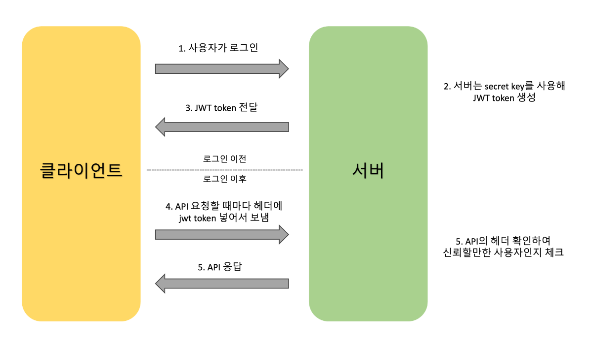

## 미니 프로젝트르 마치며
* 2024-03-21 (4일차)
* 크래프톤 정글 0주차
* jinja2 템플릿 엔진을 이용한 서버사이드 렌더링  
    * SSR(서버 사이드 렌더링)  
        * 서버쪽에서 렌더링(웹페이지를 그려주는 작업)을 하여 화면을 보여주는 방식  
        * 클라이언트(브라우저)가 서버에 매번 데이터를 요청하고 서버에서 처리하는 방식, 요청이 들어올 때마다 서버에서 새로운 화면을 만들어서 제공  
        * 장점 : 첫 페이지 로딩속도가 빠르다. 검색엔진 최적화가 가능하다.  
        * 단점 : 초기 로딩 이후 페이지 이동 시 속도가 다소 느리다. (페이지 이동 시마다 클라이언트가 서버에게 필요한 데이터를 요청하고 서버가 응답해주는 방식이다 보니 속도가 다소 느리다.)  
    * CSR(클라이언트 사이드 렌더링)  
        * 클라이언트인 부라우저가 렌더링을 처리하는 방식  
        * 서버에서 받은 데이터를 통해 부라우저가 화면을 렌더링  
        * 장점 : 빠른 인터렉션(유저가 특정 행동을 한 것에 대한 반응) 구현 가능, view 렌더링을 브라우저가 담당하여 서버 트래픽이 감소, 새로 고침이 발생하지 않음  
        * 단점 : 첫 페이지 로딩 속다가 ssr 보다 다소 느림. 서버에 첫 요청을 할때 전체 페이지에 대한 모든 문서 파일을 받다보니 로딩이 느림.  
    * jinja2  
        * 파이썬 언어로 작성된 템플릿 엔진(템플릿 엔진이란, 지정된 템플릿 양식과 데이터가 합쳐져 HTML문서를 출력하는 소프트웨어), Flask, Django 등의 파이썬 프레임워크에 사용 될 수 있음(flask를 설치하면 자동으로 jinja2 사용이 가능함) 
        * 조건문, 반복문, 필터 등을 이용해 동적인 HTML을 작성할 수 있음  
* jwt 인증 방식을 이용한 로그인 기능 구현  
    * jwt(Json Web Token)  
        * json 객체에 인증에 필요한 정보들을 담은 후 비밀키로 서명한 토큰으로, 인터넷 표준 인증 방식  
        * jwt 프로세스  
              
        * 사용자가 아이디와 비밀번호를 통해 서버에 로그인 요청을 보낼 경우, 서버에서는 secret_key를 사용해 json 객체를 암호화한 jwt 토큰을 발급하여 클라이언트에 보내게 된다. 이때 secret_key는 내가 무작위 난수로 설정하여 사용했다.  
        * 클라이언트는 jwt 토큰을 로컬에 저장해놓는다. api를 호출할 때마다 토큰을 보내고 서버는 매번 토큰을 확인하여 유효한 사용자인지 확인한 이후 응답을 보내준다.  
        * 유효기간을 지정한 jwt access토큰을 발급하여 로컬 쿠키에 저장하여 사용하였다. 페이지가 바뀔 때마다 토큰 값이 유효한지 검사하도록 로직을 구성하였다.  
        * access토큰 이외에 refresh 토큰도 함께 둔다고 하는데 refresh 토큰은 사용하지 않았다.(access토큰만 사용할 경우 유효기간이 짧기때문에 로그인을 자주 해야한다는 문제점이 있다. access토큰의 유효기간은 짧고 refresh토큰의 유효기간은 길다.)  
        * 서버 - 클라이언트 통신
            * 로그인 인증에 성공한 클라이언트가 서버로 부터 두개의 토큰을 받는다.  
            * access토큰을 사용하여 인증과정을 거치며 api통신을 한다. 일정 기간이 지나 클라이언트의 access토큰의 유효기간이 만료될 경우 서버는 401에러 코드를 출력한다.  
            * access 토큰이 만료됨을 인지한 클라이언트는 refresh토큰을 넣어 api를 재요청한다.  
            * refresh토큰으로 사용자 권한을 확인한 서버는 access 토큰을 넣어 응답한다. refresh 토큰이 만료될 경우 다시 로그인해야한다.  
            * refresh 토큰에는 사용자 식별자, 유효기간 등이 담겨 있고, 사용자 식별자로 사용자 권한을 확인하여 새로 액세스 토큰을 발급해준다.  

