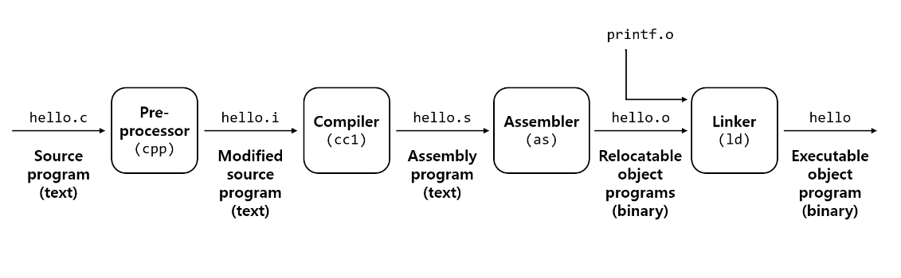
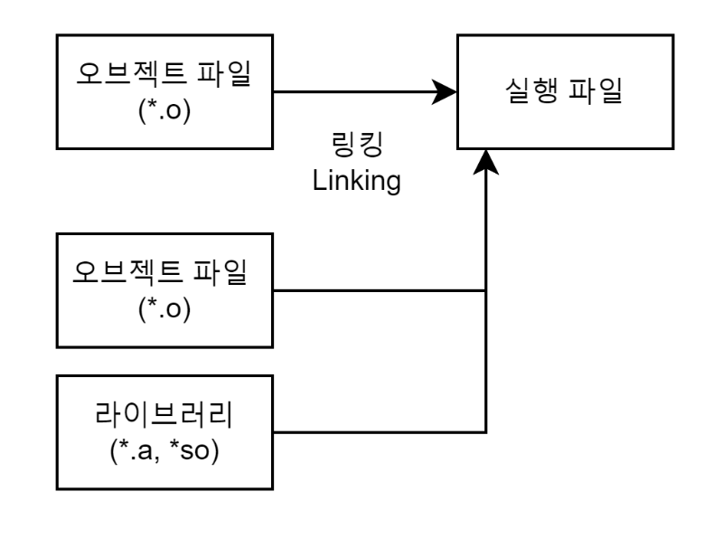
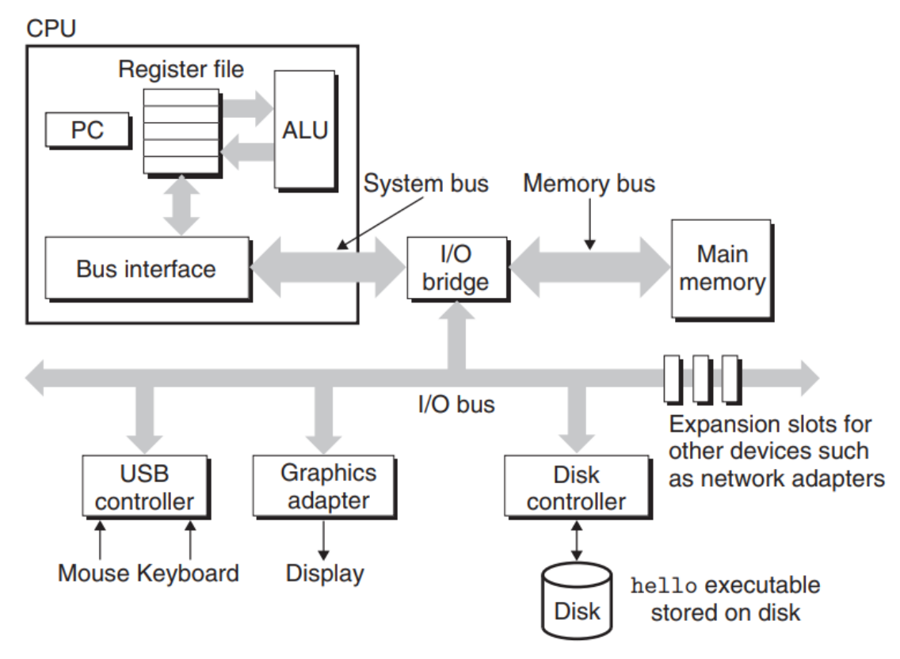
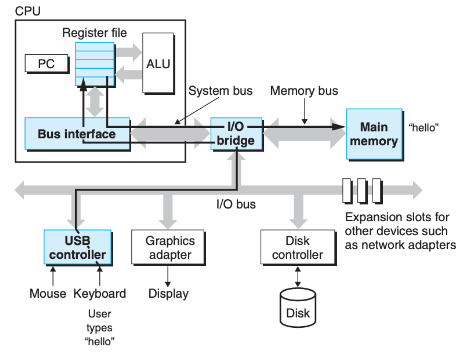
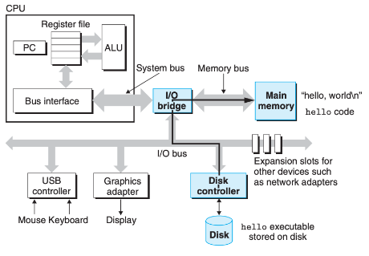
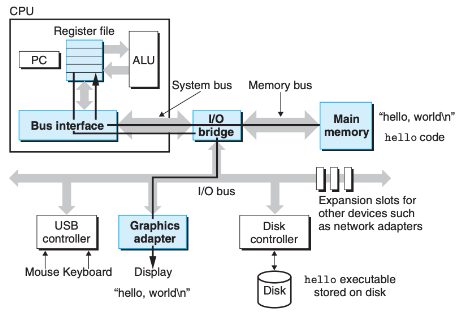

## Computer System (~1.4)  
* (1.1) 정보는 비트와 컨텍스트로 이루어진다.   
    * 오로지 아스키 문자들로만 이루어진 파일들은 텍스트 파일이라고 부른다. 다른 모든 파일들은 바이너리 파일이라고 부른다.  
* (1.2) 프로그램은 다른 프로그램에 의해 다른 형태로 번역 된다.  
    * 컴파일 시스템을 거쳐 번역이 된다. 컴파일 시스템은 (전처리기 -> 컴파일러 -> 어셈블러 -> 링커) 4단계를 거쳐 실행된다.  
      
        
    * 전처리과정은 전처리기를 통해 소스 코드 파일을 전처리된 소스 코드 파일로 변환하는 과정이다. 대표적으로 주석제거, 헤더 파일 삽입(#include 지시문을 만나면 해당하는 헤더 파일을 찾아 헤더 파일에 있는 모든 내용을 복사해서 소스 코드에 삽입한다.), 매크로 치환 및 적용(#define 지시문에 정의된 매크로를 저장하고 같은 문자열을 만나면 #define 된 내용으로 치환한다.)   
    * 컴파일이란?  
        * 인간이 이해할 수 있는 언어로 작성된 소스코드를 CPU가 이해할 수 있는 언어로 번역하는 작업을 말한다.  
        * 컴파일 과정은 컴파일러를 통해 전처리된 소스 코드 파일을 어셈블리어 파일로 변환하는 과정이다.  
    * 어셈블리어란?  
        * 01010과 같은 이진수로 이뤄진 기계어 명령어를 사람이 이해할 수 있게 부호화한 것으로 기계어(CPU 명령어)와 1대1로 매칭된다.  
        * 어셈블리어 과정은 어셈블러를 통해 어셈블리어 파일을 오브젝트 파일로 변환하는 과정이다. (오브젝트 코드로 구성된 파일을 오브젝트 파일이라고 부르며 어셈블리 코드가 더 이상 사람이 알아볼 수 없는 기계어로 변환된 것을 오브젝트 코드라고 부른다.)  
    * 링킹 과정은 링커를 통해 오브젝트 파일들을 묶어 실행 파일로 만드는 과정이다. 이 과정에서 오브젝트 파일들과 프로그램에서 사용하는 라이브러리 파일들을 링크하여 하나의 실행 파일을 만든다.  
      

* (1.3) 컴파일 시스템이 어떻게 동작하는지 이해하는 것은 중요하다.  
    * 프로그램 성능 최적화하기  
    * 링크 에러 이해하기  
    * 보안 약점 피하기  
* (1.4) 프로세서는 메모리에 저장된 인스트럭션(컴퓨터에게 일을 시키는 단위로서, 컴퓨터가 알아들을 수 있는 기계어로 이루어져 있는 명령이다.)을 읽고 해석한다.  
    * (1.4.1) 시스템의 하드웨어 조직  
        * 시스템의 하드웨어 구성  
          

        * 버스 (Buses)  
            * 시스템 내를 관통하는 전기적 배선군으로, 컴포넌트들 간에 바이트 정보들을 전송한다. '워드'라고 하는 고정 크기의 바이트 단위로 데이터를 전송하도록 설계된다. 한개의 워드를 구성하는 바이트 수는 시스템마다 보유하는 기본 시스템 변수이다.  
        * 입출력 장치  
            * 각 입출력장치는 입출력 버스와 컨트롤러나 어댑터를 통해 연결된다. (이 두장치의 차이는 패키징에 있다. 각각의 목적은 입출력 버스와 입출력 장치들 간에 정보를 주고 받돌고 해준다.)  
        * 메인 메모리  
            * 프로세서가 프로그램을 실행하는 동안 데이터와 프로그램을 모두 저장하는 임시 저장장치다.   
            * 물리적으로 메인 메모리는 DRAM(동적 램덤 액세스 메모리)칩들로 구성된다.  
            * 논리적으로 메모리는 연속적인 바이트들의 배열로, 각각 0부터 시작해서 고유의 주소를 가지고 있다.  
            * C 프로그램 변수들의 데이터 크기는 데이터 형에 따라 다르다. (short 타입의 데이터 -> 2바이트, int, float는 4바이트, long과 double은 8바이트를 필요로 함)
        * 프로세서  
            * 주처리장치(CPU) 또는 간단한 프로세서는 메인 메모리에 저장된 인스트럭션들을 해독하는 엔진이다.  
            * 프로세서는 프로그램 카운터가 가리키는 곳의 인스트럭션을 반복적으로 실행하고 PC값이 다음 인스트럭션의 위치를 가리키도록 업데이트 한다.  
            * 한 개의 인스트럭션을 실행하는 것은 여러 단계를 수행함으로써 이루어진다.  
            * 프로세서는 PC가 가리키는 메모리로부터 인스트럭션을 읽어옴 ->  이 인스트럭션에서 비트들을 해석하여 인스트럭션이 지정하는 간단한 동작을 실행하고, PC를 다음 인스트럭션 위치로 업데이트 한다.  
            * 프로세서는 위 처럼 몇개의 동작만이 있을 뿐, 이들은 메인 메모리, 레지스터 파일, 수식/논리 처리기(ALU)주위를 순회한다.  
            * 레지스터 파일 : 각각의 고유의 이름을 갖는 워드(고정크기의 바이트 단위)크기의 레지스터 집합으로 구성되어 있다.  
            * ALU(수식/논리 처리기) : 새 데이터와 주소값을 계산한다.  
            * 인스트럭션 요청에 의해 CPU가 실행하는 단순한 작업의 예  
                * 적재(Load) : 메인 메모리에서 레지스터에 한 바이트 또는 워드를 이전 값에 덮어쓰는 방식으로 방식으로 복사한다.  
                * 저장(Store): 레지스터에서 메인 메모리로 한 바이트 또는 워드를 이전 값에 덮어쓰는 방식으로 복사한다.  
                * 작업(Operate) : 두 레지스터의 값을 ALU로 복사하고 두 개의 워드로 수식연산을 수행한 뒤, 결과를 덮어쓰기 방식으로 레지스터에 저장한다.  
                * 점프(Jump) : 인스트럭션 자신으로부터 한 개의 워드를 추출하고, 이것을 PC에 덮어 쓰기 방식으로 복사한다.   
    * (1.4.2) hello 프로그램의 실행   
        * "./hello"를 입력하면 각각의 문자를 레지스터에 읽어 들인 후, 아래 그림과 같이 메모리에 저장한다.  
          

        * 아래 그림처럼 쉘은 파일 내의 코드와 데이터를 복사하는 일련의 명령어를 실행하여 실행파일 hello를 디스크에서 메인 메모리로 로딩한다. 데이터 부분은 최종적으로 출력되는 문자 스트링인 "hello, world\n"을 포함한다. 직접 메모리 접근(DMA)이라고 알려진 기법을 이용해서 데이터는 프로세서를 거치지 않고 디스크에서 메인 메모리로 직접 이동한다.  
          

        *  hello 목적 파일의 코드와 데이터가 메모리에 적재된 후, 아래 그림과 같이 프로세서는 hello 프로그램의 main 루틴의 기계어 명령어를 실행하기 시작한다. 이 명령어들은 "hello, world\n" 문자열을 메모리로부터 레지스터 파일로 복사하고, 거기로부터 디스플레이 장치로 전송하여 화면에 글자들이 표시된다.  
        
