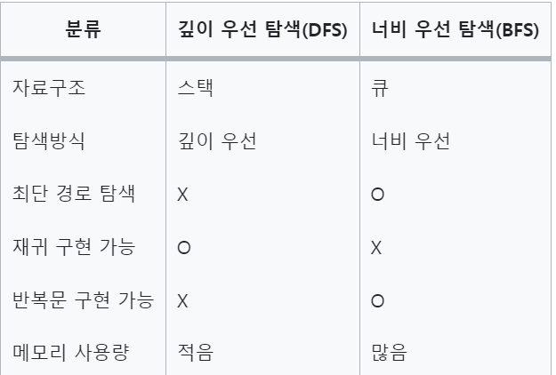
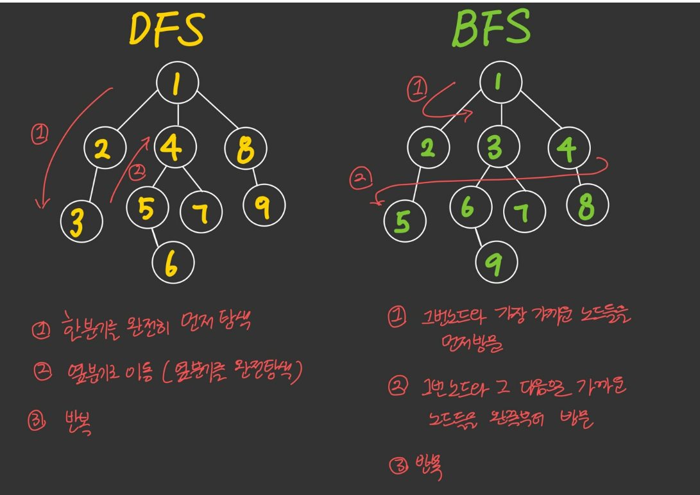

## 백준 알고리즘 문제 풀이  
* 2024 - 03 -24
* 정렬의 종류   
    * 병합 정렬  
    * 퀵 정렬  
    * 힙 정렬  
    * 삽입 정렬  
    * 선택 정렬  
    * 거품 정렬 


* 파이썬 라이브러리 순열과 조합  
    * 순열   
        ```
        from itertools import permutations

        arr =[a,b,c,d]
        permute = list(permutations(arr,2))
        print(permute)
        # [(a,b),(a,c),(a,d),(b,a),(b,c),(b,d),(c,a),(c,b),(c,d),(d,a),(d,b),(d,c)] 
        # 순서를 고려하여 경우의 수 나열
        ```  
    * 조합  
        ```
        from itertools import combinations
        arr = [a,b,c,d]
        combinate = list(combinations(arr,2))
        # [(a,b),(a,c),(a,d),(b,c),(b,d)(c,d)] 
        # 순서를 고려하지 않고 경우의 수 나열 
        ```

* 완전 탐색  
    * 완전 탐색이란 가능한 모든 경우의 수를 다 체크해서 정답을 얻어내는 방법  
    * 완전 탐색 기법을 활용하는 방법  
        * 고려 사항  
            1. 해결하고자 하는 모든 방법의 경우의 수를 대략적으로 계산한다.  
            2. 가능한 모든 방법을 고려한다.  
            3. 실제 답을 구할 수 있는지 적용한다.  
        * 종류  
            * Brute Force 기법 - 반복/ 조건문을 활용해 모두 테스트하는 방법   
            * 순열 - n 개의 원소 중 r개의 원소를 중복 허용 없이 나열하는 방법  
            * 재귀 호출  
            * 비트 마스크 - 2진수 표현 기법을 활용하는 방법  
            * BFS,DFS를 활용하는 방법  
                * 깊이 우선 탐색(DFS): 루트노드에서 시작하여 다음 분기로 넘어가기 전에 해당분기를 완벽하게 탐색하는 방법을 의미   
                * 너비 우선 탐색(BFS) : 루트 노드에서 시작하여 인접한 노드를 먼저 탐색하는 방법  
                   
                 
                * 활용할 문제 유형  
                    * 그래프의 모든 정점을 방문하는 문제 : DFS, BFS랑 상관 X  
                    * 경로의 특징을 저장해둬야 하는 경우 (각 정점에 숫자가 적혀있고 , a부터 b까지 가는 경로를 구하는데 경로에 같은 숫자가 있으면 안된다는 문제 등) : DFS  
                    * 최단 거리를 구해야하는 문제 (미로 찾기 등 최단거리를 구해야 할 경우) : BFS (검색 대상의 그래프가 정말 크다면 DFS를 고려)    
                    


* 1181번 [단어 정렬](https://github.com/dongyeoppp/Jungle_TIL/blob/main/jungle_week01/bk_1181.py)  
* 2309번 [일곱 난쟁이](https://github.com/dongyeoppp/Jungle_TIL/blob/main/jungle_week01/bk_2309.py)