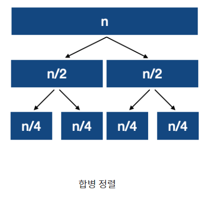

## 백준 알고리즘 풀이 및 키워드 정리  
* 2024  - 03 - 25   
* 외판원 순회 2, 안전영역 해야하는데 다른거 먼저 해보자 

* 분할 정복 알고리즘  
    * 분할 정복 알고리즘은 그대로 해결할 수 없는 문제를 작은 문제로 분할하여 문제를 해결하는 방법이다.  
    * 퀵 정렬이나 합병정렬, 이진탐색 등이 대표적인 예이다.  
    * 선택정렬과 삽입 정렬의 최대 실행시간은 O(n^2)으로 매우 걸릴 수 있다.   
    * 반면 분할정복 알고리즘을 사용하는 합병 정렬의 실행 시간은 모든 경우에 대해 O(nlog n), 퀵 정렬은 최대O(n^2)이지만 최선이나 평균의 경우 O(nlog n)으로 비교적 빠른 시간을 갖는다.  
       

    *  분할 정복 알고리즘은 최소한 두 개의 하위 문제를 생성하므로 재귀 호출을 여러 번 실행 한다.  
        

    * 합병 정렬  
        * 하나의 리스트를 두 개의 균등한 크기로 분할하고 분할된 부분 리스트를 정렬한 다음, 두 개의 정렬된 부분 리스트를 합하여 전체가 정렬된 리스트가 되게 하는 방법이다.  
           

        * 하나의 리스트를 두개의 리스트로 분할하고 정렬한다.(분할된 리스트가 충분히 작아지지 않으면 다시 분할정복 방법을 적용한다.) 이후 부분 리스트를 다시 하나의 리스트로 합병한다. 
    * 퀵 정렬  
        * 특정 원소 피봇(pivot)을 기준으로 주어진 배열을 두 부분 배열로 분할하고 각 부분 배열에 대해 퀵 정렬을 순환적으로 적용하는 방식이다.  
            

        * 피봇을 하나 선택하여 피봇을 기준으로 2개의 부분 배열로 분할한다.  
        * 피봇을 기준으로 피봇보다 큰 값 혹은 작은 값을 찾는다. 왼쪽에서부터는 피봇보다 큰 값을 찾고 오른쪽에서부터는 피봇보다 작은 값을 찾아 두 원소를 교환한다. 분할된 부분 배열의 크기가 0이나 1이 될때까지 반복한다.  
        * 이미 값이 정렬되어 있으므로 병합할 필요는 없다.  
        * 퀵 정렬의 경우 피봇의 위치나 배열의 상태에 따라 최악의 경우 O(n^2)이 나올 수 있다. (이미 오름차순으로 정렬되어 있는 배열을 퀵 정렬을 사용하여 오름차순으로 정렬을 하면 n개의 원소를 n번 순회하므로 n^2의 시간복잡도를 가진다.) 무작정 퀵 정렬을 사용하기보다는 문제의 특성에 맞게 적절한 알고리즘을 선택하는 것이 중요하다.  
        * 퀵 정렬 코드 구현   
            ```
            def qsort(arr,left,right):
                pivot = arr[(left+right)//2]  
                ql = left
                qr = right 
                while ql <= qr:
                    while arr[ql] < pivot:
                        ql += 1
                    while arr[qr] > pivot:
                        qr -= 1
                    if ql <= qr:
                        new[ql] , new[qr] = new[qr], new[ql]
                        ql += 1
                        qr -= 1
                if left < qr:
                    qsort(arr,left,qr)
                if ql < right:
                    qsort(arr,ql,right)
            qsort(new,0,len(new)-1)
            ```
    * 이진 탐색(binary search)  
        * 이진 검색(=탐색)은 원소가 오름차순이나 내림차순으로 정렬된 배열에서 좀 더 효율적으로 검색할 수 있는 알고리즘이다.  
        * 탐색 범위를 반으로 나누어 찾는 값을 포함하는 범위를 좁혀가는 방식으로 동작한다.  (up & down 게임을 생각하면 쉽게 이해할 수 있다.)  
        * 실행 복잡도는 O(log n)으로 배열의 크기에 비례하여 실행 시간이 빨라진다.  
        * 배열이나 이진탐색 트리와 같이 정렬된 구조에만 사용할 수 있다.  
           


* 해시법  
    * 배열의 데이터(키값)를 배열의 길이로 나누어 나온 값이 해시 값으로 정의되고 해시 값을 인덱스로 가지고 키값이 해시의 원소로 들어가있을 경우가 해시 테이블이다.    
    * 키를 해시값으로 변환하는 과정이 해시함수, 해시 테이블에서 만들어진 원소를 버킷이라고 한다.  
    * 해시 충돌  
        * 저장할 버킷이 중복되는 현상 (키와 해시값은 다대1)  
        * 해치 충돌 해결 방법  
            * 체인법  
            * 오픈 주소법  

* 10971번 외판원 순회 2 문제를 푸는데 시간을 많이 썼지만 결국 해결하지 못했다. 해결한 이후에 다시 풀이를 다룰 예정이다.  
* 1920번 [수 찾기](https://github.com/dongyeoppp/Jungle_TIL/blob/main/jungle_week01/bk_1920.py)  
* 2805번 [나무 자르기](https://github.com/dongyeoppp/Jungle_TIL/blob/main/jungle_week01/bk_2805.py)
* 8983번 [사냥꾼](https://github.com/dongyeoppp/Jungle_TIL/blob/main/jungle_week01/bk_8983.py)