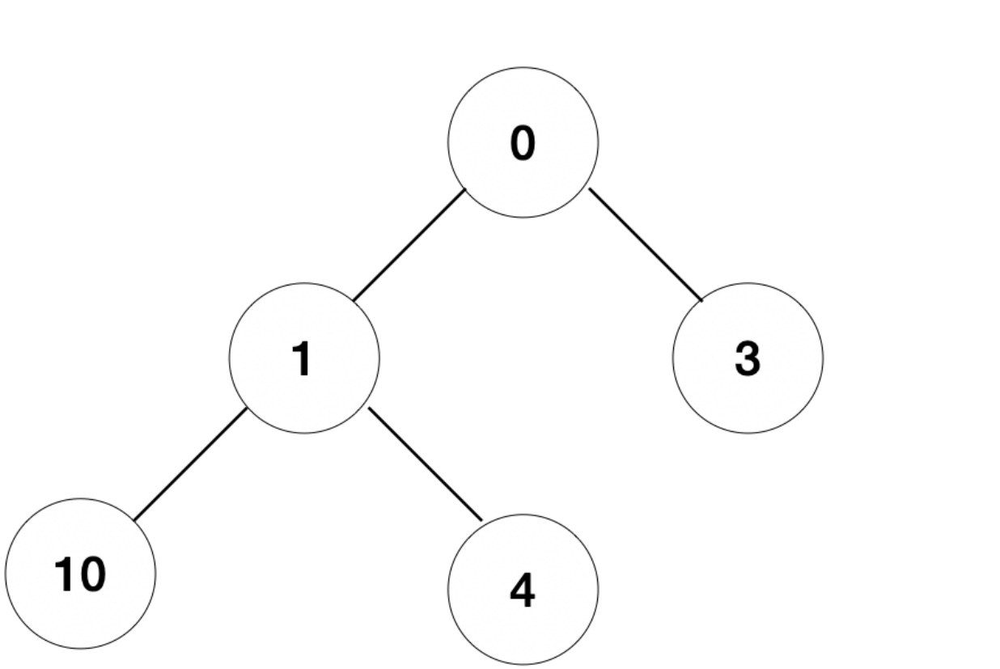
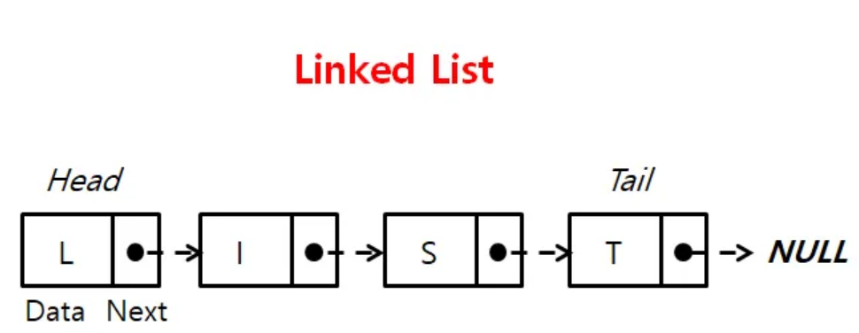
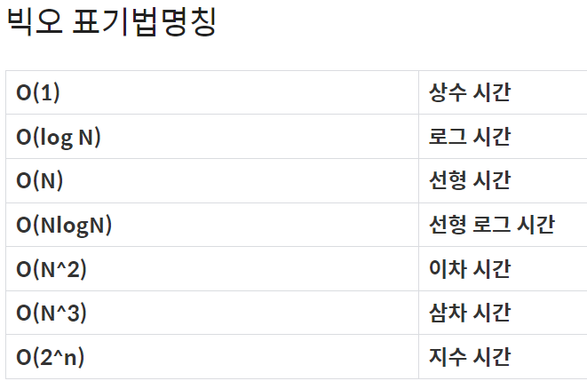

## 1주차 알고리즘 풀이 및 키워드 정리  
* 2024 - 03 -27 (10일차)

* map(), join() 함수 사용  
    * map(str,result) : result리스트의 요소를 문자열로 변환한다.  
        ```
        result = [1,2,3,4]  
        new_result = list(map(str,result))
        print(new_result)   # ['1','2','3','4']
        ```   
    * "(구분자)".join(result) : result 요소 사이에 구분자를 넣어 문자열을 합쳐준다.   
        ```
        result = ['1','2','3','4']
        new_result  = " ".join(result)  # result의 요소가 문자열일 경우
        print(new_result)   # '1 2 3 4' 
        ```
    * 리스트를 문자열로 합쳐줄 경우     
        ```
        result = [1,2,3,4]
        new_result = " ".join(map(str,result))
        print(new_result)           # '1 2 3 4'
        ```


* 스택 (stack)
    * 데이터를 임시 저장하는 자료 구조로, 데이터의 입력과 출력 순서는 후입선출(LIFO) 방식   
    * push() : 스택에 데이터를 넣는 작업  
    * pop() : 스택에서 데이터를 꺼내는 작업   
    * push, pop을 하는 윗 부분을 꼭대기라고 하고, 아랫부분을 bottom이라고 한다.  

* 큐 (queue)
    * 스택과 마찬가지로 데이터를 임시 저장하는 자료구조로, 가장 먼저 넣은 데이터를 가장 먼저 꺼내는 선입선출(FIFO) 구조이다.  
    * nequeue : 큐를 데이터에 추가하는 작업  
    * dequeue : 데이터를 꺼내는 작업  
    * Head(front) : 데이터를 꺼내는 쪽  
    * Tail(rear) : 데이터를 넣는 쪽  
    * 우선순위 큐 : enqueue할때 데이터에 우선순위를 부여하여 추가하고, dequeue할때 우선순위가 가장 높은 데이터를 꺼내는 방식이다.  
    * 링 버퍼로 큐 구현  
        * dequeue 할때 배열 안의 원소를 옮기지 않는 큐  
        * 배열 맨 끝의 원소 뒤에 맨 앞의 원소가 연결되는 자료구조  
* 덱 (deque)
    * 덱은 양방향 대기열로 맨 앞과 맨 끝 양쪽에서 데이터를 넣고 꺼낼 수 있는 자료구조이다.  
    * 2개의 포인터를 사용하여 양쪽에서 삭제, 삽입을 할 수 있으며, 큐와 스택을 합친 형태라고 생각하자.  
    * Enqueue(추가) 및 Dequeue(삭제) 실행속도는 O(1)  
    * ```from collections import deque```  
      ``` 변수 = deque()``` : deque 선언  
      속도가 리스트에 비해 굉장히 빠르다 (List = O(n), deque = O(1))   
* 힙(heap)  
    * 완전 이진 트리의 일종으로 우선순위 큐를 위하여 만들어진 자료구조이다.  
    * 여러 개의 값들 중에서 최대값이나 최솟값을 빠르게 찾아내도록 만들어진 자료구조이다.  
    * 부모 노드의 키 값이 자식 노드의 키 값보다 항상 큰 이진 트리를 말한다.  
    * 힙의 종류  
        * 최대 힙   
            * 부모 노드의 키 값이 자식 노드의 키 값보다 크거나 같은 완전 이진 트리  
            * key(부모 노드) >= key(자식 노드)  
        * 최소 힙  
            * 부모 노드의 키 값이 자식 노드의 키 값보다 작거나 같은 완전 이진 트리  
            * key(부모 노드) <= key(자식 노드)  
    * ```import heapq``` : heap 라이브러리 불러오기 (기본적으로 최소 힙으로 구현되어 있다.)  
    * heapd의 heappush를 통해 값들을 삽입하면 해당 값들은 숫자가 가장 작은 순서대로 트리 구조로 값이 저장된다.  
    * ```heapq.heappush(list,넣고자 하는 값)``` : heappush를 사용할 경우 리스트와 원소를 넘겨준다.  
        ```
        import heapq

        heap_q = []

        heapq.heappush(heap_q, 3)
        heapq.heappush(heap_q, 10)
        heapq.heappush(heap_q, 1)
        heapq.heappush(heap_q, 0)
        heapq.heappush(heap_q, 4)

        print(heap_q)

        # [0, 1, 3, 10, 4]
        ```   
           
    * ```heapq.heappop(리스트)``` : heappop 연산을 통해 우선순위 큐의 가장 우선순위가 높은 값(최소값)을 제거할 수 있다.(최소값이 제거되더라도 자동으로 힙 성질을 유지해준다.)   
    * ```heapq.heapify(리스트)``` : heapify 연산을 통해 아무런 정렬 되지 않은 리스트의 원소들을 힙으로 변환할 수 있다.  
    * ```heapq.nlargest(n=3,iterable=리스트)```  : nlargest연산을 통해 힙의 n개의 가장 큰 리스트를 반환할 수 있다.   
    * ```heapq.nsmallest(n=3,iterable=리스트)``` : nsmallest연산을 통해 힙의 n개의 가장 작은 리스트를 반환할 수 있다.  
    * 최대힙 구현  
        * 가장 큰 수에 제일 높은 우선 순위를 부여하고 싶다면 heappush를 할 경우 -1을 곱해 음수로 만들어준다.  
        * 이후 heappop연산을 할 경우 다시 -1을 곱해 원래대로 양수를 만들어주면 최대값을 뽑을 수 있다.  
            ```
            import heapq

                heap_q = []

                heapq.heappush(heap_q, -3)
                heapq.heappush(heap_q, -10)
                heapq.heappush(heap_q, -1)
                heapq.heappush(heap_q, -0)
                heapq.heappush(heap_q, -4)

                print(-1 * heapq.heappop(heap_q))

                # 10
            ```
* stack과 달리 queue를 list로 이용하지 않는 이유  
    * stack과 같이 list.append와 list.pop(0)를 이용하면 리스트를 큐처럼 사용할 수 있지만 pop(0)의 시간복잡도는 O(N)이기 때문에 오래 걸릴 수 있다.  
    * list.pop(0)을 사용하는 대신 deque모듈(```from collections import deque``` )을 불러와서 list.popleft()를 사용하면 시간복잡도를 줄일 수 있다.

* 연결 리스트(Linked list)  
    * 연결리스트는 각 요소들이 다음 요소를 가리키는 포인터로 연결되어 있다.  
    * 각 노드가 데이터와 포인터를 가지고 한 줄로 연결되어 있는 방식으로 데이터를 저장한다.  
    * 연결리스트 종류  
        * 단일 연결 리스트  
            * 각 노드는 데이터와 다음 노드를 가르키는 포인터로 구성되어 있다.  
            * 마지막 노드는 다음 노드가 가르키는 포인터 값이 null이거나 none 이다.  
            * 삽입과 삭제가 간단하며 메모리를 효율적으로 사용할 수 있다.  
        * 이중 연결 리스트  
            * 각 노드는 데이터와 이전 노드를 가르키는 포인터와 다음 노드를 가르키는 포인터로 구성된다.  
            * 양방향으로 탐색이 가능하며 검색 연산이 단일 연결 리스트보다 빠르다.   
            * 단일 연결리스트에 비해 각 노드의 메모리 사용량이 더 많다.  
    * 연결리스트의 장단점   
        * 장점  
            * 삽입과 삭제 연산이 빠르며 중간에 요소를 삽입하거나 삭제하기 편하다.  
            * 메모리를 동적으로 할당하여 유연하게 데이터를 저장할 수 있다.  
        * 단점  
            * 특정 위치의 요소에 접근하는데 O(n)의 시간이 걸린다. (단일 연결 리스트의 경우)  
            * 각 노드마다 다음 노드를 가르키는 포인터가 필요하므로 메모리 공간이 더 많이 필요하다.  
       

    * 시간 복잡도   
        * 알고리즘의 입력 크기에 따라 실행되는 시간의 증가율을 분석하는 것  
        * 시간 복잡도는 주어진 입력에 대한 알고리즘의 수행 시간을 나타내며, 주로 연산 횟수를 기준으로 측정된다.  
        * 일반적으로 최악의 경우를 가정하여 분석한다.   
        * ex) 배열의 특정요소를 검색하는 선형 검색 알고리즘의 최악 시간 복잡도는 O(n)이다.  
    * 공간 복잡도   
        * 공간 복잡도는 알고리즘이 실행되는 동안 사용되는 메모리 공간의 양을 의미한다.   
        * ex) 크기가 n인 배열을 저장하는 선형 배열의 공간 복잡도는 O(n)이다.   
    * 빅 오 표기법   
        * 알고리즘의 시간 복잡도와 공간 복잡도를 간단하고 명료하게 나타내기 위한 표기법으로 주로 최악의 경우를 가정하여 사용된다.   
          

* 정렬 알고리즘 정리        
    * 버블 정렬   
        * 이웃한 두 원소의 대소 관계를 비교하여 필요에 따라 교환을 반복하는 알고리즘(=단순 교환 정렬)  
        * 버블 정렬 알고리즘   
        ```
        # 버블 정렬 알고리즘 

        arr = [1,6,4,3,7,8,9]
        n = len(arr)
        for j in range(n-1):
            for i in range(n-1,1,-1):
                if arr[i] < arr[i-1]:
                    base = arr[i-1]
                    arr[i-1] = arr[i]
                    arr[i] = base
        print(arr)    
        # [1, 3, 4, 6, 7, 8, 9]
        ```   
        * 버블 정렬은 서로 이웃한 요소만 교환하며 원소를 교환하는 횟수는 첫 번째 n-1번, 두 번째 n-2....이므로 합계는 n(n-1)/2 이다.   
        * 셰이커 정렬  
            * 홀수 패스에서는 가장 작은 원소를 맨 앞으로, 짝수 패스에서는 가장 큰 원소를 맨 뒤로 이동시켜 패스의 스캔 방향을 번갈아 바꾸는 정렬   
            * 버블 정렬 알고리즘을 개선한 알고리즘   
            ```
            # 버블 정렬을 개선한 셰이커 정렬 알고리즘  

            arr = [1,6,4,3,7,8,9]
            left = 0
            right = len(arr) -1 
            last = right
            while left < right:
                for i in range(right, left,-1): # 뒤에서 앞으로 가며 정렬  
                    if arr[i]< arr[i-1]:
                        base = arr[i]
                        arr[i] = arr[i-1]
                        arr[i-1] = base
                        last =i
                left = last
                for i in range(left,right): # 앞에서 뒤로 가며 정렬   
                    if arr[i]< arr[i-1]:
                        base = arr[i]
                        arr[i] = arr[i-1]
                        arr[i-1] = base
                        last = i 
                right = last

            print(arr)    
            # [1, 3, 4, 6, 7, 8, 9]
            ```    
    * 단순 선택 정렬  
        * 가장 작은 원소부터 선택해 알맞은 위치로 옮기는 작업을 반복하며 정렬하는 알고리즘  
        ```
        # 단순 선택 정렬 알고리즘  

        arr = [1,6,4,3,7,8,9]
        n = len(arr)
        for i in range(n-1):
            min = i
            for j in range(i+1,n):
                if arr[j] < arr[min]:
                    arr[j],arr[min] = arr[min] , arr[j]
                
        print(arr)    
        # [1, 3, 4, 6, 7, 8, 9]
        ```   
        * 서로 이웃하지 않는 떨어져 있는 원소를 교환하므로 안정적이지 않다.  
    * 단순 삽입 정렬   
        * 주목한 원소보다 더 앞쪽에서 알맞은 위치로 삽입하며 정렬하는 알고리즘 이다.  
        * 선택 정렬과 비슷해 보이지만 값이 가장 작은 원소를 선택하지 않는다는 점이 다르다.  
        ```
        # 단순 삽입 정렬 알고리즘  

        arr = [7, 5, 9, 0, 3, 1, 6, 2, 4, 8]
        n = len(arr)
        for i in range(1,n):        # 첫번째 원소는 이미 정렬 되어있다고 간주  
            for j in range(i,0,-1):     # 갈수로 j의 범위가 증가하며 검사할 범위가 증가하지만, arr[j] 보다 작은 값을 만나지 않으면 이후엔 정렬이 이미 이루어진 것으로보고 종료
                if arr[j] < arr[j-1]:   # j가 1까지 갔을 경우도 for문 종료   
                    arr[j],arr[j-1] = arr[j-1],arr[j]
                else:
                    break

        print(arr)    
        # [1, 3, 4, 6, 7, 8, 9]
        ```
    * 단순 정렬 알고리즘 시간복잡도  
        * 버블, 선택, 삽입 알고리즘의 시간 복잡도는 모두 O(n^2)으로 프로그램의 효율이 좋지 않다.  

* 10828번 [스택](https://github.com/dongyeoppp/Jungle_TIL/blob/main/jungle_week01/bk_10828.py)
* 2493번 [탑](https://github.com/dongyeoppp/Jungle_TIL/blob/main/jungle_week01/bk_2493.py)
* 11866번 [요세푸스 문제0](https://github.com/dongyeoppp/Jungle_TIL/blob/main/jungle_week01/bk_11866.py)
* 11279번 [최대 힙](https://github.com/dongyeoppp/Jungle_TIL/blob/main/jungle_week01/bk_11279.py)    
