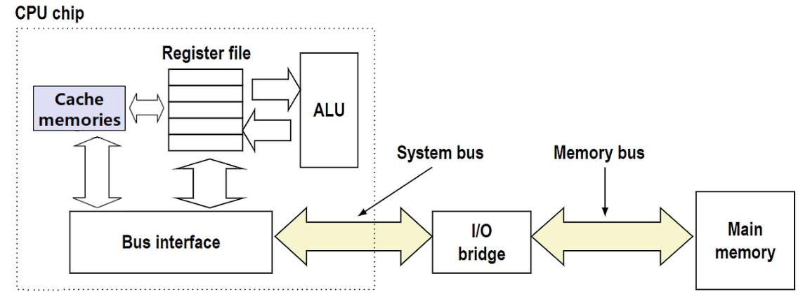
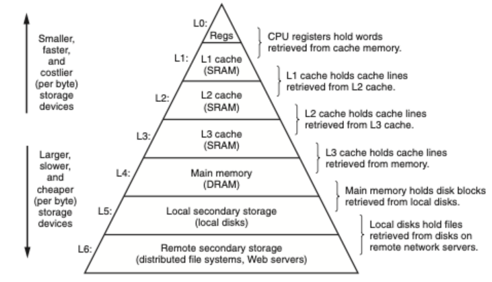
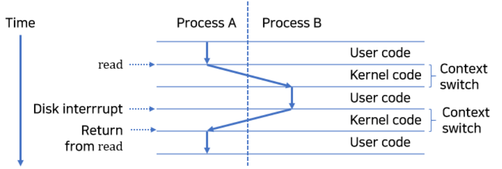

## Computer System(~1.9)  

### 1.5 캐시가 중요하다.  
* hello 프로그램의 기계어 인스트럭션들은 본래 하드디스트에 저장되어 있다가 프로그램이 로딩될 때 이들은 메인 메모리로 복사된다. 이와 비슷한 여러 복사과정들이 프로그램의 "실제 작업"을 느리게 하는 오버헤드이다.  
* 시스템 설계자들의 주요 목적은 이러한 복사과정들을 가능한 빠르게 동작하도록 하는 것이다.   
* 큰 저장장치는 작은 저장장치들보다 느린 속도를 갖는다.  
* 더 빠른 장치는 더 느린 장치들보다 만드는데 더 많은 비용이 든다.  
* 반도체 기술이 매년 발달함에 따라 프로세서 - 메모리 간 격차가 지속적으로 증가하고 있다. 메인 메모리를 더 빠르게 동작하도록 만드는 것보다 프로세서를 더 빨리 동작하도록 만드는 것이 더 쉽고 비용이 적게 든다.  
* 보다 작고 빠른 캐시 메모리는 프로세서-메모리 간 격차에 대응하기 위해 고안되었으며 프로세서가 단기간에 필요로 할 가능성이 높은 정보를 임시로 저장할 목적으로 사용한다.  
* 일반적인 시스템에서의 캐시 메모리  
      

* 캐시 시스템의 아이디어는 프로그램이 지엽적인 영역의 코드와 데이터를 엑세스하는 경향인 지역성을 활용하여 시스템이 매우 크고 빠른 메모리 효과를 얻을 수 있다는 것이다.   
* 자주 엑세스할 가능성이 높은 데이터를 캐시가 보관하도록 설정하면 빠른 캐시를 이용해서 대부분의 메모리 작업을 수행할 수 있게 된다.  

### 1.6 저장장치들은 계층구조를 이룬다   
* 모든 컴퓨터 시스템의 저장장치들은 메모리 계층구조로 구성되어 있고, 계층의 꼭대기에서부터 맨 밑바닥까지 이동할수록 저장장치들은 더 느리고, 더 크고, 바이트당 가격이 싸진다.  
    * 메모리 계층구조 (L1에서 L3까지 캐시를 사용하는 구조를 보여준다.)   
       

    * 메모리 계층구조의 주요 아이디어는 한 레벨의 저장장치가 다음 하위레벨 저장장치의 캐시 역할을 한다는 것이다.  

### 1.7 운영체제는 하드웨어를 관리한다.   
* 응용프로그램이 하드웨어를 제어하려면 언제나 운영체제를 통해서 해야 한다.  
* 운영체제의 주요 목적   
    1) 제멋대로 동작하는 응용프로그램들이 하드웨어를 잘못 사용하는 것을 막기 위해   
    2) 응용프로그램들이 단순하고 균일한 메커니즘을 사용하여 복잡하고 매우 다른 저수준 하드웨어 장치들을 조작할 수 있도록 하기 위해   
#### 1.7.1 프로세스   
* 운영체제는 문맥 전환(context switching)이라는 방법을 사용해서 교차실행을 수행한다.  
* 운영체제는 프로세스가 실행하는데 필요한 모든 상태정보의 변화를 추적한다.  
* 컨텍스트: pc, 레지스터 파일, 메인 메모리의 현재 값을 포함하고 있는 상태정보   
*  운영체제가 현재 프로세스에서 다른 새로운 프로세스로 제어를 옮기려고 할때 현재 프로세스의 컨텍스트를 저장하고 새 프로세스의 컨텍스트를 복원시키는 문맥전환을 실행하여 제어권을 새 프로세스로 넘겨준다.  
* 하나의 프로세스에서 다른 프로세스로의 전환은 운영체제 커널에 의해 관리된다. 커널은 운영체제 코드의 일부분으로 메모리에 상주한다. (커널은 별도의 프로세스가 아니다. 대신 커널은 모든 프로세스를 관리하기 위해 시스템이 이용하는 코드와 자료구조의 집합이다.)    
    * 프로세스의 문맥전환   
       

#### 1.7.2 쓰레드(Thread)   
* 스레드란 프로세스(단순히 실행중인 프로그램) 내에서 실제로 작업을 수행하는 주체를 의미한다.  
* 각각의 쓰레드는 해당 프로세스의 컨텍스트에서 실행되며 동일한 코드와 전역 데이터를 공유한다.  
* 다수의 프로세스들에서 데이터의 공유가 더 쉽다는 점과 쓰레드가 프로세스보다 더 효율적이라는 점에서 쓰레드의 중요성이 더 커지고 있다.  

#### 1.7.3 가상메모리   
* 가상메모리는 각 프로세스들이 메인 메모리 전체를 독점적으로 사용하고 있는 것 같은 환상을 제공하는 추상화이다.  
* 가상메모리의 기본적인 아이디어는 프로세스의 가상메모리의 내용을 디스크에 저장하고 메인 메모리를 디스크의 캐시로 사용하는 것이다.  

#### 1.7.4 파일   
* 파일은 그저 연속된 바이트들이다.  
* 디스크, 키보드, 디스플레이, 네트워크까지 포함하는 모든 입출력장치는 파일로 모델링한다.  

### 1.8 시스템은 네트워크를 사용하여 다른 시스템과 통신한다.  
### 1.9 중요한 주제  
#### 1.9.1 Amdahl의 법칙(암달의 법칙)  
* 주요 아이디어는 어떤 시스템의 한 부분의 성능을 개선할 때, 전체 시스템 성능에 대한 효과는 그 부분이 얼마나 중요한가와 이 부분이 얼마나 빨라졌는가에 관계된다는 것이다.   

#### 1.9.2 동시성과 병렬성  
* 동시성 : 다수의 동시에 벌어지는 일을 갖는 시스템에 관한 일반적인 개념을 말할 때 사용한다.
* 병렬성 : 동시성을 사용해서 시스템을 보다 빠르게 동작하도록 하는 것을 말할 때 사용한다.  
 

* 쓰레드 수준 동시성  
* 인스트럭션 수준 병렬성  
* 싱글 인스트럭션, 다중 데이터 병렬성(SIMD)

