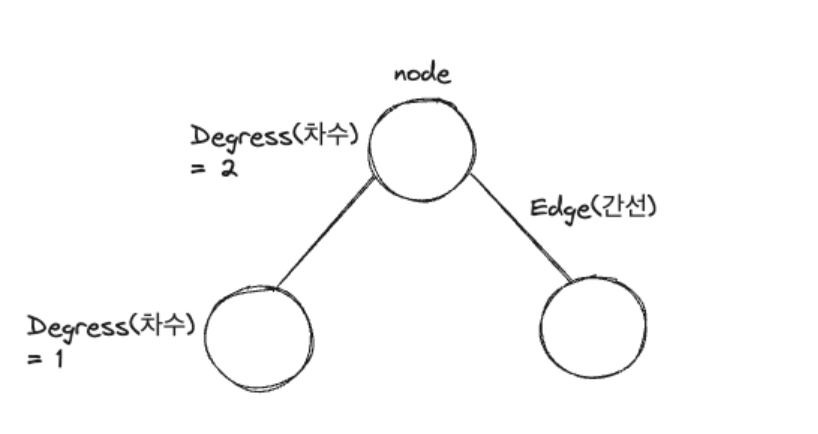

## 2주차 알고리즘 키워드 정리   
* 2024 - 03 -28 (11일차)

* 2주차 문제 풀기 전에 키워드 위주의 개념 정리를 하자  

#### 그래프 종류/ 표현 방식  

* 그래프 정의  
    * 여러 개의 점(노드 또는 정점)을 선으로 연결한 구조  
    * 가장 복잡한 (일반적인) 자료구조   
    * Node(노드) 또는 Vertex(정점) : 그래프에서 하나의 점을 나타내며 데이터를 저장할 수 있다.   
    * Edge(간선 = arc) : 그래프에서 노드와 노드를 연결하는 선   
    * degree(차수) : 노드에 연결된 간선의 수, 특정 그래프의 차수는 그래프의 최대 차수가 된다. 
    * 두 개의 노드가 간선으로 연결되어있을 경우 두 노드가 "인접"하다고 할 수 있다.   
    * 노드들을 연결하는 간선의 순서를 나타낸다. (1->2->3->4) / (1->2->3->2->4)처럼 중복이 될 경우는 path가 될 수 없다.      
    * 사이클 : 그래프에서 동일한 노드로 돌아오는 경로를 말한다. (1->2->3->1) / (부모 자식간의 관계를 만족하는 그래프가 tree -> 사이클이 존재하지 않음)   
    * 사이클이 없는 그래프는 어떤 두 노드를 연결하는 경로가 유일하게 하나 뿐 이다. ex) 트리  
    * 가중치 : 간선에 할당되어 있는 값 또는 비용      
    <br/>

* 그래프 표현법  
    * 인접 행렬  
        * 노드의 개수가 n개일 경우 n*n 행렬로 나타낼 수 있다.    
        * 두 노드 사이에 간선이 존재할경우 행렬을 1로 표시할 수 있다. (1노드와 4노드 사이에 간선이 존재한다면 1행에 4열(4행에 1열)을 1로 표현. 행과 열이 같을 경우는 0이나 1로 표시해도 무관하다.)   
        * 행렬에 표기할때 간선이 없는 경우도 0으로 표시해야하기 때문에 메모리를 낭비할 수 있다.(노드 수가 많은데 간선이 적을 경우 메모리 낭비) 이를 해결하기 위해 인접리스트를 사용한다.   
        * 간선에 가중치가 있을 경우 가중치 값을 행렬에 넣어 가중치를 표현할 수 있다.   
        * n*n행렬 이므로 memory : O(n^2)
        * 두 노드 사이 간선의 존재 여부를 O(1) 시간에 확인 가능  
        * 특정 노드에 인접한 노드를 찾을 경우 노드의 개수 만큼의 시간이 걸린다. (노드의 개수가 2만개이고 간선의 수가 2개뿐이라면 인접한 노드는 최대 2개 인데 2만개의 노드를 전부 확인해야 한다.)  
        * 새로운 간선을 추가할 경우 O(1)의 시간복잡도가 걸림  (G[u][v] = 1  -> 노드 u와 v사이의 간선을 추가) , 삭제할 경우도 동일  

    * 인접 리스트(여기서 리스트는 연결 리스트를 의미한다.)  
        * 노드의 개수가 n일때 n개의 리스트를 사용하여 그래프를 표현한다.
        * 특정 노드에 인접한 노드를 연결리스트로 연결한다. 한방향 혹은 양방향으로 표현할 수 있다.  
        * 존재하는 edge만 표현할 수 있어 메모리를 효율적으로 사용할 수 있다. 특정 노드의 인접 여부를 확인하기 위해선 연결리스트를 순회해야하므로 인접행렬에 비해 느릴 수 있다.     
        * 연결 리스트에서도 가중치 표현이 가능한데 연결리스트의 노드(연결리스트의 노드는 그래프의 노드와는 다른 개념으로 연결리스트의 노드는 연결리스트의 요소를 구성하는데 사용된다.)에 해당 간선의 목적지 노드와 함께 가중치 값을 추가할 수 있다.   
        * memory : O(n(=노드의 수) + m(=간선의수))   
        * 두 노드 사이 간선의 존재 여부 체크 : 특정 노드에 나머지 모든 노드가 연결 되어있을 경우 n-1개의 노드를 모두 찾아봐야하므로 O(n) 시간 사용  
        * 특정 노드에 인접한 노드를 찾기 위해선 특정 노드에 해당되는 연결리스트만 확인하면 되기 때문에 인접한 노드 수만큼 시간이 걸린다.   
        * 새로운 간선을 추가할 경우 시간 단축을 위해 연결리스트에 앞부분에 pushfront(파이썬에서는 리스트에 append하여 사용한다.)하여 새로운 헤더 노드로 만든다.  O(1) 시간 내에 가능  , 삭제할 경우에는 연결리스트를 search해야하므로 O(1)의 시간복잡도가 걸린다.   

    * 노드의 개수가 간선의 수보다 훨씬 많을 때 인접행렬일 경우 메모리가 인접리스트에 비해 많이 사용되지만 간선의 수가 많은 경우엔 인접리스트도 인접행렬과 비슷해진다.   

    * 무방향 그래프 (undirected graph)
        * Edge에 방향이 없는 그래프  
        * 인접 행렬로 표현할 경우 가운데 대각선을 기준으로 대칭된다. (1행의 4열이 1일때 1열에 4행도 1로 표현된다.)  
         
    * 방향 그래프 (directed graph)  
        * Edge에 방향성이 있는 그래프 
    * 가중치 그래프  
        * 그래프에 간선에 가중치 값이 할당된 그래프
        

    <br/>   

#### BFS / DFS   

* BFS(너비 우선 탐색)    
    * 시작 노드에서 가까운 노드부터 차례대로 탐색하는 알고리즘으로 시작노드에서부터 시작하여 인접한 모든 노드를 탐색한 후, 그 다음 단계에서는 인접한 모든노드의 인접한 노드들을 탐색하며 계속 탐색을 진행한다.  
    * 일반적으로 큐를 사용해 구현 하며 시작노드를 큐에 넣고, 해당 노드와 인접한 모든 노드를 큐에 넣고, 큐에서 하나씩 노드를 꺼내며 탐색한다.  
    * 최단 경로 탐색이나 두 노드간의 최단거리를 찾을 때 유용하다.  

* DFS(깊이 우선 탐색)  
    * 시작 노드에서부터 더 이상 갈 수 없을 때까지 가능한 한 깊이 들어가서 탐색한다.  
    * 시작 노드에서 출발하여 하나의 인접한 노드에 도달하면 다시 그 노드부터 깊이 우선 탐색을 진행한다. 인접 노드가 없는 경우 다시 이전 노드로 돌와 인접한 노드 중 방문하지 않은 노드로 이동한다. 인접한 노드를 모두 방문했을 경우 다시 이전 노드로 돌아가는 과정을 반복한다.  
    * 일반적으로 스택으로 구현을 하며 , 재귀 방식으로도 구현이 가능하다.  
    * 재귀 함수를 사용해서 DFS 구현  
        ```
        def dfs(graph,start,visited=[]):    # graph는 사전형태로 사용 
            visited.append(start)           # 방문한 노드는 visited리스트에 append

            for i in graph[start]:
                if i not in visited:        # 방문하지 않은 노드일 경우에만 재귀 함수 실행  
                    dfs(graph,i,visited)
            return visited
        ```   
    * 스택을 사용해서 DFS 구현  
        ```
        def dfs(graph,start,visited=[]):
            stack = [start]     # 스택 리스트를 추가하여 처음 방문하는 노드를 넣는다. 
            while stack:
                current_node = stack.pop()
                if current_node not in visited:
                    visited.append(current_node)

                for i in graph[current_node]:
                    if i not in visited:
                        stack.append(i)
            return visited
        ```    
        <br/>

#### 위상 정렬  

* 위상 정렬   
    * DAG (사이클이 없는 방향 그래프)  
    * 위상 정렬은 사이클이 없느 방향 그래프(DAG)에만 적용이 가능하다.  
    * 사이클이 발생하는 경우 위상 정렬을 수행할 수 없다.  
    * 위상 정렬은 시작점이 존재해야 하는데 사이클 그래프일 경우 시작점을 찾을 수 없다.  
    * 스택이나 큐를 사용하여 위상 정렬 알고리즘을 구현할 수 있다.  
    * 모든 노드를 확인하며 해당 노드와 연결된 간선을 제거해야하므로 시간복잡도는 O(V(=노드의수)+E(=간선의수))
