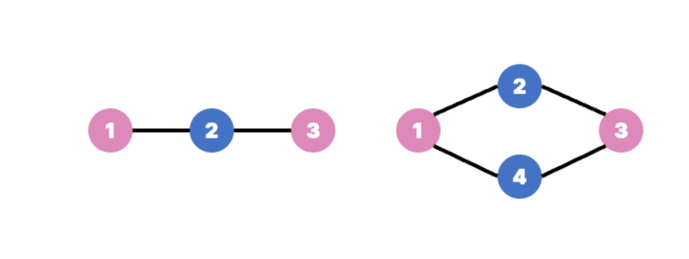
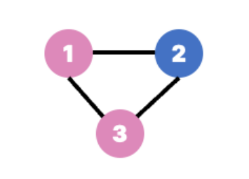

## 2주차 알고리즘 문제 풀이 및 키워드 정리  

* 2024 - 03 -30 (13일차) 

#### 최소 신장 트리   
* 신장 트리(Spanning Tree)  
    * 그래프 내의 모든 정점을 포함하는 트리  
    * 트리의 성질 -> n개의 노드에 n-1개의 엣지를 가짐  
    * 무방향 그래프에서 사용되며 하나의 그래프에는 많은 신장 트리가 존재할 수 있다.  
    * 신장트리는 트리의 특수한 형태이므로 모든 정점들이 연결되어 있어야 하고 사이클을 포함해서는 안된다.  

* 최소 신장 트리 (MST : Minimum Spanning Tree)  
    * 신장 트리 중에서 사용된 간선들의 가중치 합이 최소인 트리  
    * 가중치를 간선에 할당한 그래프에 있는 모든 정점들을 가장 적은 수의 간선과 비용으로 연결하는 것  
    * 간선의 가중치의 합이 최소여야하고, n개의 정점을 가지는 그래프에 대해 n-1개의 간선만을 사용해야 한다.  
    * 사이클이 포함되어서는 안된다.  

* 최소 신장 트리 구현 방법  
    * Kruskal MST 알고리즘   
        * 최소 비용 간선으로 구성되고 사이클을 포함하지 않음의 조건에 근거하여 각 단계에서 사이클을 이루지 않는 최소 비용 간선을 선택한다.  
        * 그래프의 간선들을 가중치의 오름차순으로 정렬한다.  
        * 정렬된 간선 리스트에서 순서대로 사이클을 형성하지 않는 간선을 선택한다.  
            * 가장 낮은 가중치를 먼저 선택  
            * 사이클을 형성하는 간선을 제외한다.  
        * 해당 간선을 현재의 MST집합에 추가한다.  
        * kruskal 알고리즘의 시간 복잡도는 정렬 알고리즘과 동일하다.    
 
    * Prim MST 알고리즘   
        * 시작 정점에서부터 출발하여 신장트리 집합을 단계적으로 확장 해나가는 방법   
        * 알고리즘 과정   
            * 시작 단계에서는 시작 정점만이 MST집합에 포함된다.  
            * 앞 단계에서 만들어진 MST집합에 인접한 정점들 중에서 최소 간선으로 연결된 정점을 선택하여 트리를 확장한다.  
                * 가장 낮은 가중치를 먼저 선택한다.  
            * 위의 과정을 트리가 (N-1)개의 간선을 가질 때까지 반복한다.  
    * prim 알고리즘과 kruskal 알고리즘 구현을 백준문제에서 학습해 보았다. 나중에 다시 참고해보자   
        * 1197번 [최소 스패닝 트리_prim](https://github.com/dongyeoppp/Jungle_TIL/blob/main/jungle_week02/bk_1197_prim.py) / [최소 스패닝 트리_kruskal](https://github.com/dongyeoppp/Jungle_TIL/blob/main/jungle_week02/bk_1197_kruskal.py)


#### 알고리즘 문제 풀이    
* BFS와 DFS   
    ```
    queue = deque()
    stack = []

    def bfs(graph,start,visited = []):
        for i in arr:
            i.sort()
        que = deque()  
        que.append(start)
        while que:
            removed = que.popleft()
            if removed not in visited:
                visited.append(removed)
                for i in graph[removed]:
                    if i not in que and i not in visited:       # 이 조건이 없을 경우 queue안에 데이터가 많이 싸이게 된다.
                        que.append(i)
        return visited

    def dfs(graph,start,visited=[]):
        for i in arr:
            i.sort(reverse=True)
        stack = [start]
        while stack:
            removed = stack.pop()
            if removed not in visited:
                visited.append(removed)
                for i in graph[removed]:            # bfs에 똑같은자리에 사용된 조건이 있을경우 오답을 출력한다. 지금은 조건이 없는 상태인데 stack에 들어왔던 데이터가 계속들어와 쌓이게된다.  
                    stack.append(i)
        return visited
    ```   
    * 위의 코드는 bfs와 dfs 함수 코드인데 bfs는 queue를 사용하고 dfs는 stack을 사용한다. 해당 코드에서 stack과 queue만 바꿔주었을 때도 코드가 동작하는지 확인해보았다.   
    * bfs의 코드를 가져와 dfs에서 사용했을 경우 (que를 스택으로 바꿈) visited 리스트는 정답으로 출력이 된다. 하지만 효율이 좋지 않음을 확인했다.  
    * Tip: e위의 코드에서 visitd리스트에 해당 인덱스가 있는지 확인할 경우 ```if removed not in visited:```를 사용하였는데 시간효율이 좋지 않았다. (0(n)의 복잡도)   
        * 시간복잡도를 줄이기 위해선 visited리스트를 ```visited[False] * (v+1)```로 초기화하여 한 이후 ```if not visited[removed]```로 사용하는것이 좋을 것 같다.   

* 이분 그래프    
    * 이분 그래프란 서로 인접하지 않은 두 그룹으로 나눌 수 있는 그래프  
    * 인접한 정점끼리 서로 다른 색을 칠해서 모든 정점을 두 가지 색으로만 칠할 수 있는 그래프   
    * 이분 그래프 특징   
        * bfs,dfs 알고리즘을 통해 이분 그래프가 맞는지 확인할 수 있다.  
        * 모든 정점을 방문하며 간선을 검사하기 때문에 시간복잡도는 O(V+E)로 그래프 탐색 알고리즘과 같다.  
        * 인접한 정점끼리는 같은 색으로 칠해질 수 없다.  서로 인접한 정점이 같은 색이면 이분 그래프가 아니다.   
    * 이분 그래프인 경우   
           

    * 이분 그래프가 아닌 경우  
           
        
    * 백준 문제를 통해 이분그래프에 대한 내용을 학습하였다. 나중에 다시 참고해보자   
    * 1707번 [이분 그래프](https://github.com/dongyeoppp/Jungle_TIL/blob/main/jungle_week02/bk_1707.py)  


* 1197번 / prim 알고리즘 사용 [최소 스패닝 트리](https://github.com/dongyeoppp/Jungle_TIL/blob/main/jungle_week02/bk_1197_prim.py) / kruskal 알고리즘 사용 [최소 스패닝 트리](https://github.com/dongyeoppp/Jungle_TIL/blob/main/jungle_week02/bk_1197_kruskal.py)  
* 2606번 [바이러스](https://github.com/dongyeoppp/Jungle_TIL/blob/main/jungle_week02/bk_2606.py)  
* 11725번 [트리의 부모 찾기](https://github.com/dongyeoppp/Jungle_TIL/blob/main/jungle_week02/bk_11725.py)    
* 1707번 [이분 그래프](https://github.com/dongyeoppp/Jungle_TIL/blob/main/jungle_week02/bk_1707.py)    
    


