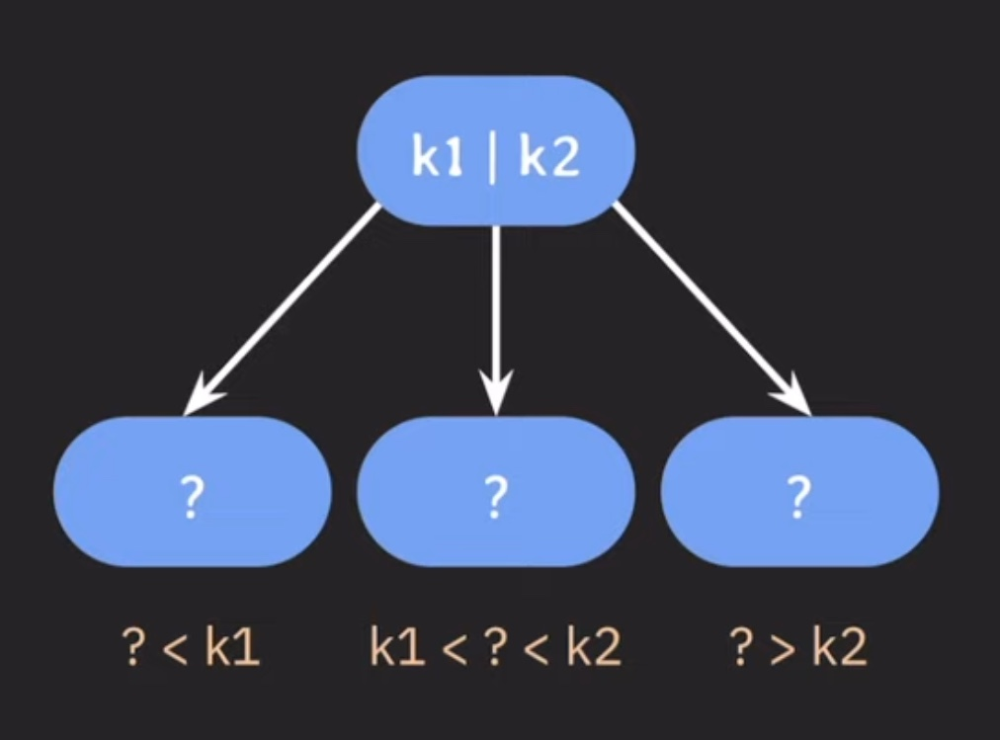
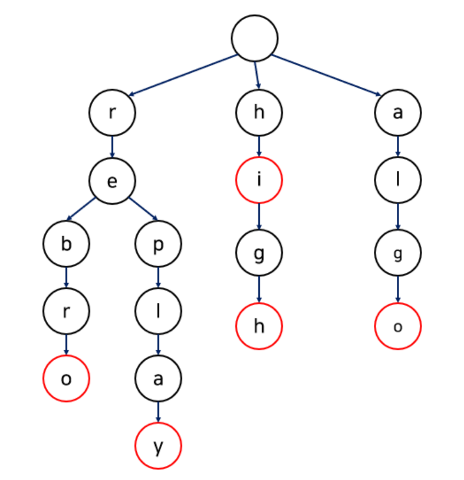

## 2주차 알고리즘 문제 풀이 및 키워드 정리  
* 2024 - 03 - 31 (14일차)    

#### B-Tree
* 이진 탐색 트리 (BST) 
    * 부모노드를 기준으로 왼쪽 자식노드에는 부모노드보다 작은값이, 오른쪽 자식노드에는 부모노드 보다 큰값이 들어가게 된다.  
    * B - Tree는 이진탐색트리를 일반화한 트리이다.  
    * 이진트리는 최악의 경우(하나의 부모가 두개의 자식밖에 갖지 못하고, 균형이 맞지 않는 경우) O(N)의 시간 복잡도를 가지지만 B-Tree의 경우 시간복잡도가 O(logN)이다.
* B-Tree
    * 데이터베이스와 파일 시스템에서 널리 사용되는 트리 자료구조의 일종으로, 이진 트리를 확장해 하나의 노드가 가질 수 있는 자식 노들의 최대 숫자가 2보다 큰 트리 구조이다.  
    * 자기 균형 트리 중 AVL트리, Red-Black트리는 모든 데이터를 메모리에 적재할 수 있는 경우에 적용함과 달리 B-Tree는 대용량 데이터를 다뤄야하는 DB나 디스트에 주로 적용된다.  
    * 이진 트리가 자식 노드가 최대 2개인 노드를 말하는 것이라면, B-Tree는 자식 노드의 개수가 2개이상인 트리를 말한다.  
    * 자녀 노드의 최대 개수를 늘리기 위해서 부모노드에 key를 하나 이상 저장한다.  
    * 부모 노드의 키는 오름차순으로 정렬되며 정렬된 순서에 따라 자녀 노드들의 key값의 범위가 결정된다.   
    * "각 노드의 최대 자녀 노드 수" = M 일 경우, 최대 M개의 자녀를 자질 수 있는 B-Tree를 M차 B-Tree라고 부른다.  
    * "각 노드의 최대 key수"는 M-1개가 된다.  
           

        * 위 그림과 같이 부모 노드에 k1,k2 두개의 키값이 주어져 있다면 k1보다 작은 값이 들어가는 노드, k1과 k2 사이 범위에 들어가는 노드, k2 보다 큰 값이 들어가는 노드와 같이 3개의 자식 노드가 필요하다. 그러므로 최대 key수는 M-1개가 된다.  
    * "각 노드의 최소 자녀 노드 수"는 M/2가 된다. (만약 M/2 값이 소숫점일 경우 무조건 올림해준다. M=3일경우 M/2 = 1.5 이므로 각 노드의 최소 자녀 노드 수는 2이다. 단, root node이거나 leaf node(자식이 없는 노드)의 경우는 제외한다.)   
    * "각 노드의 최소 key 수"는 M/2(올림)-1이고 root node일 경우는 제외된다.  
    * 부모 노드(root node)의 key수가 x개라면, 자녀 노드의 수는 언제나 x+1개이다.  

* B-Tree 삽입  
    * 추가는 항상 leaf 노드에 한다.  
    * 노드가 넘치면 가운데 key를 기준으로 좌우 key들은 분할하고 가운데 key는 승진한다.  
    * 모든 leaf node들은 같은 레벨에 있다.   
  
* B-Tree 데이터 삭제  
    * 삭제도 항상 leaf node에서 발생한다.  
    * 삭제 후 최소 key수(3차 b-tree의 경우 각 노드의 최소 key수는 1(m/2(올림)-1)개이다)보다 적어졌다면 재조정 한다.  
    * 데이터 삭제 후 최소 key보다 작아졌을 경우  
        1)  key 수가 여유있는 형제(부모가 같은 노드)의 지원을 받는다.  
            * 왼쪽 노드의 key값이 여유가 있다면(최소 key의 수보다 많을 경우 ) 왼쪽 노드의 가장 큰 키 값을 부모 노드로 옯기면서 원래 부모 노드에 있던 키값을 삭제된 데이터가 있던 노드로 옮겨준다.  
            * 왼쪽 노드의 key 값이 여유가 없을 경우 (최소 key의 수만큼 있을 경우) 오른쪽 노드의 가장 작은 key값을 부모노도로 올리고 그 자리에 있던 부모노드의 key 값을 현재 데이터가 삭제된 노드로 옮겨준다.  
        2) 형제노드(왼쪽 노드, 오른쪽노드)에 최소 키값의 수만큼만 데이터가 있을 경우에는 부모 노드에서 지원을 받는다.  
            * 부모노드에서 키값을 받고 형제노드와 합친다.(형제노드 중 왼쪽 노드와 합친다.)  
        3) 부모노드에서 자식노드로 값을 지원해준 이후 부모노드의 key값이 최소 key값보다 작아졌을 경우 
            * 부모노드가 root node가 아닐경우 그 위치에서 부터 다시 1번 과정부터 재조정을 시작한다.   
            * 부모노드가 root node이고 비어있을 경우, 부모노드를 삭제한다, 직전에 합쳐진 노드가 root 노드가 된다.  
    * 데이터는 항상 leaf node에서 삭제해야하므로 leaf node에 있지 않은 데이터를 삭제하고자 할때는 leaf node에 있는 데이터와 위치를 바꾼 이후에 삭제를 진행한다.  
        * 삭제하고자 하는 데이터와 leaf node에 있는 데이터에 위치를 바꾸어줄때 삭제할 데이터의 선임자(삭제하고자 하는 데이터보다 작은 데이터들 중 가장 큰 데이터)나 후임자(삭제하고자 하는 데이터보다 큰 데이터들 중 가장 작은 데이터)와 위치를 바꿔준다.  선임자나 후임자는 무조건 leaf node에 위치한다.  

* B-Tree 계열을 DB 인덱스로 사용하는 이유  
    * DB는 기본적으로 secondary storage에 저장된다.(secondary storage는 데이터 처리속도가 가장 느리다.)  
    * B-Tree index는 self-balancing BST에 비해 secondary storage 접근을 적게 한다. (secondary storage에 접근을 적게할수록 데이터 처리 속도가 빠르다.)  
    * B-Tree 노드는 block 단위의 저장 공간을 알차게 사용할 수 있다.   

#### 트라이(Trie)  
* Trie   
    * 문자열을 저장하고 효율적으로 탐색하기 위한 트리 형태의 자료구조이다.  
    * 숫자를 대상으로 이진탐색을 할 경우 시간복잡도가 O(log n)으로 짧지만, 문자열을 대상으로 이진탐색을 진행할 때 문자열의 최대 길이를 M이라고 할경우 시간복잡도는 O(M logn)으로 상당히 길어질 수 있다.  
    * trie 자료 구조를 통해 문자열을 탐색할 경우 빠르게 탐색이 가능하지만, 각 노드에서 자식들에 대한 포인터들을 배열로 모두 저장하고 있다는 점에서 저장공간의 크기가 크다.   
       
    * 각 노드에는 값으로 입력될 문자(=key), 문자열 종료를 알리는 flag(=data), 자식노드를 저장하는 데이터(=children) => 3가지 정보가 들어있다.  
    * head는 항상 빈 노드로 설정한다.   

#### 다익스트라
* 다익스트라   
    * 다익스트라 알고리즘은 그리디 알고리즘의 한 종류이지만, 다이나믹 프로그래밍과 유사한 문제 해결 방식을 사용한다. 
    * 특정한 하나의 정점에서 다른 모든 정점으로 가는 최단 경로를 알려준다.  
    * 현재까지 알고 있던 최단 경로를 계속해서 갱신하는 과정이다.    
        * 다이나믹 프로그래밍  
            * 하나의 큰 문제를 여러개의 작은 문제로 나누어서 그 결과를 저장하여 다시 큰 문제를 해결할 때 사용하는 알고리즘 설계기법이다.  
            * 문제의 해결에 있어서 이전에 계산한 값을 재활용하여 중복 계산을 피한다.   
            * 부분 문제의 최적해를 구할 수 있고, 이를 이용해 전체 문제의 최적해를 찾을 수 있다.  
        * 그리디 알고리즘   
            * 그리디 알고리즘은 선택의 순간마다 최적이라고 생각되는 것을 선택해 나가는 방식으로 진행하여 최종적인 해답에 도달한다.  
            * 그리디 알고리즘에서 각 선택의 시점에서 이루어지는 결정은 지역적으로 최적이지만, 그것들을 계속 수집하여 최종적인 해답을 만들었다고하여, 그것이 최적이라는 보장은 없다.  
    * 구체적인 동작 과정   
        1) 출발 노드를 설정한다.  
        2) 출발 노드를 기준으로 각 노드의 최소 비용을 저장한다.  
        3) 방문하지 않은 노드 중에서 가장 비용이 적은 노드를 선택한다.  
        4) 해당 노드를 거쳐서 특정한 노드로 가는 경우를 고려하여 최소 비용을 갱신한다.  
        5) 위 과정에서 3번 ~ 4번을 반복한다.  
    * 다익스트라 알고리즘 구현   
        * 노드 간 최소 비용을 갱신할 테이블 필요(해단 노드번호를 인덱스로 가짐)  
        * 인접행렬을 사용하여 간선에 표신된 가중치를 행렬값에 넣는다. 인접 리스트로도 구현 가능   
