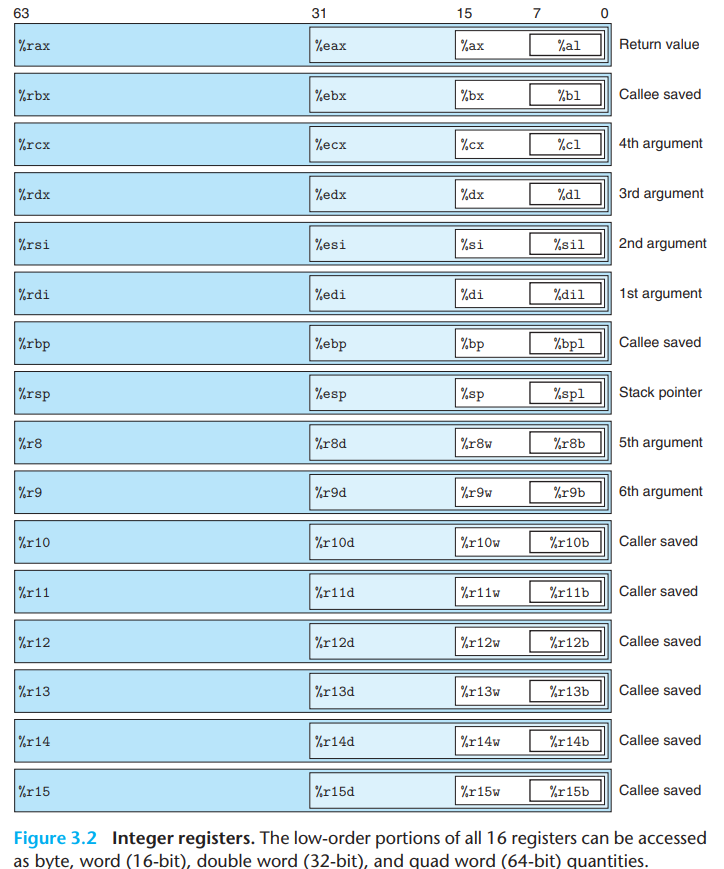
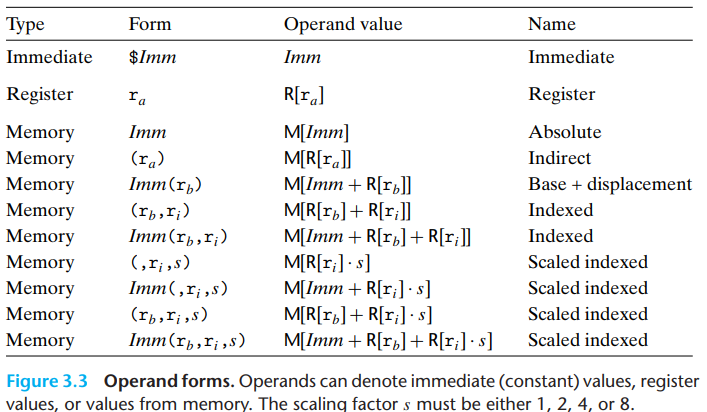
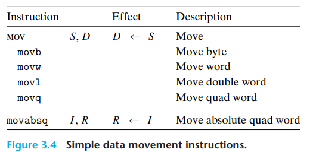
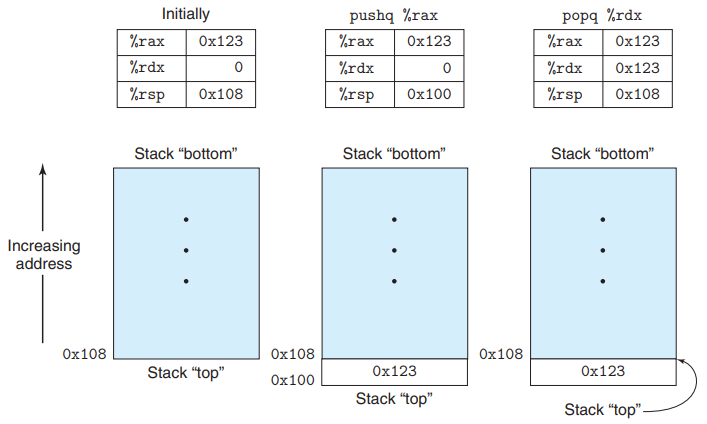

## Computer System(3.4장)

#### 3.4 정보 접근하기   
* 레지스터   
    * cpu 내부에 있는 고속 메모리 위치, 데이터를 저장하고 연산을 수행하는데 사용된다.  
    * cpu가 프로그램을 실행할 때 사용하는 매우 빠른 메모리 단위이다.  
    * 레지스터는 다양한 크기의 데이터를 저장한다.  
        * 바이트 수준 연산은 최하위 바이트에 접근하고, 16비트 연산은 최하위 2바이트에 접근하며, 32비트 연산은 최하위 4바이트에 접근하고, 64비트 연산은 레지스터 전체에 접근한다.  
    * 1,2,4,8 바이트 값을 복사하거나 생성하기 위한 여러 명령어를 소개할 것이고, 이러한 명령어들이 레지스터인 경우(+ 8비트보다 적은 값을 생성하는 경우) 레지스터의 남은 바이트에 대한 두가지 규칙이 존재한다.   
        1) 1바이트나 2바이트 값을 생성하는 경우 남은 바이트를 변경하지 않는 것이다.(즉, 레지스터의 나머지 부분은 그대로 유지된다.)   
        2) 4바이트 값을 생성하는 경우, 레지스터의 상위 4바이트를 0으로 설정하는 것이다. 4바이트 값이 생성되면 레지스터의 하위 4바이트는 그 값으로 설정되고, 상위 4바이트는 0으로 설정된다.  
        * 이 규칙은 IA32에서 x86-64로의 확장된 과정에서 채택된 것이다.   
    * 주요 레지스터는 스택 포인터인 '%rsp'이다.  
        * 실행 시 스택의 끝 위치를 나타내며 일부 명령어는 명시적으로 이 레지스터를 읽거나 쓸 수 있다.   
* 범용 레지스터  
    * 일반적으로 프로그램의 임시 데이터를 저장하거나 연산에 사용된다.   
* x86-64 주처리장치 cpu는 64비트 값을 저장할 수 있는 16개의 범용 레지스터를 보유한다.    
       

    * 레지스터의 발전  
        * %ax에서 %sp까지의 16비트 레지스터 -> %eax에서 %esp까지의 32비트 레지스터(IA32로 확장) -> 본래의 8개의 레지스터들은 %rax에서 %rsp까지 64비트로 확대되었다.(여기에 8개의 새로운 레지스터들이 추가되었고, %r8에서 %r15까지로 이름을 붙였다. x86-64로 확장.)   
 

* 오퍼랜드 식별자     
    * 오퍼랜드는 연산을 수행할 소스값과 그 결과를 저장할 대상 위치를 지정한다.   
* 오퍼랜드 종류 (피연산자 종류)    
    * 즉시(Immediate)   
        * 이 형식은 상수 값을 나타낸다.   
        * ATT형식 어셈블리 코드에서는 일반적인 C표기법을 사용하여 상수 값 뒤에 '$'를 붙여 나타낸다.   
        * 다양한 명령어들은 다양한 범위의 즉시 값들을 허용하며, 어셈블러는 값의 가장 간결한 인코딩 방식을 자동으로 선택한다.   
    * 레지스터(Register)   
        * 이 형식은 레지스터의 내용을 나타낸다.  
        * 64비트 연산에서는 레지스터의 하위 8,4,2 또는 1바이트의 일부분을 가리키는데 사용된다.   
    * 메모리 참조(Memory Reference)  
        * 이 형식은 계산된 주소에 따라 특정 메모리 위치에 액세스하는 것을 의미한다.   
       

 
        
* 데이터 이동 인스트럭션   
    * 데이터 이동 명령어는 컴퓨터에서 가장 자주 사용되는 명령어 중 하나이며, 한 위치에서 다른 위치로 데이터를 복사하는데 사용된다.  
    * "mov"클래스  
        * "movb","movw","movl","movq"와 같은 네 가지 명령어가 포함되어 있다.   
        * 위의 각각의 명령어는 데이터를 소스 위치에서 대상 위치로 복사하는데 사용되며, 변환 없이 단순한 데이터를 복사한다.   
        * 이들 명령어는 각각 1바이트, 2바이트, 4바이트, 8바이트의 다른 크기의 데이터를 다루는데 사용된다.   
           

    * 소스 오퍼랜드  
        * 즉시 값, 레지스터에 저장된 값, 또는 메모리에 저장된 값 중 하나를 나타낸다.  
        * 목적 오퍼랜드는 레지스터 또는 메모리 주소를 나타낸다.  
    * x86-64는 데이터 이동 인스트럭션에서 두 개의 오퍼랜드 모두가 메모리 위치에 올 수 없도록 제한한다. (메모리에서 메모리로 직접 복사하는 것은 불가능하다.)  
    * 하나의 메모리 위치에서 다른 위치로 어떤 값을 복사하기 위해서는 두 개의 인스트럭션이 필요하다.  
        * 소스 값을 레지스터에 적재하는 인스트럭션  
        * 레지스터의 값을 목적지에 쓰기 위한 인스트럭션  
    * mov 명령어는 대상 오퍼랜드가 가리키는 특정 레지스터 바이트 또는 메모리 위치만 업데이트한다. (movl의 경우 대상이 레지스터일때 해당 레지스터의 상위 4바이트를 0으로 설정한다.)    
    * 일반적인 movq 명령어는 32비트의 2의 보수 형태로 표현할 수 있는 즉시 소스 오퍼랜드만 가질 수 있다.  
    * movabsq 명령어는 소스오퍼랜드로 임의의 64비트 즉시 값을 가질 수 있으며, 대상으로 레지스터만 가질 수 있다.  
    * movz클래스의 명령어들은 대상의 나머지 바이트를 모두 0으로 채우고, movs클래스의 명령어들은 소스 오퍼랜드의 가장 유의미한 비트를 복제하여 대상의 나머지 바이트를 채운다.(각 명령어 이름은 오퍼랜드의 크기를 나타내는 크기 지정자를 가지며, 첫 번째는 소스 크기를 나타내고, 두 번째는 대상 크기를 나타낸다.)    
    * 명시적으로 4바이트 소스 값을 8바이트 대상으로 0으로 확장시키는 명령어인 movzlq가 없다. 논리적으로 movzlq가 될 수 있지만 이러한 인스트럭션은 존재하지 않는다. 대신 이러한 유형의 데이터 이동은 대상으로 레지스터를 가지는 movl 명령어를 사용하여 구현될 수 있다. (대상이 레지스터일때 4바이트 값을 생성하는 명령어가 상위 4바이트를 0으로 채운다는 특성을 활용한다.)   
    * 'cltq' 명령어는 피연산자가 없으며, 항상 레지스터 %eax를 소스로 사용하고 부호 확장된 결과를 대상으로 %rax를 사용한다. (movslq %eax, %rax와 정확히 동일한 효과를 가지지만 더 간결한 인코딩을 가진다.)    

    
   
* 어셈블리 코드 특징  
    * c에서 "포인터"라고 부르는 것은 단순히 주소이다. 포인터를 역참조하는 것은 해당 포인터를 레지스터에서 복사한 다음 이 레지스터를 메모리 참조에 사용하는 것을 의미한다.   
    * x와 같은 지역 변수는 종종 메모리 위치에 저장하는 대신 레지스터에 보관된다.(레지스터 접근은 메모리 접근보다 훨씬 빠르다.)    

* stack 데이터의 push와 pop   
    * x86-64에서 프로그램 스택은 메모리의 특정 영역에 위치한다.  
    * 스택 포인터 %rsp는 stack 맨 위 원소의 주소를 저장한다.  
    * 스택에 쿼드워드 값을 push하는 것은 먼저 스택 포인터를 8만큼 감소시키고 그런 다음 스택 맨 위 주소에 값을 쓴다.  
    * 쿼드워드를 pop하는 것은 스택 탑 위치에서의 읽기 작업 후에 스택 포인터를 8 증가시키는 것으로 구현된다. 그러므로 popq %rax 인스트럭션은 다음 한 쌍의 인스트럭션과 동일하다.   
       

    * 위의 그림의 세번째 열은 pushq 실행 직후에 popq %rdx 인스트럭션을 실행한 결과를 보여준다.     

