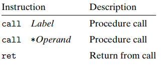

## Computer System(3.7장)   

### 3.7 프로시저   
* 프로시저 호출은 소프트웨어에서의 주요 추상화이다. 일부 기능을 구현하는 코드를 지정된 인수 집합과 선택적 반환 값과 함께 패키징하는 방법을 제공한다.    
* 프로시저는 다양한 프로그래밍 언어에서 다양한 형태로 나타나지만 (함수, 메서드, 서브루틴, 핸들러 등) 모두 일반적인 일련의 특징을 공유한다.  
* 프로시저에 대한 기계 수준의 지원을 제공할 때 처리해야할 다양한 특성이 존재한다. 
    * 프로시저 P가 프로시저 Q를 호출하고, Q가 실행되고 다시 P로 반환되는 상황으로 가정   
        1) 제어 전달   
            * 프로그램 카운터는 Q의 코드 시작 주소로 설정되어야 하며, 반환 시에는 Q 호출 이후 P의 명령으로 설정되어야 한다.  
        2) 데이터 전달   
            * P는 Q에 하나 이상의 매개변수를 제공할 수 있어야 하며, Q는 P에 값을 반환할 수 있어야한다.    
        3) 메모리 할당 및 해제   
            * Q는 시작할 때 로컬 변수에 공간을 할당해야 할 수 있으며, 반환하기 전에 해당 저장 공간을 해제해야 할 수 있다.   
* x86-64에서 프로시저의 구현은 특별한 명령어와 레지스터 및 프로그램 메모리와 같은 기계 자원을 사용하는 방법에 대한 규칙의 조합으로 이루어진다.   

#### 3.7.1 런타임 스택   
* c와 대부분의 다른 언어의 프로시저 호출 메커니즘의 주요 특징 중 하나는 스택 데이터 구조에서 제공되는 후입 선출 메모리 관리 규칙을 활용할 수 있다는 것이다.   
* 프로그램은 스택을 사용하여 프로시저에 필요한 저장 공간을 관리할 수 있으며, 여기에는 제어 및 데이터 전달을 위한 정보와 메모리 할당이 포함된다.  (p가 q를 호출할 때, 제어 및 데이터 정보가 스택 끝에 추가된다. 이 정보는 p가 반환될 때 할당 해제된다.)   
* x86-64 프로시저가 레지스터로는 보유할 수 없는 저장 공간이 필요한 경우 스택에 공간을 할당한다. 이 영역을 프로시저의 "스택 프레임"이라고 한다.   
    * 일반적인 스택 프레임의 구조   
            

        * 함수가 호출될 때 스택에는 함수의 "매개변수", 함수 호출이 끝난 뒤 돌아갈 "반환 주소값", 함수 내부 "지역 변수"가 저장된다. 
        * 현재 실행중인 프로시저의 프레임은 항상 스택의 맨 위에 있다.  
        * 프로시저 P가 프로시저 Q를 호출할 때, 프로그램이 Q의 반환 시점에 P에서의 실행을 재개해야 하는 위치를 나타내는 반환 주소를 스택에 PUSH 한다.   
        * 반환 주소를 P의 스택 프레임의 일부로 간주하며, 이는 P와 관련된 상태를 유지한다.  
        * Q의 코드는 현재 스택 경계를 확장하여 필요한 스택 프레임에 필요한 공간을 할당한다.  
    * 대부분의 프로시저의 스택 프레임은 프로시저의 시작 부분에서 할당되는 고정 크기이지만, 몇 가지 프로시저는 가변 크기의 프레임을 필요로 한다.   
    * 프로시저 P는 최대 여섯개의 정수 값을 스택에 전달할 수 있지만, Q가 더 많은 인수가 필요한 경우 이는 P에 의해 호출 전에 스택 프레임 내에 저장될 수 있다.   
* 사실 많은 함수가 스택 프레임이 필요하지 않을 수 있다.   
    * 모든 지역변수들을 레지스터에 보관할 수 있고, 이 함수가 다른 함수를 하나도 호출하지 않을 때 발생한다.   

#### 3.7.2 제어의 이동  
* 함수 P에서 함수 Q로 제어를 전달하는 것은 단순히 프로그램 카운터(PC)를 함수 Q의 코드가 시작하는 주소로 설정하는 것이다.  
* x86-64 머신에서는 인스트럭션 call Q로 프로시저 Q를 호출해서 기록한다. (주소 A를 스택에 푸시하고 PC를 Q의 시작부분으로 설정한다. 푸시된 주소 A는 리턴주소로 불린다.)    
* 이에 대응하는 인스트럭션 ret은 주소 A를 스택에서 팝해오고 PC를 A로 세팅한다.         
* call 명령은 호출되는 프로시저가 시작하는 명령 주소를 나타내며 call은 직접적일 수도 있고 간접적일 수도 있다. 어셈블리 코드에서 직접적 호출의 대상은 레이블로 제공되고, 간접적 호출의 대상은 '*'을 사용하여 호출한다.   
       

* call과 ret의 기능   
       

       

    * %rip : 명령어 포인터 레지스터, 현재 실행 중인 명령어의 주소(메모리 상의 위치)를 저장한다. 다음에 실행될 명령어의 위치를 결정하는데 사용된다.  
    * call의 효과는 리턴 주소 0x400568을 스택에 저장하고 0x400540에 위치한 함수 mulstore의 첫 번재 인스트럭션으로 점프한다.   
    * 함수 mulstore는 주소 0x40056d의 ret 인스트럭션을 만날 때까지 실행된다.  이 인스트럭션은 스택에서 0x400568을 pop해서 이 주소로 점프한 후에 call 인스트럭션 바로 다음의 main의 실행을 재개한다.   

    * 프로시저 콜과 리턴에 연관된 프로그램의 상세한 실행   
            

        * %rdi : 함수 호출 시 첫 번째 인수를 전달하는데 사용된다. 주로 함수에 전달되는 인수가 이 레지스터에 저장된다.   
        * %rax : 레지스터는 함수의 반환 값을 저장하는데 사용된다. 함수가 실행을 완료하고 반환할 때, 이 레지스터에 저장된 값을 호출하는 코드로 반환한다.  
        * %rsp : 스택에 top에 있는 요소의 주소를 가르킨다. (스택의 최상위를 가리키는 포인터 역할을 한다.) -> 스택에 값을 푸시할 때 스택포인터를 데이터의 크기에 따라 감소시키고, 팝할 경우 8만큼 스택 포인터를 데이터의 크기에 따라 증가시킨다.(쿼드 워드를 푸시하거나 팝할 경우 스택포인터를 8만큼 감소 , 증가 시킨다.) / (byte : 8bit(1byte), word : 2byte, doubleword : 4byte, quadword : 8byte// 아키텍처에 따라 달라질 수 있다.) 
        * *%rsp : %rsp 레지스터가 가리키는 주소에 저장된 값을 의미한다.   

#### 3.7.3 데이터 전송   
* 인자 전달  
    * x86-64에서 대부분의 경우 프로시저 간 데이터 전달은 레지스터를 통해 이루어진다. 함수가 호출될 때, 인자는 주로 레지스터 %rdi,%rsi등에 전달된다. (함수 P가 함수 Q를 호출할 때, P의 코드는 먼저 인자를 적절한 레지스터에 복사해야한다.)        
* 값 반환  
    * 프로시저가 반환될 때, 반환 값은 보통 레지스터 %rax에 저장된다. 함수 Q가 함수 P로 반환될 때, P의 코드는 레지스터 %rax에서 반환값을 가져올 수 있다.  
* 레지스터 사용    
    * x86-64에서는 최대 6개의 정수 인자를 레지스터를 통해 전달할 수 있다. 이때 레지스터 이름은 전달되는 데이터 유형의 크기에 따라 결정된다. 만약 함수가 6개 이상의 인자를 가지고 있는 경우, 나머지 인자들은 스택에 전달된다.  
* 인자가 스택에 전달되는 경우   
    * 인자가 레지스터로 전달되지 못할 경우, 나머지 인자는 스택에 전달된다. 이때 스택에 전달되는 모든 데이터 크기는 8의 배수로 반올림된다. (메모리를 정렬하여 메모리를 절약하기 위함. 많은 시스템에서 데이터의 액세스 속도를 향상시키기 위해 데이터를 메모리에서 읽거나 쓸 때 특정한 크기로 정렬된 메모리 주소를 사용하는데, 이를 위해 데이터가 정렬된 크기의 배수로 배치되어 있어야 한다.)  
* 함수 인자 전달을 위한 레지스터(레지스터들은 인자 크기에 따라 이름이 붙여지며, 특성 순서로 이용된다.)            
        

#### 3.7.4 스택에서의 지역저장공간  
* 지역 데이터가 메모리에 저장되어야 하는 경우   
    1) 지역 데이터 모두를 저장하기에는 레지스터 수가 부족할 경우    
    2) 지역 변수에 연산자 '&'가 사용되었으며, 이 변수의 주소를 생성할 수 있어야 한다. (&연산자가 있을 경우 레지스터의 수가 부족하지 않아도 스택(메모리)에 저장된다.)
    3) 일부 지역변수들이 배열 또는 구조체여서 이들이 배열이나 구조체 참조로 접근되어야 한다. 우리는 배열과 구조체가 어떻게 할당되는지 설명할 때, 이 가능성에 대해 다뤄야 한다. (배열이나 구조체의 요소에 접근하려면 포인터를 프로시저에 전달해야 할 필요가 있다.)     
* 호출하는 코드에 주소연산자가 있기 때문에 스택 프레임을 할당 해야한다.   
    

* 주소 연산작가 스택에 먼저 들어간다. 
* 스택에서 할당된 메모리 크기는 데이터의 크기에 상관없이 일반적으로 일정하다. (일정한 크기의 스택 프레임이 사용된다.)

#### 3.7.5 레지스터를 이용하는 지역저장소   
* 프로그램 레지스터들은 모든 프로시저들이 공유하는 단일 자원의 역할을 한다.   
* 한 번에 하나의 프로시저만 활성화될 수 있지만 호출자(caller) 프로시저가 피호출자(callee)프로시저를 호출할 때, 피호출자가 호출자가 나중에 사용할 레지스터 값을 덮어쓰지 않도록 해야 한다.  
* ```%rbx```,```%rbp``` 및 ```%r12```-```%r15``` 레지스터는 callee-saved 레지스터로 분류된다. 프로시저 P가 프로시저 Q를 호출할 때, Q는 Q가 P로 리턴될 때 Q가 호출되었을 때의 값들과 동일하도록 보장할 수 있게 이 레지스터의 값들을 보존해야 한다.(Q는 이 값을 전혀 변경하지 않거나 원래의 값을 스택에 푸시해두고 이 값을 변경하며, 리턴하기 전에 스택에서 이전 값을 팝해오는 방식을 레지스터를 보존한다.)   
* 나머지 스택 포인터 ```%rsp```를 제외한 모든 레지스터는 caller-saved 레지스터로 분류된다.   

#### 3.7.6 재귀 프로시저   
* 함수를 재귀적으로 호출하는 것도 다른 함수의 호출과 마찬가지로 진행된다. 스택 기법을 사용해서 함수의 각 호출 시에 상태정보(리턴 위치의 저장된 값, 피호출자-저장 레지스터)를 위한 자신만의 개별적 저장 공간을 제공한다.  
* 표준 프로시저 처리방식은 재귀적 함수를 구현하기에 충분하다.  


  


 


