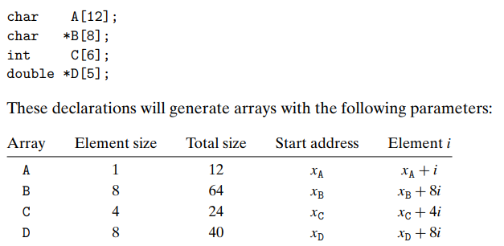

## Computer System(3.8장)   

### 3.8 배열의 할당과 접근   
* 스칼라 데이터 : 크기와 방향을 제외한 단일 값으로 이루어진 데이터 (정수,부동 소수점 숫자, 문자 등)   
* c의 특이한 점은 배열 원소들에 대한 포인터를 만들고 이들 포인터 간에 연산을 할 수 있다는 점이다.   

#### 3.8.1 기본 원리   
* 자료형과 정수형 상수에 대한 선언      
        

* 포인터 배열의 원소는 8바이트이다.  

#### 3.8.2 포인터 연산   
* C에서는 포인터에 대한 산술 연산이 가능하며 연산된 값은 해당 포인터가 참조하는 데이터 타입의 크기에 따라 스케일링 된다.   
* 단항 연산자 '&'과 '*'은 포인터를 생성하고 간접 참조하는데 사용된다.   
* 어떤 객체를 나타내는 식 Expr에 대해 &Expr는 그 객체의 주소를 주는 포인터, 주소를 나타내는 식 AExpr에 대해 *AExpr는 그 주소에 위치한 값을 준다.  (따라서 Expr 과 *&Expr는 동일하다.)
* 배열 참조 A[i]는 표현식 *(A+i)와 동일하다.    

#### 3.8.3 다중 배열  
* 다차원 배열 생성 참조   
    * ```int A[5][3];``` : ```typedef int row3_t[3];```으로 선언된 배열과 동일하며 여기서 데이터 타입 row3_t는 세개의 정수로 이루어진 배열이다.   
    * 배열 A는 이러한 요소가 5개 들어있으며 각각은 세개의 정수를 저장하는데 12바이트가 필요하므로 총 배열의 크기는 4 * 5 * 3 = 60바이트이다.   
    * 배열 A는 이차원 배열로써 배열 요소는 메모리에 "행 우선" 순서로 저장된다.  

#### 3.8.4 고정 크기의 배열   
#### 3.8.5 가변 크기의 배열   
* 배열의 크기를 컴파일 타임에 정하지 않고 실행 타임에 정할 수 있도록 하는 기능이다.  
* 가변크기 배열을 참조하기 위해서는 고정크기 배열의 결과를 약간만 일반화하면 된다.   
