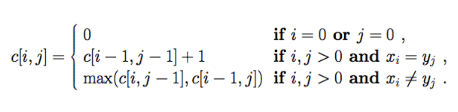
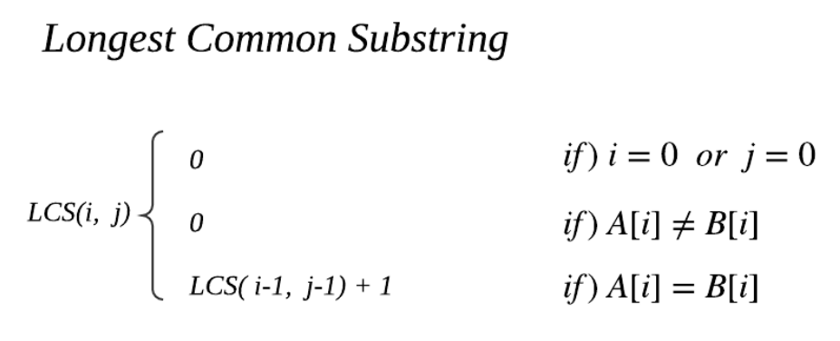

## 3주차 알고리즘 키워드 정리 및 문제풀이

* 2024 - 04 -05 (19일차)   

#### 다이나믹 프로그래밍  
* 다이나믹 프로그래밍 (DP)
    * 하나의 문제를 단 한번만 풀도록 하는 알고리즘   
    * 이미 해결한 문제를 반복적으로 해결하는 비효율성을 막기 위해 사용한다.  
    * 큰 문제를 작은 문제로 나눌 수 있으며 작은 문제의 답을 모아서 큰 문제를 해결해야 하는 경우와 동일한 작은 문제를 반복적으로 해결해야 하는 경우 DP를 사용할 수 있다. 
        * 다이나믹 프로그래밍 기법을 적용시키기 위한 조건  
            1) 최적 부분 구조 : 큰 문제를 작은 문제로 나눌 수 있으며, 작은 문제의 답을 모아서 큰 문제를 해결한다.  
            2) 중복 되는 부분 문제 : 동일한 작은 문제를 반복적으로 해결한다.  
    * 크고 어려운 문제가 있으면 그것을 먼저 잘게 나누어서 해결한 뒤에 처리하여 나중에 전체의 답을 구하는 것이다. ('메모제이션'이 사용된다는 점에서 분할정복과 다르다.)   
        * 이미 계산한 결과는 배열에 저장함으로써 나중에 동일한 계산을 해야 할 때는 저장된 값을 단순히 반환하기만 하면 된다.  
        * 메모제이션  
            * 컴퓨터 프로그램이 동일한 계산을 반복적으로 해야 할때, 이전에 계산한 값을 메모리에 저장하여 중복적인 계산을 제거하여 전체적인 실행 속도를 빠르게 해주는 기법이다.  
            * 다이나믹 프로그래밍에 핵심이 되는 기술이다.   
    * ex) 피보나치 수열  
        * 재귀적으로 함수를 호출하는 경우  
            ```
            def fibo(x):
                if x == 1 or x == 2:
                    return 1
                return fibo(x-1) + fibo(x-2)
            ```  
            * 중복된 값을 여러번 계산하여 계산 횟수가 두배씩 증가하기 때문에 시간복잡도는 O(2**n)을 가진다.   
        * DP알고리즘을 적용한 경우   
            ```
            dp = [0] * 100      # 한번 계산한 값을 저장하는 리스트  
            def fibo(x):
                if x == 1 or x == 2:
                    return 1  
                if dp[x] != 0:      # dp에 값이 들어있을 경우   
                    return dp[x]
                dp[x] = fibo(x-1) + fibo(x-2)
                return dp[x]
            ```   
            * n번의 연산만 수행하면 되기 때문에 시간복잡도는 O(n)이다.  
    * DP 알고리즘 문제를 풀기위해선 규칙을 찾고 점화식을 세우는 것이 중요하다.   

#### 그리디 알고리즘  
* 그리디(Greedy) 알고리즘  
    * 당장 눈 앞에 보이는 최적의 상황만을 쫓는 알고리즘  
    * 항상 최적의 결과를 도출하는 것은 아니지만 어느 정도 최적의 해에 근사한 값을 빠르게 구할 수 있다. (특정 경우에는 최적의 해를 보장하는 경우도 있다. ex)거스름 돈 문제, 가장 적은 양의 화폐를 주는 것 이 편함)  
    * 최적의 해를 보장하지 못하므로 DP등의 기타 알고리즘 기법을 적용해야 할 수 있다.  
    * 무조건 큰 경우대로, 무조건 작은 경우대로, 무조건 긴 경우대로, 무조건 짧은 경우대로 등으로 극단적으로 문제에 접근한다.(정렬 기법이 함께 사용되는 경우가 많다. -> 크루스칼 알고리즘: 모든 간선을 정렬한 이후에 짧은 간선부터 연결하는 최소 비용 신장 트리 알고리즘)   

#### LCS   
* Longest Common Subsequence  
    * 2개 이상의 문자열에서 공통으로 나타나는 부분 문자열 중 가장 긴 문자열을 의미한다. (부분 문자열이란 다른 문자열에서 몇몇 문자가 빠져있어도(연속되지 않아도) 순서는 바뀌지 않은 문자열을 말한다.)  
    * 점화식  
        
* Longest Common Substring   
    * 부분 수열(subsequence)과 같이 부분 문자열 중 가장 긴 문자열을 의미하지만 공통으로 나타나는 부분 문자열이 반드시 연결된 형태여야한다.   
    * 점화식  
        

#### Knapsack problem  
* knapsack problem 
    * 배낭 문제는 n개의 물건과 각 물건 무게 weight와 가치 value가 주어지고, 배낭의 용량이 k일때, 배낭 용량을 초과하지 않고 담을 수 있는 물건의 최대 가치를 찾는 문제이다. (각 물건을 하나씩만 존재한다고 가정한다.)
    * 선택된 item의 크기 합이 배낭 무게보다 작으면서 선택된 item의 가치의 합이 최대가 되어야한다.   
    * Fraction Knapsack Problem   
        * item 분할 가능   
        * 가성비가 제일 좋은 item부터 선택 (greedy 조건)   
        * 항상 올바른 해를 찾는다.  
    * 0-1 KnapSack Problem    
        * item 분할 불가  
        * greedy 알고리즘이 항상 올바른 해를 찾지 못한다.  
    * 0-1 KnapSack solution은 Fraction Knapsack solution으로 바꿀 수 있지만 Fraction Knapsack solution은 0-1 KnapSack solution 으로 바꿀 수 없다.   
    * 가방에 선택해서 넣을 수 있는 가치의 합은 Fraction Knapsack solution이 0-1 KnapSack solution보다 같거나 크다.   

#### 문제풀이  
* 2748번 [피보나치 수 2](https://github.com/dongyeoppp/Jungle_TIL/blob/main/jungle_week03/bk_2748.py)   
* 1904번 [01타일](https://github.com/dongyeoppp/Jungle_TIL/blob/main/jungle_week03/bk_1904.py)   
* 9084번 [동전](https://github.com/dongyeoppp/Jungle_TIL/blob/main/jungle_week03/bk_9084.py)   
* 11047번 [동전 0](https://github.com/dongyeoppp/Jungle_TIL/blob/main/jungle_week03/bk_11047.py)  

 


    
