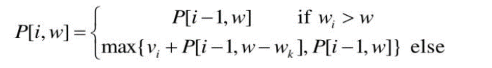
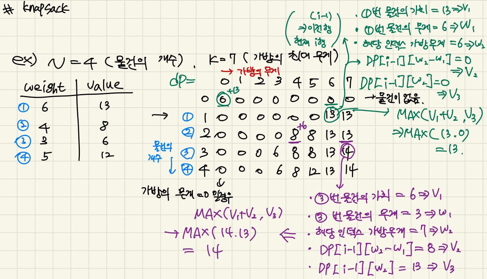

## 3주차 알고리즘 키워드 정리 및 문제풀이  + cs 개념 

* 2024 - 04 -06 (20일차)   

#### 분할 정복과 DP   
* 분할 정복  
    * 문제를 나눌 수 없을 때까지 나누어서 각각 풀면서 다시 합병하여 문제의 답을 얻는 알고리즘  
* 분할 정복과 DP의 공통점  
    * 두 기법 모두 문제를 더 작은 부분 문제로 나누어서 해결한다.  
    * 문제를 재귀적으로 해결할 수 있다.  
    * 큰 문제의 최적 해결 방법이 작은 부분 문제의 최적 해결 방법을 활용하는 구조를 가진다.  
* 분할 정복과 DP의 차이점   
    * DP는 부분 문제가 중복되어 상위 무제 해결 시에 재활용되고, 분할 정복은 부분 문제가 중복되지 않는다.   
    * 다이나믹 프로그래밍(DP)은 부분 문제의 중복 계산을 피하기 위해 해결된 부분 문제의 결과를 저장히지만 분할 정복은 해결된 부분 문제를 저장하지 않고 독립적으로 해결한다.   

#### knapsack   
* 점화식   
       

* 예제를 통해 db테이블 만들기   
       

#### 포인터(pointer), & 연산자와 * 연산자   
* 포인터   
    * 포인터는 특정 데이터가 저장된 메모리의 주소를 저장하는 변수라고 할 수 있다.   
    * *연산자   
        * 포인터 변수를 선언한다.   
    * 포인터를 사용하면 해당 함수 뿐만아니라 메인 함수에서도 어떠한 변수가 가지는 값을 변경할 수 있다.   
* & 연산자  
    * 특정한 변수의 주소를 의미한다.  
#### Computer System(3.4)
* ComputerSystem 책을 참고하여 정리하였다. [cs_week03_1](https://github.com/dongyeoppp/Jungle_TIL/blob/main/jungle_week03/ComputerSystem1.md)

#### 문제 풀이   
* 1541번 [잃어버린 괄호](https://github.com/dongyeoppp/Jungle_TIL/blob/main/jungle_week03/bk_1541.py)   
* 9251번 [LCS](https://github.com/dongyeoppp/Jungle_TIL/blob/main/jungle_week03/bk_9251.py)  
* 12865번 [아주 평범한 배낭](https://github.com/dongyeoppp/Jungle_TIL/blob/main/jungle_week03/bk_12865.py)   
