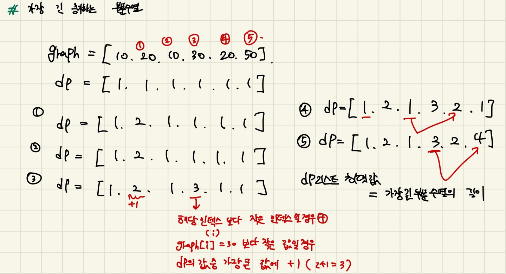

## 알고리즘 문제 풀이   

* 2024 - 04 -10 (24일차)   

* 11053번 [가장 긴 증가하는 부분 수열](https://github.com/dongyeoppp/Jungle_TIL/blob/main/jungle_week03/bk_11053.py)   
* dp 알고리즘을 사용해 문제를 해결하였다.  
        

* 1946번 [신입 사원](https://github.com/dongyeoppp/Jungle_TIL/blob/main/jungle_week03/bk_1946.py)   
* 1700번 [멀티탭 스케줄링](https://github.com/dongyeoppp/Jungle_TIL/blob/main/jungle_week03/bk_1700.py)    

