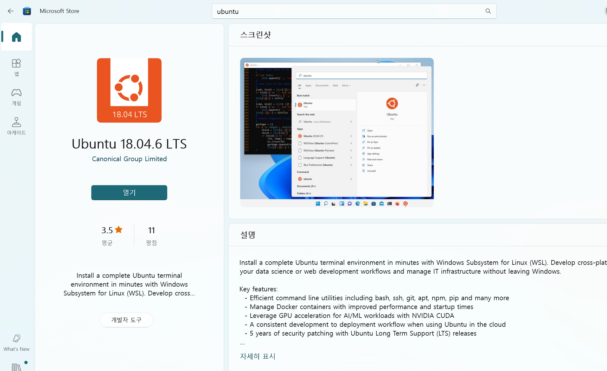
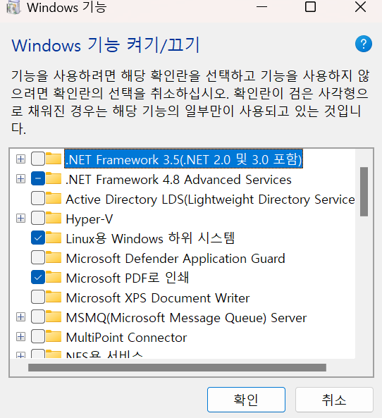
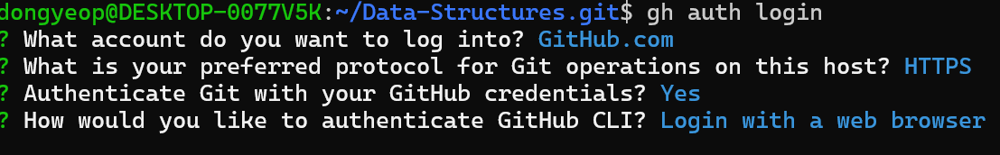
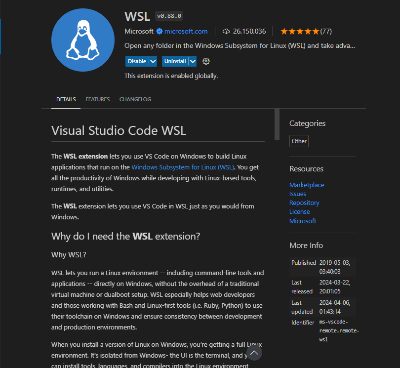
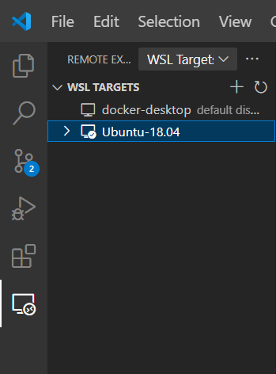
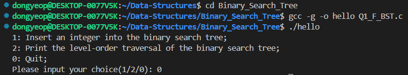

## c 개발 환경 설정 

* 2024 - 04 -10 (24일차)   

#### Linux , Ubuntu  
* unix : 대부분의 현대적 컴퓨터 운영체제의 원형이 된 운영체제, 대부분 고급 언어인 c 언어로 쓰여져 있고, 소스코드를 쉽게 구할 수 있어 다른 컴퓨터 하드웨어나 새로운 기종에 쉽게 이식할 수 있다.  
* 리눅스(Linux)   
    * unix 기반의 운영체제 (리눅스 커널을 사용), 리눅스는 무료이며 오픈 소스   
    * 리눅스는 사용자가 프로그램을 실행하고 코드를 변경하며 수정된 사본을 재배포할 수 있다. (누구나 무료로 다운로드하여 배포 가능)  
* ubuntu    
    * 리눅스 커널을 기반으로 하는 운영체제 시스템을 리눅스 배포판(리눅스에서 작동하는 여러 종류의 프로그램을 꾸러미 하나로 모아놓은 것)이라함. 그 배포판 중 하나가 ubuntu 이다.   

#### ubuntu 설치 (window)
* ubuntu 18.04 개발 환경 설치   
    * microsoft store에서 ubuntu 18.04 설치하기    
            

        * 터미널에서 ubuntu 에러 발생할 경우   
            * 설정 > windows기능 켜기/끄기 > Linux용 windows 하위 시스템 체크박스 표시    
                    

    * ubuntu 터미널에 개발 환경 설치   
        ```
        $ sudo apt update                         # package list update
        $ sudo apt upgrade                        # upgrade packages
        $ sudo apt install gcc make valgrind gdb  # gcc, make 등 개발 환경 설치
        $ sudo apt install gcc-multilib           # 32-bit lib , 64 bit linux에서 32bit compile을 할 수 있도록 도와주는 라이브러리  
        ```   
    * github 토큰 관리를 위한 gh 설치  (리눅스에 github cli 설치)
        ```
        $ curl -fsSL https://cli.github.com/packages/githubcli-archive-keyring.gpg | sudo dd of=/usr/share/keyrings/githubcli-archive-keyring.gpg

        $ echo "deb [arch=$(dpkg --print-architecture) signed-by=/usr/share/keyrings/githubcli-archive-keyring.gpg] https://cli.github.com/packages stable main" | sudo tee /etc/apt/sources.list.d/github-cli.list > /dev/null

        $ sudo apt update
        $ sudo apt install gh

        ```   
    * ```gh auth login``` : access token을 생성(gh 초기 인증) 
           

        * 이후 웹 브라우저에 터미널에 나온 one-time code를 입력   
    
    * WSL install   
        * WSL(Windows Subsystem for Linux) : 기존의 가상 머신이나 듀얼 뷰팅 없이 대부분의 Linux 명령줄 도구, 유틸리티 및 애플리케이션을 window에서 실행할 수 있게 해주는 도구   
        * Windows에서 VS Code를 사용하여 wsl에서 실행되는 Linux 애플리케이션을 빌드할 수 있게 한다.    
           

          

    * gcc 컴파일 하기  
        * 컴파일 : 코드를 컴퓨터가 알아들을 수 있도록 기계어로 변환한다.  
        * gcc : GNU 컴파일러 모음(GNU는 운영 체제의 하나이자 컴퓨터 소프트웨어의 모음집이다.)
        * ```$ gcc -g -o <실행파일명> <소스파일명>```    
           


