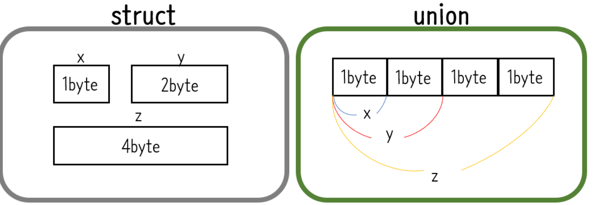

## 4주차 공부 키워드 정리 

* 2024 - 04 -12 (26일차)   

#### 가상화   
* 서버, 스토리지, 네트워크 및 기타 물리적 시스템에 대한 가상 표현을 생성하는데 사용할 수 있는 기술이다.   
* 단일 컴퓨터의 하드웨어 요소를 일반적으로 가상머신(VM:virtual machine)이라고 하는 다수의 가상 컴퓨터로 분할할 수 있도록 해주는 기술이다. (하나의 컴퓨터를 여러 컴퓨터로 분할해주는 기술)    
* 가상화를 사용하면 재부팅하지 않고도 동일한 서버에서 서로 다른 운영 체제 간에 전환할 수 있다.    
    * 운영체제 : 시스템 하드웨어 자원과 소프트웨어 자원을 운영 관리하는 프로그램 (Window,Linux,MacOS,Android...)   
* HVM(Hardware Virtual Machine)   
    * 하드웨어에서 직접 가상화를 지원   
    * 직접 guest-OS가 하드웨어와 통신 => 빠른 속도   
* AWS 클라우드 환경에서 리소스를 작은 단위로 빠르게 구성할 수 있는 원동력이 가상화이다.  
* AWS에서는 사용자마다 컴퓨터를 할당해주는 것이 아닌 이미 구축된 가상화 가능한 서버의 한 부분을 할당해주는 것이다.    

#### 동적 메모리 할당  
* 정적 메모리 할당(Static Memory Allocation)   
    * 프로그램을 작성하는 단계에서 필요한 기억공간의 크기를 결정하는 것   
    * 데이터를 저장할 변수를 선언해놓고 사용한다. (변수, 포인터, 구조체, 배열 등)
    * 정적 메모리 할당 선언   
        ```
        char arr[10];   # char 자료형 10개 선언  
        ```
* 동적 메모리 할당(Dynamic Memory Allocation)    
    * 입력되는 데이터에 맞게 기억공간을 확보 하는 것    
    * 프로그램이 시작된 후 필요에 따라 그때 그때 메모리를 할당하고 저장하는 것   
    * 동적 메모리의 사용이 끝나면 반드시 해당 메모리 영역을 명시적으로 반납해주어야 한다.   

* 동적 메모리 할당을 사용하는 이유   
    * 정적 메모리 할당의 경우 메모리를 낭비하는 경우를 초래할 수 있다. (위의 arr에 3글자만 넣었을 경우 나머지 7byte의 메모리 공간이 낭비된다.)   
    * 메모리의 낭비를 최소화하기 위해 프로그램의 실행중에 입력되는 데이터에 맞게 기억공간을 할당할 필요가 있다.    

#### malloc, calloc, realloc, free   
* malloc    
    * 동적으로 메모리를 할당  
        ```
        #include <stdlib.h>  
        ptr = (int*) malloc(n * sizeof(int));   # 앞 뒤 자료형 맞춰야한다. n = 할당할 int형 요소의 개수    
        ```    
    * 할당하고자 하는 메모리의 크기를 바이트 단위로 전달하면 그 크기만큼 메모리를 할당한다. (핟당한 메모리의 주소(첫 번째 바이트의주소)를 리턴)  
    * 메모리 할당에 실패하면 null 리턴   
    * 할당된 메모리는 초기화되지 않는다.   
* calloc
    * malloc과 같은 기능을 가지고 있지만, 할당된 메모리를 모두 0으로 초기화 한다.  
        ```
        #include <stdlib.h>  
        ptr = (int*) calloc(n,sizeof(int));     # n = 할당할 int형 요소의 개수  
        ```    
    * malloc과의 차이점  
        * malloc은 할당된 공간의 값을 바꾸지 않는다.  
        * calloc은 할당된 공간의 값을 모두 0으로 바꾼다. 배열을 할당하고 모두 0으로 초기화할 필요가 있을 경우에는 calloc을 쓰면 편하다.     
* realloc   
    * 이미 할당한 공간의 크기를 바꿀 때 realloc 사용   
        ```
        #include <stdlib.h>
        int n = 5;
        ptr = (int*)malloc(n * sizeof(int));        # 초기 메모리 할당   

        n = 10;
        prt = (int*)realloc(ptr, n * sizeof(int));      # 기존에 할당된 메모리의 크기를 재조정  

        ```
* free  
    * 할당된 메모리를 해제   
    * 메모리를 할당한 이후 해제해 주지 않는다면, 메모리 부족 현상이 발생할 수 있다.  
    * 할당된 메모리가 더 이상 필요하지 않을경우 free를 이용하여 메모리를 해제시켜야한다.    
        ```
        #include <stdlib.h>  
        ptr = (int*) malloc(n * sizeof(int));   # 메모리 할당

        free(ptr);       # free함수를 이용하여 메모리 해제  
        ```   
#### call by value, call by reference   
* call by value (값에 의한 호출) 
    * 함수가 인수로 전달받은 값을 복사하여 처리하는 방식이다.   
    * 변수가 가진 값을 복사하여 전달하므로 함수 내에서 값을 변경해도 원본 값은 변경되지 않는다. 값의 불변성을 유지하는데 용이하다.   
        ```
        #include <stdio.h>
        void swap(int x, int y){
            int temp = x;
            x = y;
            y = temp;
        }
        int main(void){
            int a = 10;
            int b = 20;
            swap(a,b);        
            printf("%d,%d",a,b);    // 10, 20 출력
        }
        ```   
        * 장점 : 복사하여 처리하기 때문에 안전하다.(원래의 값이 보존된다.)   
        * 단점 : 복사를 하기 때문에 메모리 사용량이 늘어난다.  

* call by reference (참조에 의한 호출)    
    * 함수 내에서 인자로 전달된 변수의 값을 변경하면, 호출한 쪽에서도 해당 변수의 값이 변경된다.  
    * 인자로 전달되는 값이 변수의 주소이므로, 함수 내에서 변수의 값을 변경하면 해당 주소에 저장된 값이 변경된다.   
        ```
        #include <stdio.h>
        void swap(int *x, int *y){
            int temp = *x;
            *x = *y;
            *y = temp;
        }
        int main(void){
            int a = 10;
            int b = 20;
            swap(&a,&b);        
            printf("%d,%d",a,b);    // 20, 10 출력
        }
        ```      
        * 장점 : 복사하지 않고 직접 참조를 하기에 빠르다.  
        * 단점 : 직접 참조를 하기에 원래 값이 영향을 받는다.  

#### extern, static   
* extern 변수     
    * 다른 파일에 정의된 전역 변수를 참조할 때 사용된다.   
    * 다른 파일에 정의된 변수를 참조해야 할 때 extern 키워드를 사용하여 해당 변수를 선언한다.   
    * extern 변수는 선언만 해주고, 실제 메모리 공간은 변수가 정의된 파일에서 할당된다.   
        ```
        extern int globalVariable;      # 다른 파일에 정의된 전역 변수 globalVariable를 참조 할 수 있음   
        ```

* static 변수  
    * 특정 파일 내에서만 사용 가능한 지역 변수   
    * static 변수는 전역 변수처럼 프로그램이 실행될 때 생성되지만, static 변수는 해당 파일 내에서만 접근 가능하며 다른 파일에서는 참조할 수 없다.  
        ```
        static int count;       # 해당 파일 내에서만 접근 가능한 static 변수 count 선언   
        ```

* extern 변수와 static 변수의 차이점  
    * extern 변수는 다른 파일에서 정의된 전역 변수를 참조 할 때 사용하며, static 변수는 해당 파일 내에서만 접근 가능하다.  
    * extern 변수는 변수가 정의된 파일에서 할당된 메모리를 참조하며, static 변수는 프로그램이 실행될 때 생성되고 프로그램이 종료될 때 소멸 된다.  

#### struct, union, enum   
* 구조체(struct)   
    * 사용자가 c언어의 기본 타입을 가지고 새롭게 정의할 수 있는 사용자 정의 타입   
    * 구조체 정의       
        ```
        struct Point{	// Point라는 이름의 구조체 선언
            int x;		// 구조체 멤버 x
            int y;		// 구조체 멤버 y
        };
                ```
* Union (공용체)
    * 구조체와 선언은 동일하지만 메모리 공간에 할당/접근하는 방식이 다르다.   
    * struct는 선언이 되면 구조체를 구성하는 멤버가 메모리 공간에 각각 할당이 되고, union은 선언이 되면 가장 큰 변수 사이즈만큼 메모리 공간이 할당되고, 나머지 변수들은 앞에서부터 공유하게 된다. (union으로 정의된 변수들의 주소값은 동일하다.)   
        

* enum (열거형)
    * 열거형도 구조체, 공용체와 동일하게 사용한다. 변수가 가질 수 있는 값들을 미리 열거 해놓은 자료형이 있다.   
    * 공용체와 구조체는 정의한 자료형에 의미를 두는 반면, 열거형은 연관있는 이름을 상수로 선언하는데 중점을 둔다.    

#### git clone(non-bare) , git clone --bare, git clone --mirror  
* git clone(non-bare)   
    * 원격 저장소를 복제하여 로컬 저장소를 생성한다. 복제된 로컬 저장소에는 작업 디렉토리와 .git 디렉토리가 모두 포함된다. 
* git clone --bare   
    * 원격 저장소를 복제하여 로컬 저장소를 생성하지만, 작업 디렉토리를 생성하지 않고 .git 디렉토리만 가지고 있다.  
    * .git 디렉토리에는 원격 저장소의 모든 데이터가 포함되어 있으며, 일반적으로 중앙 집중식 저장소를 만들 때 사용된다.  
* git clone --mirror   
    * 로컬 저장소를 완벽하게 복제하므로, 모든 작업 디렉토리와 .git 디렉토리를 포함한다.  
    * 복제한 저장소는 원격 저장소와 동일한 내용을 가지고 있으므로, 변경 사항을 다른 사용자들과 공유하거나 백업용으로 사용할 수 있다.  


  


