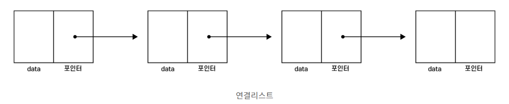
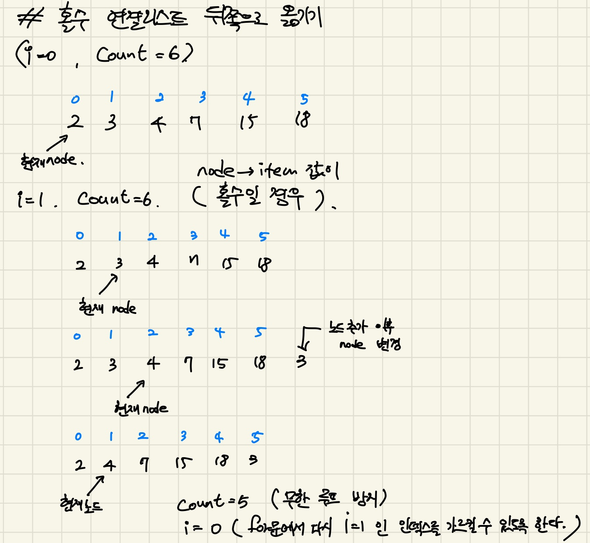
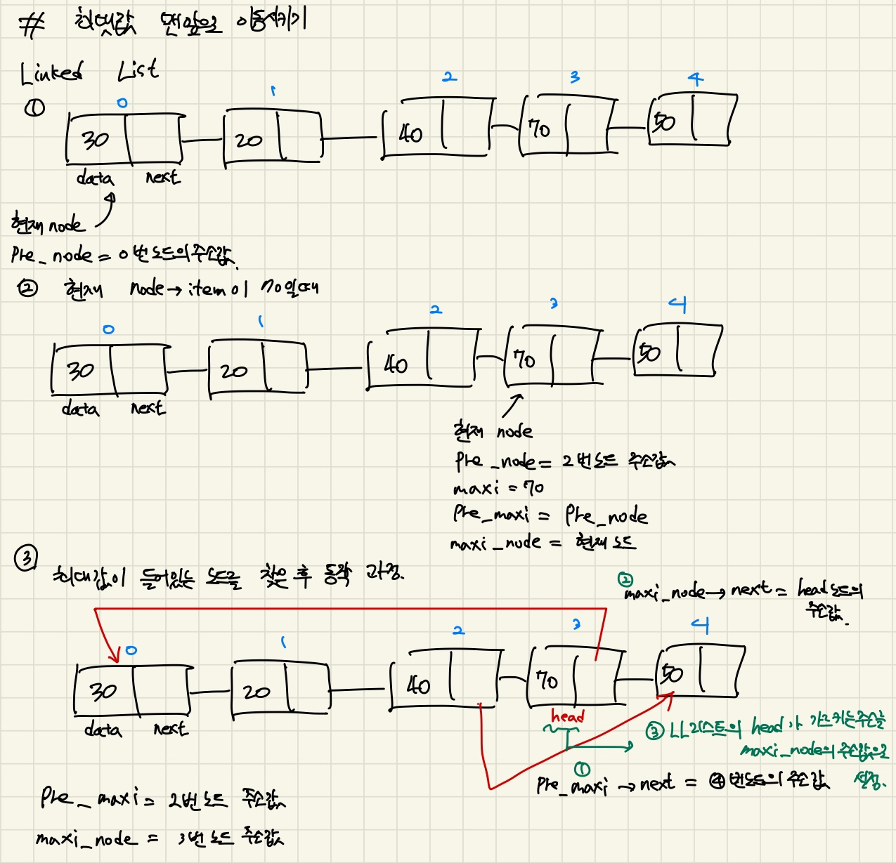

## 4주차 Linked List

* 2024 - 04 -13 (27일차)    

#### 과제 문제풀이   
* 연결리스트 (Linked List)   
    * 연결리스트는 일반적으로 사용하는 배열과 달리 동적으로 각 칸들이 앞, 뒤로 사슬처럼 연결되어 있는 자료구조    
    * 연결리스트 구조   
        * data : 연결리스트의 한 노드에 저장하고자하는 데이터를 저장할 수 있다.  
        * next : 다음 노드의 주소값을 저장함으로써, 노드의 앞, 뒤를 연결해줄 수 있다.   
        * head : 연결리스트의 첫 번째 노드의 주소값을 저장하는 포인터이다. head는 연결리스트를 첫 번째 노드부터 읽기 위해 반드시 필요하다.       
        * tail : 연결리스트의 마지막 노드의 주소값을 저장하는 포인터이다.    
       

* [c언어로 연결리스트 구현하기(LL_Q1~LL_Q6)](https://github.com/dongyeoppp/Data-Structures/tree/master/Linked_List)   

* 연결리스트 노드 오름차순으로 정렬하기(LL_Q1)    
    ```
    int insertSortedLL(LinkedList *ll, int item)			// 연결리스트 요소 오름차순 정렬 하기 
    {
        ListNode *node= ll->head;		// node안에 head값을 넣고, *node값은 head주소 안에 요소를 가르킨다.    

        for(int i = 0 ; i < ll-> size; i++){		// ll->size는 ll 연결리스트의 길이   
            if (node == NULL){			// 연결리스트에 아무것도 없을 경우 해당 인덱스에 아이템 값을 추가  
                insertNode(ll,i,item);
                return i;		// 해당 인덱스를 반환  
            }
            else if(node->item == item){		// 연결리스트에 존재하는 중복된 값을 입력할 경우 -1을 반환  
                return-1;
            }
            else if(node->item > item){			// 지금 넣은 item 값보다 노드에 있는 item값이 크면 그 자리에 해당 item값을 넣는다.   
                insertNode(ll,i,item);
                return i;						// 해당 인덱스를 반환   
            }
            else {
                node = node->next;				// 위에 조건에 해당하지 않는다면 다음노드를 가르키도록 한다. 
            }
        }
        insertNode(ll,ll->size,item);		// item 값이 list에 들어있는 값들보다 더 클 경우   
        return ll->size-1;					// 가장 마지막 인덱스 반환     
    }
    ```     

* 두개의 연결리스트 병합하기(LL_Q2)     
    ```
    int insertSortedLL(LinkedList *ll, int item)			// 연결리스트 요소 오름차순 정렬 하기 
    {
        ListNode *node= ll->head;		// node안에 head값을 넣고, *node값은 head주소 안에 요소를 가르킨다.    

        for(int i = 0 ; i < ll-> size; i++){		// ll->size는 ll 연결리스트의 길이   
            if (node == NULL){			// 연결리스트에 아무것도 없을 경우 해당 인덱스에 아이템 값을 추가  
                insertNode(ll,i,item);
                return i;		// 해당 인덱스를 반환  
            }
            else if(node->item == item){		// 연결리스트에 존재하는 중복된 값을 입력할 경우 -1을 반환  
                return-1;
            }
            else if(node->item > item){			// 지금 넣은 item 값보다 노드에 있는 item값이 크면 그 자리에 해당 item값을 넣는다.   
                insertNode(ll,i,item);
                return i;						// 해당 인덱스를 반환   
            }
            else {
                node = node->next;				// 위에 조건에 해당하지 않는다면 다음노드를 가르키도록 한다. 
            }
        }
        insertNode(ll,ll->size,item);		// item 값이 list에 들어있는 값들보다 더 클 경우   
        return ll->size-1;					// 가장 마지막 인덱스 반환     
    }
    ```    

* 노드의 value값이 홀수일 경우 연결리스트의 뒤쪽으로 이동시키기(LL_Q3)     
    ```
    void moveOddItemsToBack(LinkedList *ll)			// 노드의 value값이 홀수일 경우 연결리스트의 뒤쪽에으로 옮기기   
    {
        ListNode *node = ll->head;		// node는 ll연결리스트의 head를 가지고 있다. 
        int count = ll->size;			// count는 연결리스트의 길이  
        for(int i =0; i<count; i++){
            if(node->item %2==1){		// node의 item 값이 홀수일 경우   
                insertNode(ll,ll->size,node->item);		// 연결리스트의 가장 뒤쪽에 해당 node의 item값 넣기   
                node = node->next;		// node가 다음 노드를 가르킬 수 있도록한다.   
                removeNode(ll,i);		// 홀수 item값을 뒤로 넘긴 후 해당 노드는 삭제한다.  
                count--;			  // 뒤쪽으로 보낸 값은 다시 보지 않기 위해, 무한루프 방지하기 위해 count값을 줄여준다.   
                i--;		// 중간에 노드를 건너뛰지 못하고 차례대로 다 보기 위함. item이 짝수인 요소의 갯수만큼 인덱스가 증가한다. 
            }
            else{
                node=node->next;   // node의 item 값이 짝수일 경우 다음 노드를 가르키도록한다.   
            }
        }
    }
    ```    
         

* 노드의 value값이 짝수일 경우 연결리스트의 뒤쪽으로 이동시키기(LL_Q4)              
    ```
    void moveEvenItemsToBack(LinkedList *ll)	// 노드의 value값이 짝수일 경우 연결리스트의 뒤쪽에으로 옮기기 (홀수일 경우와 동일하다.)
    {
        ListNode *node = ll->head;
        int count = ll->size;
        for(int i =0; i<count; i++){
            if(node->item %2==0){
                insertNode(ll,ll->size,node->item);
                node = node->next;
                removeNode(ll,i);
                count--;
                i--;
            }
            else{
                node=node->next;   
            }
        }
    }
    ```    
* 연결리스트 두개로 나누기(LL_Q5)      
    ```
    void frontBackSplitLinkedList(LinkedList *ll, LinkedList *resultFrontList, LinkedList *resultBackList)		// 연결리스트 나누기  
    {
        ListNode *node = ll->head;		// *node는 ll리스트에 head를 주소로 같는 노드의 데이터를 가르킨다. 
        int count = (ll->size+1) / 2 ;		// 리스트를 반으로 나눈 길이 (ll길이가 홀수일 경우 frontlist에 노드 한개가 더 들어간다.)
        for(int i=0;i<count;i++){			// front리스트에 value값 넣기  
            insertNode(resultFrontList,i,node->item);		
            node = node->next;		// 다음노드를 가르키도록함 
        }
        for(int j=0; j<ll->size-count;j++){		// front에 반을 넣고 남은 나머지 만큼 back리스트에 넣는다.    
            insertNode(resultBackList,j,node->item);
            node = node->next;
        }
    }
    ```    
* 연결리스트에서 최대값 맨앞으로 이동시키기(LL_Q6)         
    ```
    int moveMaxToFront(ListNode **ptrHead)		// 연결리스트에서 가장 큰 값을 가지고 있는 노드를 연결리스트에 맨앞으로 보내기   
    {
        ListNode *node= *ptrHead;		// node는 head를 담고 있고, *node는 head를 주소로 가지는 노드를 가르킨다.
        int maxi = node->item;
        ListNode *pre_maxi= node;		// 최대값을 담고 있는 노드의 이전 노드를 담을거다//
        ListNode *maxi_node = node;		// 최대값을 가지고 있는 노드를 담자//
        ListNode *pre_node = node;		// 연결리스트의 모든 노드를 살펴보며 이전 노드를 계속담자//
        node = node-> next;
        while(node!=NULL){
            if(maxi< node->item){		// 노드의 value값(item)이 최댓값일 경우//
                maxi= node->item;
                maxi_node = node;
                pre_maxi = pre_node;	// 이전노드와 최대값 노드 갱신 //
            }
            pre_node = node;		// 이전노드를 계속 저장 
            node = node -> next;		// 가르키는 포인터를 다음노드로 변경//
        }
        pre_maxi->next = maxi_node -> next;		// 최대값 이전 노드의 next값에 최대값을 가지고 있는 노드의 next주소를 넣음
        maxi_node->next = *ptrHead;		// 최대값을 가지는 노드의 next값에 head를 넣음  (head가 가르키는 노드의 주소 = head)
        *ptrHead = maxi_node;		// head를 주소로 가지고 있는 노드를 최댓값이 들어있는 노드로 바꿈    
    }
    ```    
        

#### c언어 문법  

* 포인터 변수는 주소값을 가진다.   
* c언어의 나눗셈 연산  
    ```
    #include <stdio.h>

    int main(){
        int a = 5 / 2;
        double b = 5 / 2;
        printf("%d\n", a); // 2
        printf("%.1f\n", b); // 2.0
    }
    ```  
    * 정수 자료형(int)간의 연산은 기본적으로 정수를 반환한다.  
    * 적어도 한쪽 자료형이 실수일 경우에만 소숫점을 반영한 정확한 나눗셈연산을 할 수 있다.   
        ```
        #include <stdio.h>
        int main(){
            double c = 5.0 / 2;
            double d = 5 / 2.0;
            double e = (double)5 / 2;

            printf("%.1f\n", c); // 2.5
            printf("%.1f\n", d); // 2.5
            printf("%.1f\n", e); // 2.5
        }
        ```
* 구조체 접근 "." 와 "->"의 차이 
    * '.'(도트연산자)   
        * 구조체 변수를 이용하여 구조체 원소에 접근할 때 도트연산자 "."을 사용   
    * '->' (화살표 연산자)   
        * 포인터를 사용하여 구조체 원소에 접근할 때 화살표 연산자 "->"을 사용    


