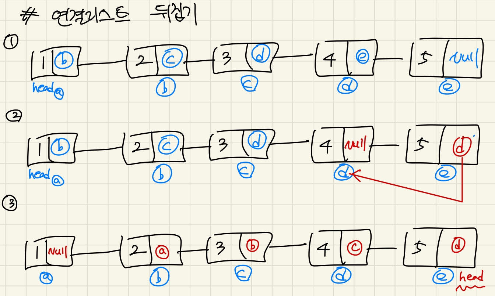

## 4주차 Linked List & stack, queue

* 2024 - 04 -14 (28일차)   

### 과제 문제풀이    

#### 연결리스트     

* [c언어로 연결리스트 구현하기(LL_Q7)](https://github.com/dongyeoppp/Data-Structures/tree/master/Linked_List)    

* 연결리스트 뒤집기(LL_Q7)        
    * 재귀를 사용하지 않고 구현하였다. 재귀로 구현하는 방법을 연구해봐야겠다.   
    ```
    void RecursiveReverse(ListNode **ptrHead)		// 연결리스트 뒤집기  
    {
        ListNode *node = *ptrHead;		// node에는 head의 주소를 넣음  
        ListNode *pre_node = node;		// 해당노드의 이전 노드를 담자  
        ListNode *last_node = node;		// 마지막 노드를 저장할거임   
        ListNode *first_node = node;	// 처음에 head가 가리키는 주소 저장    
        int count = 0;		// 마지막 노드 저장하기 위한 변수    
        while(1){
            if(node->next==NULL){		// 마지막 노드일 경우(next가 가르키는 주소가 없을경우 = null)
                if(count == 0){			// ll리스트의 마지막 노드를 last_node에 저장  
                    last_node = node;
                }
                node->next = pre_node;		// 해당 노드의 next에 이전노드의 주소를 저장  
                pre_node->next = NULL;		// 이전 노드에 next 값에는 NULL저장  
                if (pre_node == first_node){		// 이전 노드가 처음 노드가 되었을 경우 
                    break;
                }
                node = *ptrHead;		// 다시 처음 head가가르키는 node로 이동  
                pre_node= node;			// pre_node도 초기화   
                count++;				// 마지막 노드를 저장했다면 count는 필요없다.  
            }
            pre_node = node;		// node->next 값이 null이 아닐경우 pre_node에 해당 노드 저장   
            node = node->next;		// 다음노드를 가르키는 주소를 node에 저장   
        }
        *ptrHead = last_node;		// while문에 나온이후 head가 가르키는 주소를 마지막 노드로 바꿉니다. 그럼 마지막 노드부터 출력이 됩니다.   
    }
    ```    
         

#### 스택, 큐   

* [c언어 연결리스리트를 이용한 스택 큐 구현하기(SQ_Q1)](https://github.com/dongyeoppp/Data-Structures/tree/master/Stack_and_Queue)  

* 연결리스트 큐로 구현하기(SQ_Q1)      
    ```
    void createQueueFromLinkedList(LinkedList *ll, Queue *q)		// 연결리스트 큐로 구현하기  
    {
        ListNode *node = ll->head;		// node는 ll의 첫번째 노드를 가르킨다.  
        for(int i =0; i<ll->size;i++){		
            enqueue(q,node->item);		// q에 node의 data를 넣어준 후 node가 가르키는 값을 해당노드의 다음노드로 옮긴다.  
            node=node->next;
        }
    }
    ```   
* 연결리스트에서 큐로 짝수값만 남기기(Q1)   
    ```
    void removeOddValues(Queue *q)		// 연결리스트에서 큐를 사용해 짝수만 남기기
    {
        int removed =0;		// queue에서 삭제한 값을 담을 때 사용  
        int count = q->ll.size;		// LinkedList의 길이= count
        for(int i =0; i<count;i++){
            removed = dequeue(q);		
            if(removed%2 ==0){
                enqueue(q,removed);			// LinkedList에서 뺀 값이 짝수일 경우 다시 연결리시트의 끝에 넣어준다.   
            }
        }
    }
    ```    


