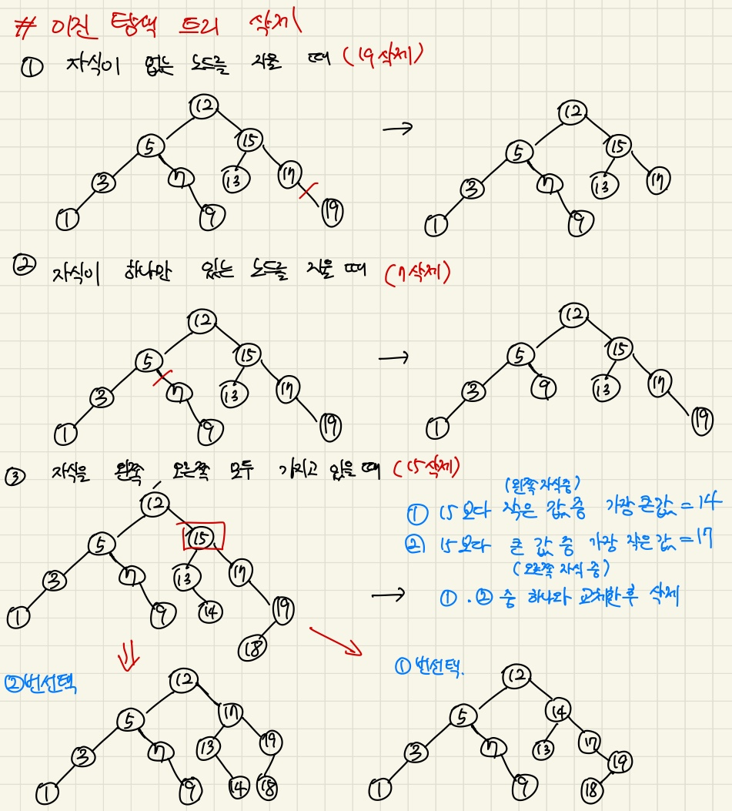

## 4주차 c언어 stack, queue, 알고리즘 풀이(python)   

* 2024 - 04 -15 (29일차)   

#### 연결리스트   
* [연결리스트 구현하기(LL_Q7)](https://github.com/dongyeoppp/Data-Structures/tree/master/Linked_List)  
* 연결리스트 뒤집기 (재귀로 구현하기)   
    ```
    void RecursiveReverse(ListNode **ptrHead)		// 연결리스트 뒤집기  (재귀로 구현)
    {
        ListNode *pre = *ptrHead;		// pre노드에는 prehead의 주소(ll의head주소를 담고있는)가 들어간다.
        ListNode *node = pre->next;		// head의 다음 노드의 주소를 node에 넣음  

        if(node == NULL){		// 재귀 종료 조건 -> node가 null일경우, pre는 그러면 마지막 노드의 주소를 가르키고 있다.
            return;
        }
        RecursiveReverse(&node);	// node의 주소를 매개변수로 하여 재귀 ->node의 주소값을 넘겼기때문에 node의 값이 계속 갱신될 수 있다.  
        pre->next->next = pre;		// 재귀가 끝났을 때 node의 next값을 pre의 주소로 바꾸어준다.
        pre->next = NULL;			// pre의 next값은 node의 주소가 들어있던걸 null로 바꿔준다.   

        *ptrHead = node;		// ll의 head가 가르키는 노드를 원래 ll리스트의 마지막노드로 바꿔주기위함, node값은 마지막 노드의 주소값으로 계속 갱신된다.   
    }
    ```   
#### stack, queue   
* [C언어로 stack, queue 구현하기(SQ_Q2 ~ SQ_Q7)](https://github.com/dongyeoppp/Data-Structures/tree/master/Stack_and_Queue)    
* stack 구현하기   
    ```
    void createStackFromLinkedList(LinkedList *ll, Stack *s)		// stack에 연결리스트 데이터 값 넣기     
    {
        ListNode *node = ll->head;		// node가 ll head의 주소를 가지도록 하였다.

        if(isEmptyStack(s)){		// 스택이 비어있을 경우에만 스택에 push   
            while(1){
            if (node == NULL){		// node가 비어있을경우 break
                break;
            }
            push(s,node->item);		
            node = node->next;
            }
        }
    }
    ```   
* 스택에서 짝수 값 제거하기   
    ```
    void removeEvenValues(Stack *s)			// stack에서 짝수 값 제거하기  
    {
        LinkedList ll = { 0, NULL };		// 새로운 LinkedList 생성(size값은 0, head가 가르키는 node는 null )
        Stack temp = { ll };				// 새로운 스택 temp(방금만든 ll을 가지고 있도록 한다.)  
        Stack *ss = &temp;					// ss는 temp의 주소를 가지고 있고 *ss는 temp안에 ll리스트를 가르키고 있다.  
        int removed=0;   // stack에서 pop한 값을 담자   

        while(1){
            if(isEmptyStack(s)){		// s stack이 비어있다면 break
                break;
            }
            removed = pop(s);		
            if(removed%2==1){
                push(ss,removed);		// 스택에 있던 홀수 값만 새로 만든 스택 ss에 push
            }
        }
        while(1){
            if(isEmptyStack(ss)){		// ss stack이 비어있을 때 까지 
                break;
            }
            removed = pop(ss);		
            push(s,removed);		// s 스택에 다시 push 
        }
        
    }
    ```   
* 스택 사용해서 순서쌍 찾기   
    ```
    int isStackPairwiseConsecutive(Stack *s)		// 순서쌍 여부 확인하기  
    {
    if(s->ll.size%2==1){		// 스택의 길이가 홀수일 경우 return 0  
            return 0;
        }
    int removed1,removed2;	
    int count =1;

    while(1){
        if (isEmptyStack(s)){	// stack 값이 다 비어졌다면 return 1 
            return count;
        }
        removed1 = pop(s);		// stack에서 연속된 두값을 뺀 후 비교하여 순서쌍인지 확인한다.  
        removed2 = pop(s);
        if(removed1-removed2==1 || removed2-removed1 == 1){
            continue;		// count 값 1 유지
        }
        else{
            count=0;		// 순서쌍이 아니라면 count 값 0으로 바꾼 후 return   
            return count;
        }

    }
    }
    ```    
* 큐 뒤집기  
    ```
    void reverse(Queue *q)		// 큐 뒤집기 (스택 사용) 		
    {
        LinkedList ll = {0,NULL};	// ll이라는 새로운 연결리스트 만들기 (size -> 0, node -> null)
        Stack temp = { ll };		// temp라는 stack 만들기 (위에 만든 ll과 연결됨)   
        Stack *ss = &temp;			// ss는 temp의 주소값을 가지고 *ss는 ll리스트를 가르킨다.   
        while(1){
            if(isEmptyQueue(q)){		// 먼저 que가 빌때까지 빼서 ss 스택에 dequeue한 값을 넣어준다.  
                break;
            }
            push(ss,dequeue(q));		
        }
        while(1){
            if(isEmptyStack(ss)){		// ss스택에 들어간 값을 pop하여 다시 q에 넣어준다.  (queue는 선입 선출방식이고 stack은 선입후출이어서 순서가 뒤집힌다.)
                break;
            }
            enqueue(q,pop(ss));
        }
    }
    ```   
* 큐 뒤집기 (재귀 사용)   
    ```
    void recursiveReverse(Queue *q)		// 재귀를 사용하여 큐 요소 뒤집기  
    {
        int temp;
        if(isEmptyQueue(q)){		// 재귀 종료 조건, q가 빌때 까지   
            return;
        }
        temp = dequeue(q);		// dequeue한 값이 temp에 저장됨 
        recursiveReverse(q);		// 재귀
        enqueue(q,temp);		// 마지막에 temp에 저장된 값부터 순서대로 q에 다시 enqueue
    }
    ```   
* stack에 특정 value값 확인하기  
    ```
    void removeUntil(Stack *s, int value)		//value값이후의 stack만 출력  
    {
        while(1){
            if(isEmptyStack(s)){		
                break;
            }
            if(peek(s)== value){		// peek -> stack의 top에 있는 값을 빼지 않고 확인할 수 있다.  
                break;
            }
            else{			// value값이 나오기 전까지는 계속 pop하고 value값이 나오면 break
                pop(s);
            }
        }	
    }
    ```   
* 괄호 순서쌍 찾기   
    ```
    int balanced(char *expression)		// 괄호 짝 맞추기  
    {
        
        LinkedList ll = {0,NULL};		
        Stack temp = { ll };
        Stack *ss = &temp;		// 새로운 스택 생성 (*ss는 temp stack 안에 ll리스트를 가르킨다. )
        for(int i =0;i<strlen(expression);i++){		// expression 문자열 길이 만큼   
            if(expression[i]=='(' || expression[i]=='[' || expression[i]=='{'){		// 열린 괄호만 stack에 push  
                push(ss,expression[i]);
            }
            else{
                if (isEmptyStack(ss)){		// for문이 아직 끝나지 않았는데 ss스택이 비어있지 않다면 not balanced!
                    return 1;
                }
                else if(peek(ss) =='(' && expression[i]==')'){		// 괄호의 순서쌍이 맞았을 경우 열린괄호도 stack에서 빼기  
                    pop(ss);
                }
                else if(peek(ss) =='[' && expression[i]==']'){		
                    pop(ss);
                }
                else if(peek(ss) =='{' && expression[i]=='}'){
                    pop(ss);
                }
                else {
                    return 1;	// 괄호의 순서쌍이 맞지 않을 경우 not balanced! 	
                }
            }
        }
        if(isEmptyStack(ss)){	// for문 이후 ss가 비어있을 경우 balanced!
            return 0;	
        }
        else{			// for문 이후 ss가 비어있지 않을 경우 not balanced!
            return 1;
        }
    }
    ```

#### c언어 문법    
* sizeof(문자열) : 문자열의 byte크기를 알려준다.(맨 뒤에 위치하는 종료문자 "/n"도 문자열의 크기에 포함된다.)   
* strlen(문자열) : 문자열의 글자 수를 알려준다.   

#### 이진 탐색 트리 삭제   
   

#### 알고리즘 문제풀기  
* 8983번 [사냥꾼](https://github.com/dongyeoppp/Jungle_TIL/blob/main/jungle_week04/bk_8983.py)   


