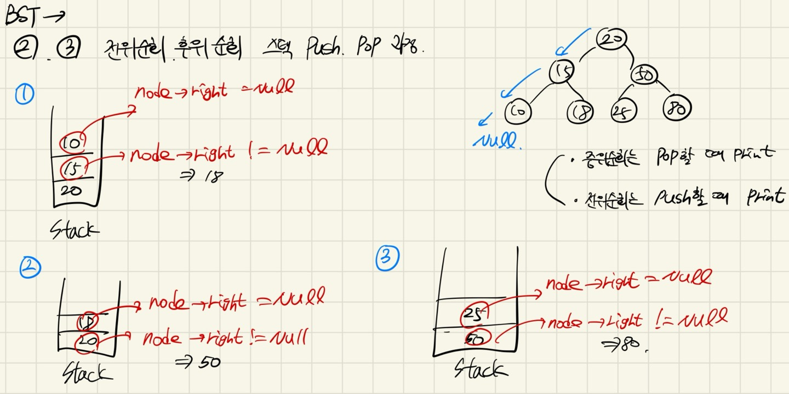
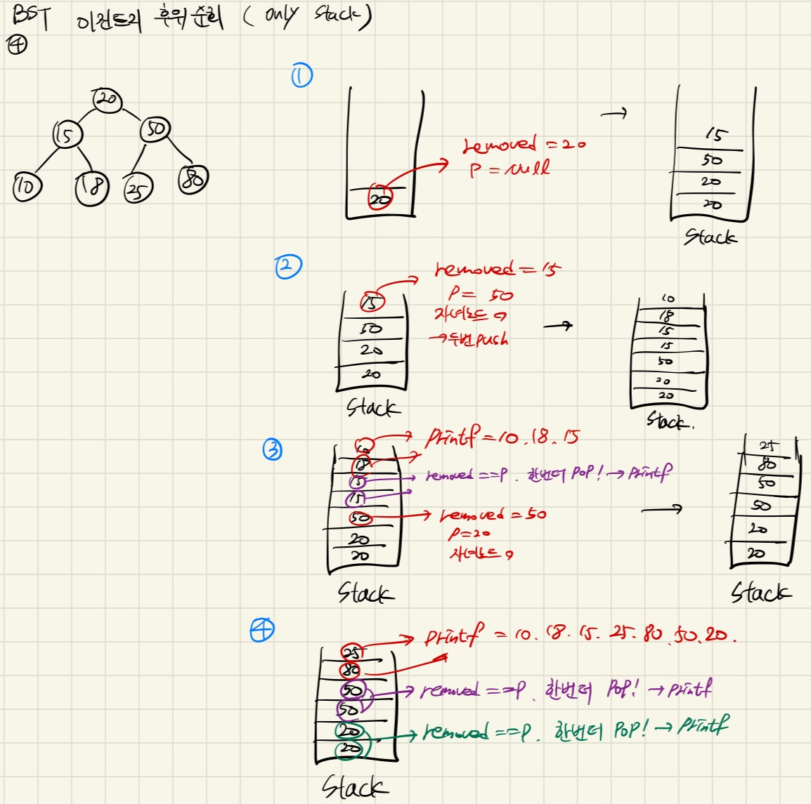
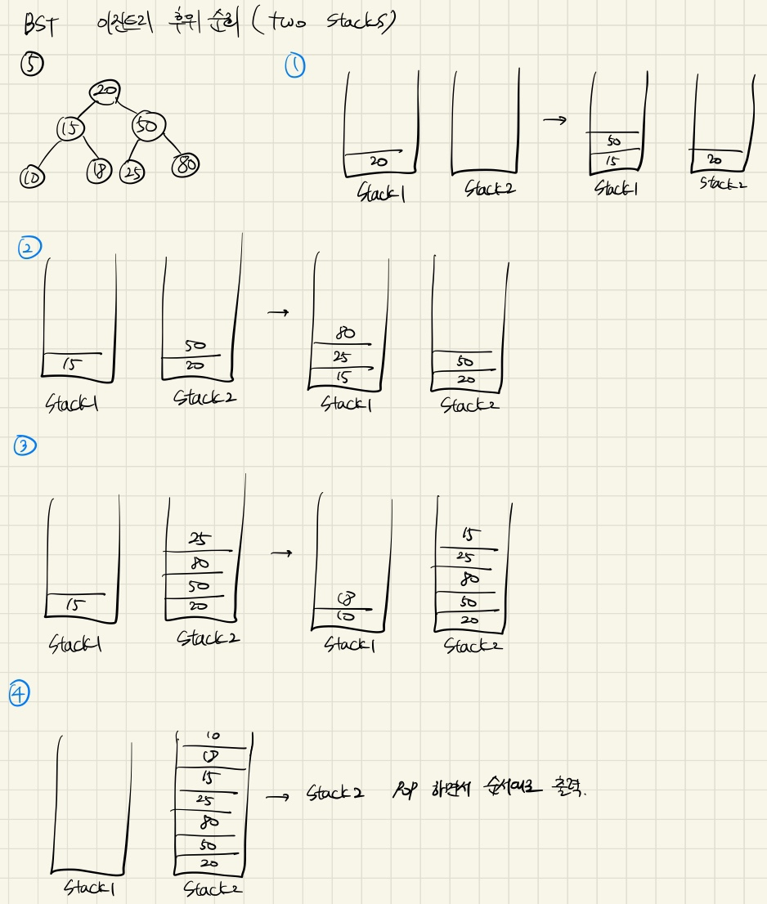

## 4주차 c언어 이진트리 및 파이썬 알고리즘 풀이   

* 2024 - 04 -18 (32일차)   


#### c언어 과제 풀이  
* [c언어로 이진 탐색 트리 (BST_Q1 ~ BST_Q5)](https://github.com/dongyeoppp/Data-Structures/tree/master/Binary_Search_Tree)  

* 이진 트리 레벨 순회(BST_Q1)
    ```
    void levelOrderTraversal(BSTNode* root)		// 이진 트리 레벨 순회  
    {
        Queue que = {NULL,NULL};		// 비어있는 queue 생성  
        enqueue(&(que.head),&(que.tail),root);		// root enqueue
        BSTNode *removed ;

        while(1){
            if(que.head==NULL){		// queue가 빌때까지
                break;
            }
            removed = dequeue(&(que.head),&(que.tail)); 		// queue에서 pop한 값 removed에 저장 후 removed->item 값 출력    
            printf("%d ",removed->item);
            if(removed->left != NULL){
                enqueue(&(que.head),&(que.tail),removed->left);		// removed노드의 left 노드가 존재하면 queue에 enqueue
            }
            if(removed->right != NULL){
                enqueue(&(que.head),&(que.tail),removed->right);		// removed노드의 right 노드가 존재하면 queue에 enqueue
            }
        }
    }
    ```   
* 이진트리 중위순회_stack사용(BST_Q2)   
    ```
    void inOrderTraversal(BSTNode *root)		
    {
        Stack ss = {NULL};		// 새로운 stack ss 생성  
        BSTNode *node = root;
        while (node != NULL || !isEmpty(&ss)){		// 해당 node가 null이 아니거나 stack이 비어있지 않을때 
            while(node!=NULL){		// 해당 노드가 null에 도달할때까지 왼쪽 노드를 ss stack에 push
                push(&ss,node);
                node = node->left;
            }
            node = pop(&ss);	
            printf("%d ",node->item);		// pop할때 마다 해당 노드 item값 출력
            node = node->right;		// right 값이 있을 경우 node != null
        }
    }
    ```   
* 이진트리 전위순회   
    ```
    void preOrderIterative(BSTNode *root)		// 이진트리의 전위 순회 (이진트리 중위순회와 동일한 방식)
    {
        Stack ss = {NULL};		// 새로운 스택 생성 		
        BSTNode *node = root;		
        while(node != NULL || !isEmpty(&ss)){		// node가 비어있지 않거나 스택이 비어있지 않을 경우 
            while(node!=NULL){
                printf("%d ",node->item);		// node를 stack에 push하기 전에 print
                push(&ss,node);		
                node = node->left;		// 왼쪽 노드를 계속 넣음(null이 나올때 까지)
            }
            node = pop(&ss);		 
            node = node->right;		// node->right가 있다면 node !=null
        }

    }
    ```   
        

* 이진트리 후위순회    
    ```
    void postOrderIterativeS1(BSTNode *root)		// 이진트리 후위 순회   
    {
        Stack ss = {NULL};
        BSTNode *removed;
        BSTNode *p;
        push(&ss,root);
        while(!isEmpty(&ss)){
            removed = pop(&ss);		// removed -> 스택에서 pop한 값 저장
            p = peek(&ss);		// pop이후 stack 맨위에 저장 된 값 p에 저장
            if(p != NULL && removed->item == p->item){		// p가 null이 아니고 removed 와 p의 값이 같을 경우 (자녀노드가 있는 노드이지만 스택에서 한번 나왔다 들어간 노드) 
                printf("%d ",removed->item);		// 자녀노드가 있는 노드 print, 값이 두개 들어가므로 한번더 pop
                pop(&ss);
            }
            if ((removed->right !=NULL || removed->left !=NULL)){		// 자녀노드가 한개라도 있을 경우, 오른쪽 노드부터 스택에 push
                push(&ss,removed);		// push 두번 해서 나갔다 다시 들어온 값을 체크  
                push(&ss,removed);
                if(removed->right !=NULL){		// right값이 존재하면 right값 push
                    push(&ss,removed->right);
                }
                if(removed->left !=NULL){		// left값이 존재하면 left값 push
                    push(&ss,removed->left);	
                }
            }
            else{		// removed => 바닥노드일 경우 출력 
                printf("%d ",removed->item);
            }
        }
            
    }
    ```   
       

* 이진트리 후위 순회  
    ```
    void postOrderIterativeS2(BSTNode *root) // 이진 트리 후위 순회 (two stacks)
    {
        Stack ss1 = {NULL};
        Stack ss2 = {NULL};
        BSTNode *removed;
        push(&ss1,root);
        while(!isEmpty(&ss1)){		// ss1 stack이 빌때까지  
            removed = pop(&ss1);		// ss1에서 pop한 값을 ss2에 push
            push(&ss2,removed);
            if(removed->left != NULL){			// left노드부터 ss1에 push
                push(&ss1,removed->left);
            }
            if(removed->right != NULL){			// right 노드 ss1에 push
                push(&ss1,removed->right);
            }
        }
        while(!isEmpty(&ss2)){		// ss2에 담긴 값을 순서대로 pop하여 printf
            removed = pop(&ss2);
            printf("%d ",removed->item);
        }
    }
    ```   
       
    

