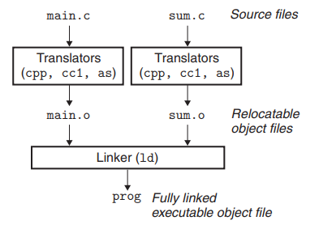
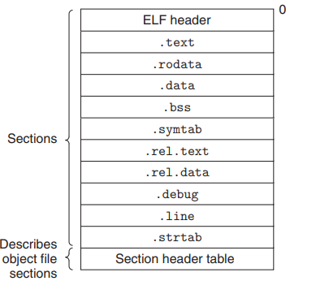
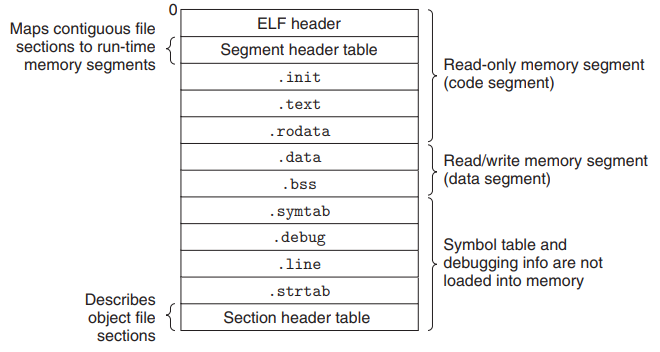
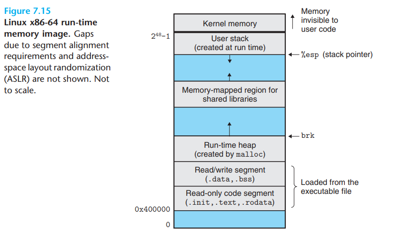

## 7장 링커

- 2024 - 04 - 22 (36일)
- 컴파일
  - 컴퓨터가 이해할 수 있는 언어는 0,1이므로 사람이 작성한 언어를 컴퓨터가 읽을 수 있도록 번역하는 과정이 컴파일이다.
  - test.c라는 파일을 컴파일하면 0101..로 이루어진 오브젝트 파일 test.obj라 바꾼다.
- 링크
  - 우리가 작성한 코드와 라이브러리를 연결시켜주는 역할을 하는 것이 링커이다. 여러 소스 코드를 묶어주는 역할도 수행한다.
  - 링크 과정을 거치면 test.obj 라는 오브젝트 파일은 test.exe라는 실행파일로 바뀌게 된다.
- 빌드
  - 컴파일과 링크 과정을 거치는 일련의 과정을 빌드라고 한다.
- 링킹(Linking)은 여러 개의 코드와 데이터를 모아서 연결하여 메모리에 로드될 수 있고, 실행될 수 있는 한 개의 파일로 만드는 작업(프로세스)이다.
- 링커(Linker)는 링킹을 수행하는 프로그램이다.

#### 컴파일러 드라이버

- 컴파일러 드라이버  
   

  - 컴파일 시스템에서 사용되는 프로그램으로 사용자를 대신해서 언어 전처리기, 컴파일러, 어셈블러, 링커를 필요에 따라 호출한다. (gcc 드라이버 호출 -> `linux> gcc -Og -o prog main.c sum.c`)
  - 컴파일러 드라이버는 먼저 전처리기(cpp)를 호출해서 c 소스파일 main.c를 중간 파일인 main.i로 번역한다.
  - 이후 드라이버는 컴파일러(cc1)를 호출하여 main.i를 어셈블리 언어 파일인 main.s로 번역한다.
  - 이후 드라이버는 어셈블러(as)를 호출하여, main.s를 재배치 가능한 바이너리 목적 파일인 main.o로 번역한다. sum.o를 만드는 과정도 위 과정과 동일하다.
  - 마지막으로 링커 프로그램(ld)를 실행하는데, 이것은 필요한 시스템 목적파일들과 함께 실행 가능 목적파일 prog를 생성하기 위해 main.o와 sum.o를 연결한다.
  - 실행파일 prog를 실행시키려면, linux 쉘에서 그 이름을 명령줄에 입력하면 된다. `linux> ./prog`
  - 쉘은 로더(loader)라고 부르는 운영체제 내의 함수를 호출하며, 로더는 실행파일 prog의 코드와 데이터를 메모리로 복사하고, 제어를 프로그램의 시작부분으로 전환한다.

#### 정적 연결

- 실행파일을 만들기 위한 링커의 주요 작업
  - 심볼 해석(symbol resolution)
    - 심볼은 함수, 전역변수, 정적변수에 대응되며 각각의 심볼 참조를 정확하게 하나의 심볼 정의에 연결하는 것이다.
  - 재배치
    - 프로그램이 컴파일될 때, 심볼들의 위치는 상대적인 주소로 정의된다.
    - 재배치는 이러한 상대주소를 실제 메모리 주소로 변환하여 프로그램이 올바르게 작동하도록 한다. (재배치 작업을 통해 프로그램은 메모리에 로드될 때 올바른 위치에 배치되어 실행가능한 상태가 된다.)

#### Object File

- 재배치 가능 Object File
  - 컴파일러와 어셈블러를 통해 생성되는 파일로 실행 가능 object file을 생성하기 위해 사용된다.
- 실행 가능 object file
  - 링크 과정을 지난 이후의 실행 가능한 object file (메모리에 직접 복사될 수 있고 실행될 수 있는 형태)
- 공유 목적 파일
  - 재할당 가능한 데이터를 정적 혹은 동적으로 다른 공유 오브젝트들과 공유할 수 있도록 함

#### Relocatable Object Files

- ELF(Executable and Linkable Format) : 주로 Linux 및 unix 시스템들에서 사용되는 파일 형식
- 전형적인 ELF 재배치 가능 object file  
   

  - ELF header
    - ELF header는 이 파일을 생성한 워드 크기(x86-64아키텍처일 경우 워드 크기는 64비트)와 시스템의 바이트 순서를 나타내는 16바이트 배열로 시작한다.
    - ELF header의 나머지는 링커가 오브젝트 파일을 구문분석하고 해석하도록 하는 정보를 포함한다. (ELF헤더 크기, 오브젝트 파일 타입, 머신 타입, 섹션 헤더 테이블의 파일 오프셋, 섹션 헤더 테이블의 크기와 엔트리 수)
  - Section header table
    - 여러가지 섹션들의 위치와 크기는 섹션 헤더 테이블로 나타낸다.
    - 이 테이블은 오브젝트 파일의 각 섹션에 대해 고정된 크기의 엔트리를 갖는다.
      - 각 엔트리는 하나의 섹션에 대응되며, 각 엔트리에는 해당 섹션에 대한 여러 가지 정보가 포함되어 있다.
      - 섹션 헤더 테이블의 각 항목이 동일한 크기를 가진다는 것을 의미한다. 섹션 헤더 테이블을 읽는 프로그램이 각 섹션의 정보를 정확하게 파악하기 위해 각 엔트리의 크기를 미리 알고 있어야 한다는 것을 의미한다.
    - ELF파일의 끝에 위치하며, ELF 헤더에 있는 섹션 헤더 테이블의 오프셋(오프셋은 어떤 위치나 기준점으로부터의 거리)을 이용하여 섹션 헤더 테이블의 위치를 찾아내고 그 위치에서 섹션 헤더 테이블을 읽어서 각 섹션에 대한 정보를 얻어올 수 있다. 이를 통해 프로그램은 파일 내의 섹션들의 위치와 크기 등의 정보를 알 수 있다.

#### 실행 가능 object file

- 실행 가능 목적파일의 포맷은 재배치 가능한 목적파일의 포맷과 유사하다.
- .text, .rodata, .data 섹션들은 이들 섹션들이 각자의 최종 런타임 메모리 주소로 재배치되었다는 점을 제외하고는 재배치 가능 목적파일에 있는 섹션들과 유사하다.  
   

#### 실행 가능 object file의 로딩

- 로더 : 디스크로부터 실행 가능한 목적파일 내의 코드와 데이터를 메모리로 복사하고 이 프로그램의 첫 번째 인스트럭션(엔트리 포인트-> 프로그램의 시작 주소)으로 점프해서 프로그램을 실행한다.
- 로딩 : 프로그램을 메모리로 복사하고 실행하는 과정
- 리눅스 x86-64 런타임 메모리 이미지 (런타임 메모리 : 프로그램이 실행되는 동안 사용되는 메모리 공간)  
   

  - code segment : object 파일의 텍스트 섹션(.text)에 해당하며, 실행 가능한 프로그램 코드가 저장되는 영역이다. cpu가 실행할 명령어들이 저장되어있다.
  - data segment : 초기화된 전역변수와 정적 변수가 저장되는 영역이다. 프로그램이 시작될 때 초기화된 데이터가 저장되며, 이 영역은 실행파일의 데이터 section과 bss section에 해당한다.
  - heap 영역 : 동적으로 할당된 메모리가 저장되는 영역, 힙은 프로그램 실행 중에 동적으로 메모리를 할당하고 해제할 수 있는 영역으로, malloc(),free()와 같은 함수를 호출해서 위로 성장한다.
  - memory mapping : 공유 모듈들을 위해 예약된 영역
  - stack 영역 : 지역 변수와 함수 호출 시 생성되는 데이터가 저장되는 영역으로 함수 호출 및 복귀 주소, 함수의 매개변수, 지역 변수 등이 저장된다. 큰 합법적 사용자 주소(2\*\*48 -1) 아래에서 시작해서 더 작은 메모리 주소 방향인 아래로 성장한다.
  - stack 위의 영역은 운영체제의 메모리 상주 부분인 커널의 코드와 데이터를 위해 예약되어 있다.
