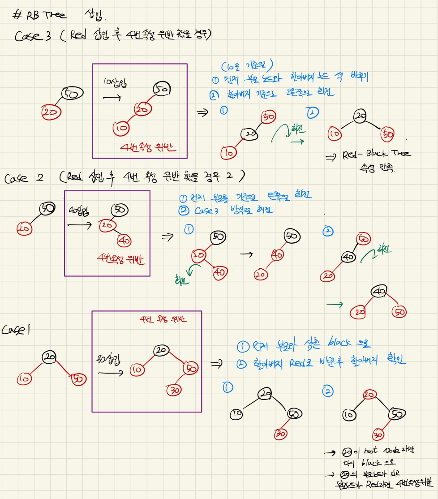
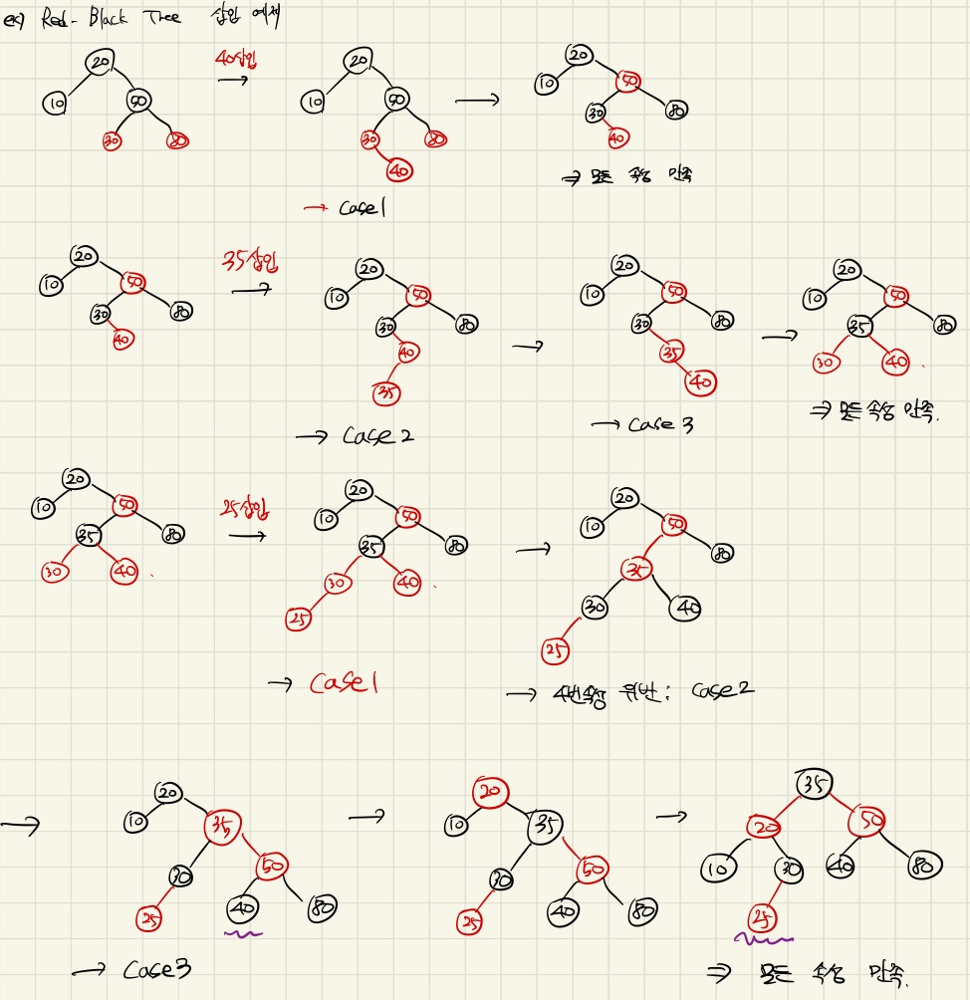
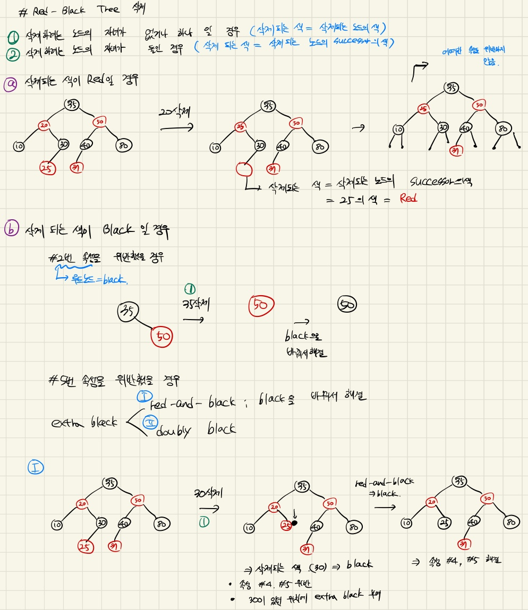
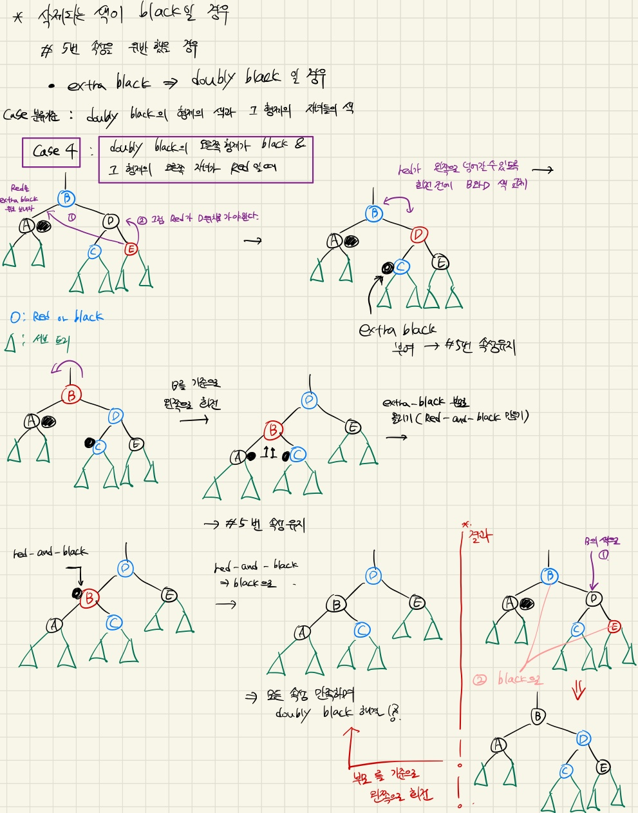
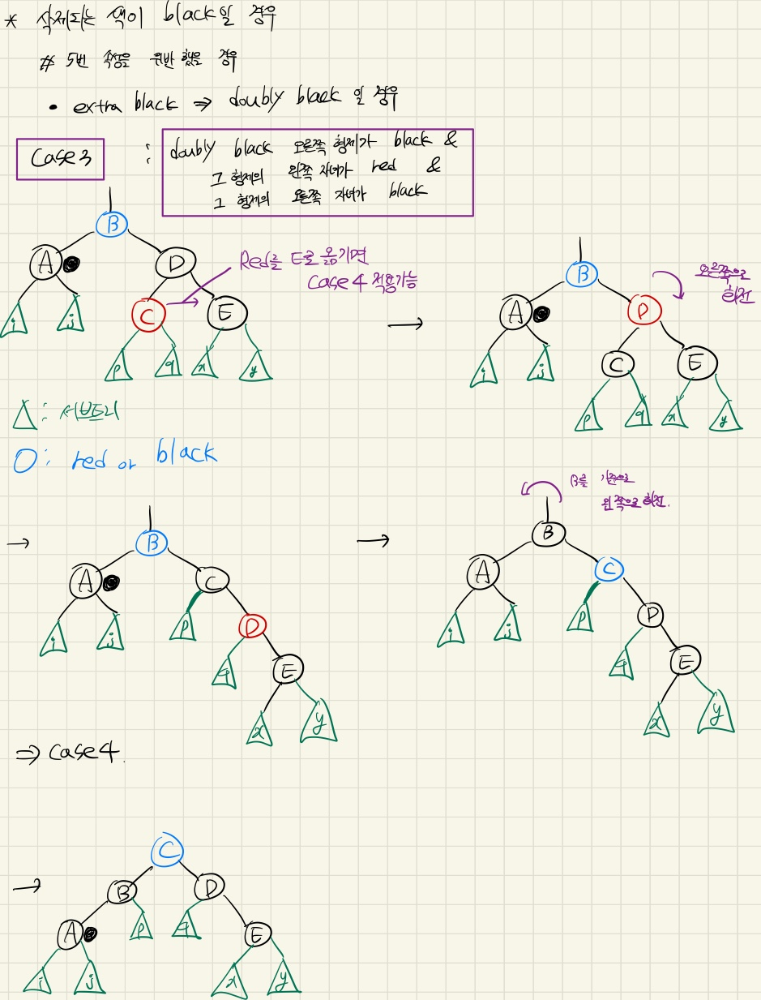
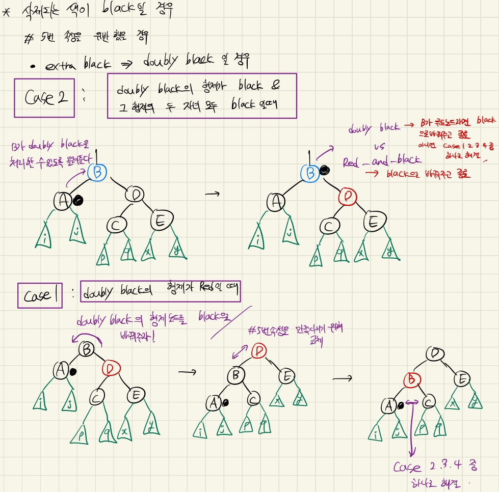
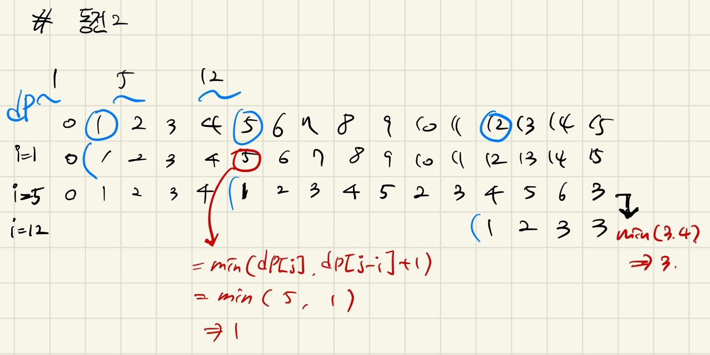

## 5주차 Red-Black Tree 및 알고리즘 문제 풀이  

* 2024 - 04 -19 (33일차)   

#### 가상화  
* 가상화는 하나의 실물 컴퓨팅 자원을 마치 여러 개인 것처럼 가상으로 쪼개서 사용하거나, 여러 개의 실물 컴퓨팅 자원들을 묶어서 하나의 자원인 것처럼 사용하겠다는 것이다.   
* 1개의 자원을 여러 개로 나눌 수 있는 것 처럼 여기거나, 여러 개의 자원을 하나인 것처럼 생각하는 과정들을 자원을 '추상화'한다고 함   
* ex) 구글 클라우드 -> 자신들의 데이터 센터에 있는 컴퓨팅 자원들을 가상화하하여, 클라우드 서비스에 가입한 사용자들에게 나누어 준다.   
* 가상머신(Virtual Machine,VM)    
    * 자체 컴퓨팅 자원과 os를 갖춘 가상 컴퓨팅 환경을 가상머신, virtual machine->vm이라고 부른다.   
    * 각 vm들은 같은 서버 위에 있을지라도 별도의 시스템처럼 동작한다. 이때, 생성된 vm을 게스트서버, vm들이 구동되는 서버를 호스트 서버라고 부른다.
    * 장점     
        * vm은 격리된 환경을 제공하므로, vm 내에서 어떤 대상이 실행되든 다른 시스템을 방해하지 않는다.   
        * 각 vm이 독립적이 os를 갖기 때문에, 단일 서버에서 windows,MAC,Linux등 다양한 OS를 사용할 수 있다.   
    * 단점   
        * vm이 많을수록 성능의 안전성이 떨어지고 실행 속도가 느려진다.   
* 하이퍼바이저(Hypervisor)   
    * 가상화 계층을 구현해주는 소프트웨어   
    * 하드웨어 위에서 가상머신을 생성하고, 필요한 만큼 자원을 할당해주고, 가상 머신들의 요청을 처리해주는 등 가상화를 도와주는 기능을 수행 (가상 머신 매니저= virtual machine manager or vmm, moniter라고 불림)   
    * 물리 하드웨어와 가상 머신의 영역을 분리하고 자신이 그 사이에서 중간 관리자, 즉 인터페이스 역할을 한다.   

#### gcc   
* GNU Compiler Collection (gcc)   
    * 다양한 프로그래밍 언어를 위한 오픈 소스 컴파일러  
    * 소스 코드를 컴파일하여 실행 가능한 프로그램으로 변환할 수 있다.   
1) 전처리기 실행    
2) 컴파일러 실행 : 전처리된 파일일 어셈블리어로 바꿔주는 과정       
3) 어셈블러 실행 : 어셈블리어 코드를 기계어로 바꿔주는 과정 (기계어 코드는 오브젝트 파일 형식으로 저장된다.)   
4) 링커 실행 : 오브젝트 코드 파일을 하나로 묶어 실행파일로 만드는 과정  

#### Red-Black Tree   
* Red-Black Tree란   
    * 자가 균형 이진 탐색 트리로서, 대표적으로 연관 배열 등을 구현하는데 쓰이는 자료구조다.  (BST의 worst case(시간 복잡도 : O(N))의 단점을 개선 함)    
    * 복잡한 자료구조이지만, 실 사용에서 효율적이고, 최악의 경우에도 상당히 우수한 실행 시간을 보인다. 트리에 n개의 원소가 있을 때 O(log n)의 시간복잡도로 삽입, 삭제, 검색을 할 수 있다.   
* Red-Black Tree 속성      
    1) 모든 노드는 red 혹은 black   
    2) 루트 노드는 black   
    3) 모든 nil(leaf) 노드는 black   
        * nil 노드란   
            * 존재하지 않음을 의미하는 노드   
            * 자녀가 없을 때 자녀를 nil노드로 표기   
            * 값이 있는 노드와 동등하게 취급   
            * RB트리에서 leaf 노드는 nil 노드   
    4) red의 자녀들은 black, red가 연속적으로 존재할 수 없다.   
    5) 임의의 노드에서 자손 nil 노드들까지 가는 경로들의 black 수는 같다. (자기 자신은 카운트에서 제외)   
        * 노드 x(임의의 노드)의 black height   
            * 노드 x에서 임의의 자손 nil 노드까지 내려가는 경로에서의 black 수 (자기 자신은 카운트에서 제외)   
        * 색을 바꾸면서도 #5번 속성 유지하기   
            * rb트리가 #5번 속성을 만족하고 있고 두 자녀가 같은 색을 가질 때 부모와 두 자녀의 색을 바꿔줘도 #5 속성은 여전히 만족한다.   
* Red-Black Tree 삽입   
    0) 삽입 전 RB 트리 속성 만족한 상태   
    1) 삽입 방식은 일반적인 BST와 동일   
    2) 삽입 후 RB 트리 위반 여부 확인   
    3) RB 트리 속성을 위반 했다면 재조정  
    4) RB 트리 속성을 다시 만족    
    * 삽입 노드의 색은 항상 RED!!    
        * 새로 삽입하는 노드가 RED인 이유    
            * 삽입 후에도 #5번(임의의 노드에서 자손 nil 노드들까지 가는 경로들의 black 수는 같다.) 속성을 만족하기 위해서..   

   
    
    

* Red-Black Tree 삭제   
    0) 삭제 전 RB 트리 속성 만족한 상태   
    1) 삭제 방식은 일반적인 BST와 동일   
    2) 삭제 후 RB 트리 속성 위반 여부 확인   
        * RB트리에서 노드를 삭제할 때 어떤 색이 삭제되는지가 속성 위반 여부를 확인할 때 매우 중요   
            * 삭제하려는 노드의 자녀(유효한 값을 가지는 자녀)가 없거나 하나라면 삭제되는 색 = 삭제되는 노드의 색    
            * 삭제하려는 노드의 자녀(유효한 값을 가지는 자녀)가 둘이라면 삭제되는 색 = 삭제되는 노드의 successor(후임자)의 색 
            * 삭제되는 색이 red라면 어떠한 속성도 위반하지 않는다.   
            * 삭제되는 색이 black이라면 #2,#4,#5 속성을 위반할 수 있다.    
    3) RB 트리 속성을 위반했다면 재조정   
        * 삭제되는 색이 black일때 #2 속성(루트 노드는 black이어야 한다.) 위반 해결하기   
            * 루트노드를 black으로 바꿔준다.   
        * 삭제되는 색이 black이고 #5 속성(임의의 노드에서 자손 nil 노드들까지 가는 경로들의 black 수는 같다.)위반일 때 #5 속성을 다시 만족시키기 위해 삭제된 색의 위치를 대체한 노드에 'extra black' 을 부여       
            * 경로에서 black 수를 카운트 할 때 extra black은 하나의 black으로 카운트 된다.    
            * red-and-black : extra black이 부여된 red 노드  -> red 노드를 black으로 바꿔주어 해결 가능 (위반된 #4,#5 속성을 동시에 만족할 수 있음) 
            * doubly black : extra black이 부여된 black 노드    

    4) RB 트리 속성을 다시 만족     

       

      

        

        

* Red-Black Tree 시간복잡도   
    * 일반적인 이진 탐색 트리는 worst case 시간복잡도가 O(N)이지만 RB Tree의 시간복잡도는 worst case에서 O(log N)     
* Red-Black Tree와 AVL Tree   
    * 삽입/삭제 성능  
        * Red-Black Tree가 AVL Tree에 비해 빠르다.   
    * 검색 성능   
        * Red-Black Tree가 AVL Tree에 비해 느리다. 
       
#### 알고리즘 문제풀이   
* 2294번[동전 2](https://github.com/dongyeoppp/Jungle_TIL/blob/main/jungle_week05/bk_2294.py)     
    * 동적프로그래밍을 이용한 문제     
       

