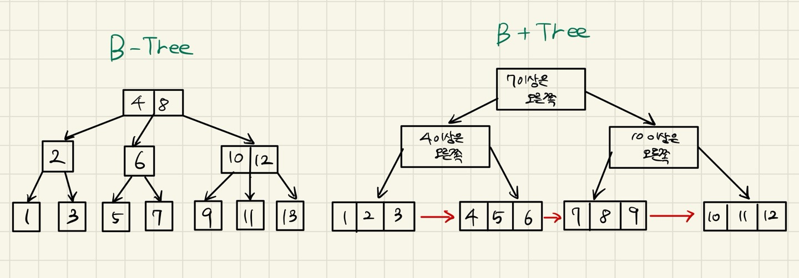

## 5주차 Red-Black Tree 및 알고리즘 풀이 및 cs 정리

* 2024 - 04 -24 (38일차)    

#### 알고리즘 문제 풀이   
* 1406번 [에디터]()   

#### RB Tree   

* [RB TREE 구현하기](https://github.com/dongyeoppp/rbtree-lab/blob/main/src/rbtree.c)  

* RB Tree array로 반환   
    ```
    void array_traversal(const rbtree *t, node_t *node, key_t *arr, int *index, const size_t n)   // rb tree 순회 함수  
    {
    if (node == t->nil || *index >= n) // node가 nil이거나 index값이 배열의 크기를 넘어갈 경우 return
    {
        return;
    }

    array_traversal(t, node->left, arr, index, n);
    arr[*index] = node->key; // arr에 해당 인덱스에 node의 key값을 넣음
    (*index)++;              // 각 재귀호출간에 index값을 공유하도록 int 포인터 사용
    array_traversal(t, node->right, arr, index, n);
    }

    int rbtree_to_array(const rbtree *t, key_t *arr, const size_t n) // rb tree의 내용을 key순서대로 주어진 array 반환
    {
    int index = 0;                               // 배열의 index값 지정
    array_traversal(t, t->root, arr, &index, n); // 주소값을 넘겨주어서 index값을 공유할 수 있도록 한다.

    return 0;
    }
    ```    

#### CS(Computer System) 정리   

* [Computer System 7장 링커](https://github.com/dongyeoppp/Jungle_TIL/blob/main/jungle_week05/ComputerSystem1.md)  

#### B+TREE   
* B+TREE   
    * B-TREE의 변형으로 데이터 베이스 시스템에서 많이 사용되고 있다.   
    * B+TREE는 데이터를 노드마다 보관하는 것이 아니라 가장 아래 노드에만 정렬된 데이터를 보관해 두고 있다.   
    * 위에 있는 내부 노드들은 데이터가 저장되어있지 않고 키 값만을 저장하고 있다. 이 키값은 데이터를 찾는데 필요한 경로를 결정하는 이정표 역할을 한다.   
    * 이때 아래 노드끼리는 연결 리스트의 형태로 연결되어있어 형제노드끼리의 이동이 쉬어질 수 있다.   
       

* B+TREE 데이터 검색      
    * 특정 범위에 속하는 모든 데이터를 찾는 범위 검색이나 순차적으로 데이터를 탐색하는 경우, B+TREE는 아래 노드끼리 연결 리스트 형태로 연결되어 있기 때문에 범위 검색의 속도가 더 빠르다. (특정한 하나의 값을 찾을 때는 B-TREE와 마찬가지의 연산 횟수를 가진다.)   
    * 검색 연산이 빈번한 데이터 베이스에선 B+TREE 형태의 자료구조가 많이 사용되고 있다.   
    * RB-TREE, AVL TREE는 주로 메모리 내 자료구조로 사용이 되고, 데이터 베이스의 인덱구현에는 B-TREE와 B+TREE가 주로 사용된다.    

    


