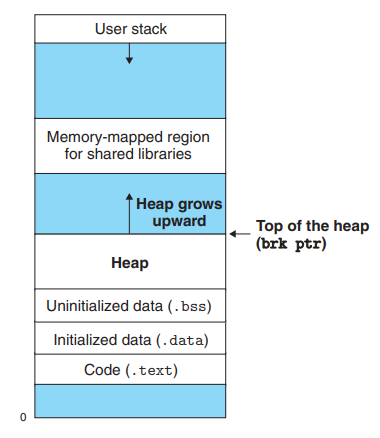

## 9장 가상 메모리

- 2024 - 04 - 22 (36일)    

#### 9.9 동적 메모리 할당   

* 동적 메모리 할당기   
       

    * 힙이라고 하는 프로세스의 가상 메모리 영역을 관리한다.  
    * 각각의 프로세스에 대해서, 커널은 힙의 꼭대기를 가리키는 변수 brk를 사용한다.    
    * 할당기는 힙을 다양한 크기의 블록들의 집합으로 관리한다.   
    * 명시적 할당기   
        * 프로그래머가 직접 메모리 할당 및 해제를 관리한다. 대표적으로 c 프로그래밍 언어의 'malloc()' 및 'free()' 함수가 이에 해당한다.   
        * 프로그래머가 각 할당 및 해제를 수동으로 관리해야 한다.    
    * 묵시적 할당기   
        * 메모리 할당과 해제를 자동으로 관리하는 시스템이나 언어의 일부이다.   
        * 대표적으로 java의 가비지 컬렉션(garbage collection)이 있다.   
        *  프로그래머가 명시적으로 메모리 할당과 및 해제를 관리할 필요가 없으며, 시스템이 자동으로 메모리를 관리한다.   

* brk, sbrk   
       

    * sbrk 함수는 커널의 brk 포인터에 incr을 더해서 힙을 늘리거나 줄인다.  -> sbrk 함수를 통해 힙 영역의 크기를 조절한다. (incr 값은 sbrk 함수에 전달되는 인자로, incr값이 양수라면 힙 영역을 확장, incur값이 음수라면 힙 영역을 축소하여 incr만큼의 메모리를 해제한다.)
    * sbrk 함수를 통해 힙 영역의 크기 조절에 성공했다면, 이전의 brk값을 리턴한다. (brk값은 힙의 꼭대기를 가리키는 변수로, 이전의 brk값은 변경된 힙 영역의 시작 지점을 나타낸다.)   
    * sbrk 함수가 실패했다면, -1을 리턴하고 errno를 ENOMEM으로 설정한다.   
        * 'errno'는 오류코드를 나타내는 전역변수이다.   
        * 'ENOMEM'은 '메모리 부족'을 의미하는 오류코드이다. -> 시스템의 가용 메모리가 부족하여 메모리를 할당할 수 없었다는 것을 의미한다.   
    * 만일 incur=0이라면 ,sbrk의 현재 brk 값을 리턴한다. (이때는 힙영역의 크기를 변경하지 않고 현재의 brk값을 반환한다. 즉 힙 영역의 끝지점을 반환한다.)   
        * heap영역의 요청이 없을 때 까지는 data segment 끝 주소가 brk 값이 된다.     

* 단편화   
    * 내부 단편화   
        * 할당된 블록이 데이터 자체보다 더 클 때 일어난다. (할당기는 정렬 제한사항을 만족시키기 위해서 블록의 크기를 증가시킬 수 있다.)     
            
        * 위 이미지 (b)에서 할당기는 정렬 제한 사항을 만족시키기위해서 블록의 크기를 증가시켜 내부 단편화가 발생함을 알 수 있다.   
    * 외부 단편화   
        * 할당 요청을 만족시킬 수 있는 메모리 공간이 전체적으로 공간을 모았을 때는 충분한 크기가 존재하지만, 이 요청을 처리할 수 있는 단일한 가용블록은 없는 경우에 발생한다.  
        * 위 그림의 (e)에서 p4의 요청이 2워드가 아니라 8워드였다면 힙에 8개의 가용워드가 남아 있는데도 커널에서 추가적인 가상메모리를 요청하지 않고는 만족시킬 수 없다. (외부 단편화 발생)   
        * 외부 단편화는 측정하기 어렵고 예측하기 불가능하기 때문에 할당기들은 대게 많은 수의 더 작은 가용블록보다는 더 적은 수의 더 큰 가용 블록들을 유지하려는 방법들을 채택하고 있다. 
    * 단편화 해결방법  
        * 통합 기법   
            * 하나의 작업 완료 후 그 사용 영역이 다른 비어있는 분할 공간과 인접해 있는지 점검하여 만약 인접해 있다면 두 개의 빈 분할 공간을 하나로 통합하여 효율성을 높이는 작업   
        * 압축 기법    
            * 주기억장치 내 분산되어 있는 단편화된 비어있는 공간들을 통합합여 하나의 커다란 빈 공간을 만드는 작업  (비어있는 공간들을 모으는 작업)     
            * 가비지 컬렉션 작업이라고도 한다.  
        * 재배치 기법   
            * 압축을 실행하여 이 과정에서 프로그램의 주소를 새롭게 지정해주는 기법 (주소를 재배치하여 메모리 내의 프로그램을 다시 배치하는 것)   

* 묵시적 가용 리스트        
      

    * 힙 블록의 포맷   
        * 헤더에 1워드-> 헤더에는 블록 크기와 블록이 할당되어있는지 가용상태인지를 확인할 수 있는 이진수 정보가 담겨있다.  
        * payload -> 데이터  
        * padding -> 정렬 요건을 맞추기 위한 또 다른 1워드가 될 수 있다.  
    * 묵시적 가용 리스트는 헤더에 담겨있는 블록의 크기만큼 이동하여 다음 힙 블록으로 묵시적으로 연결될 수 있다.   

* 명시적 가용 리스트   
      

    * 명시적 가용 리스트는 각 가용 블록 내에 pred, succ (이전블록, 다음블록) 포인터를 포함하는 이중 연결 가용리스트로 구성될 수 있다.  

* first fit, next fit, best fit   
    * 할당기가 요청한 블록을 저장하기에 충분히 큰 가용 블록을 리스트에서 검색하는데 이 검색을 수행하는 방법은 배치 정책에 의해서 결정된다.   
    * first fit   
        * 가용 리스트를 처음부터 검색하여 크기가 맞는 첫 번째 가용 블록을 선택한다.   
        * 장점   
            * 리스트의 마지막에 가장 큰 가용 블록들을 남겨두는 경향이 있다는 점이다.   
        * 단점      
            * 리스트의 앞 부분에 작은 가용 블록들을 남겨두는 경향이 있어서 큰 블록을 찾는 경우에 검색 시간이 늘어난다.   
    * next fit  
        * first fit과 비슷하지만 검색을 리스트의 처음에서 시작하는 대신, 이전 검색이 종료된 지점에서 검색을 시작한다.     
        * firt-fit보다 매우 빠른 속도를 가지지만 최악의 메모리 이용도를 가질 수 있다.    
    * best fit   
        * 모든 가용 블록을 검색하며 크기가 맞는 가장 작은 블록을 선택한다.  
        * 내부 단편화를 줄일 수 있지만 외부 단편화가 발생할 가능성이 높다.   
        * best fit이 일반적으로 first fit이나 next fit 보다는 더 좋은 메모리 이용도를 갖는다.   
