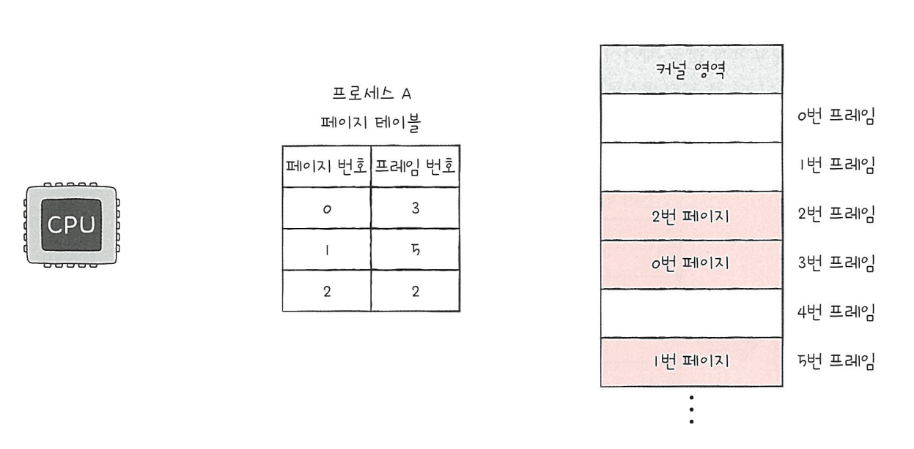
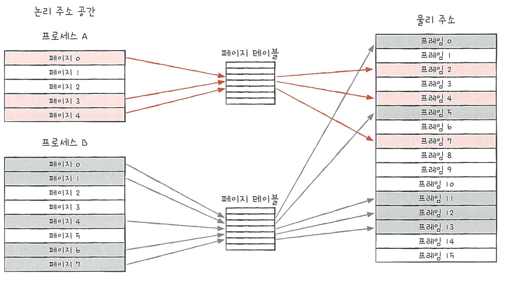
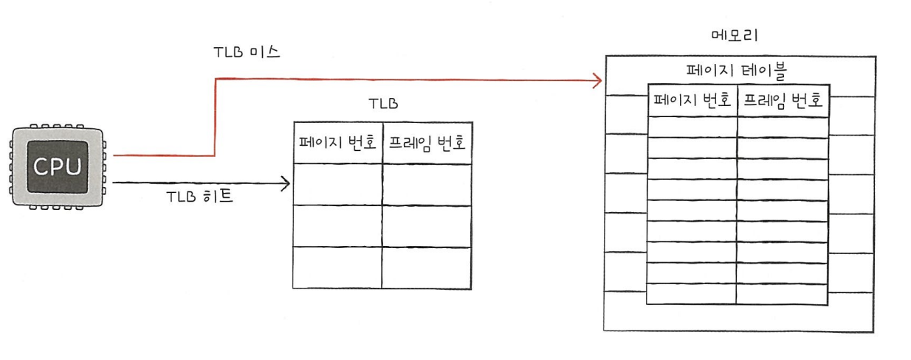
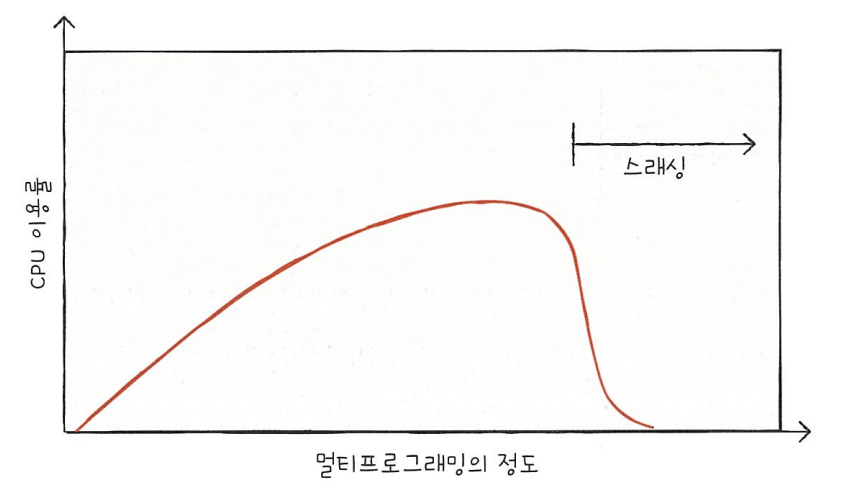

## 6주차 malloc-lab 키워드 정리 

- 2024 - 04 -27 (41일차)

* 가상메모리,, demand zero memory, 시스템 콜   
#### 가상 메모리와 페이징   
* 가상메모리   
    * 실행하고자 하는 프로그램을 일부만 메모리에 적재하여 실제 물리 메모리 크기보다 더 큰 프로세스를 실행할 수 있게 하는 기술이다.   
* 페이징  
    * 가상메모리 관리 기법으로 페이징 기법을 이용하면 물리 메모리보다 큰 프로세스를 실행할 수 있을 뿐만 아니라 외부 단편화 문제도 해결할 수 있다.   
    * 프로세스의 논리 주소 공간을 '페이지'라는 일정한 단위로 자르고, 메모리 물리 주소 공간을 '프레임'이라는 페이지와 동일한 크기의 일정한 단위로 자른 뒤 페이지를 프레임에 할당하는 가상 메모리 관리 기법이다.   
    * 한 프로세스를 실행하기 위해 프로세스 전체가 메모리에 적재될 필요가 없고, 프로세스를 이루는 페이지 중 실행에 필요한 일부 페이지만을 메모리에 적재하고, 당장 실행에 필요하지 않은 페이지들은 보조기억장치에 남겨둘 수 있다.  이와 같은 방법을 토해 물리 메모리보다 더 큰 프로세스를 실행할 수 있다.   

    * 페이지 테이블   
        * 프로세스가 메모리에 불연속적으로 배치되면 cpu 입장에서 '다음에 실행할 명령어 위치'를 찾기가 어려워진다.   
        * 이를 해결하기 위해 페이징 시스템은 프로세스가 물리주소에 불연속적으로 배치되더라도, 논리 주소에는 연속적으로 배치되도록 페이지 테이블을 이용한다.   
        * 페이지 테이블은 현재 어떤 페이지가 어떤 프레임에 할당되었는지를 알려준다. (페이지 테이블의 페이지 번호를 이용해 페이지가 적재된 프레임을 찾을 수 있다.)   
        * 프로세스들이 메모리에 분산되어 저장되어 있더라도 cpu는 논리 주소를 그저 순차적으로 실행하면 된다.    
           

            

    * 페이징은 외부 단편화 문제를 해결할 수 있지만 내부 단편화 문제를 야기할 수 있다. (페이지 크기가 10kb인데, 프로세스의 크기가 108kb일때 마지막 페이지는 2kb만큼의 크기가 남는다.)  
    * cpu 내의 페이지 '테이블 베이스 레지스터'(PTBR)는 각 프로세스의 페이지 테이블이 적재된 주소를 가리키고 있다.   
    * 페이지 테이블을 메모리에 두면 메모리 접근 시간이 두 배로 늘어난다.  -> 이 문제를 해결하기 위해 TLB라는 페이지 테이블의 캐시 메모리를 둔다. (TLB는 페이지 테이블의 캐시이기 때문에 페이지 테이블의 일부 내용을 저장한다. 참조 지역성에 근거해 주로 최근에 사용된 페이지 위주로 가져와 저장한다.)   
    * CPU가 발생한 논리 주소에 대한 페이지 번호가 TLB에 있을 경우 TLB 히트(), 페이지 번호가 TLB에 없을 경우 TLB 미스이다.   
       

    * 페이징에서의 주소 변환   
        * 하나의 페이지 혹은 프레임은 여러 주소를 포괄하고, 특정 주소에 접근하려면 1) 어떤 페이지 혹은 프레임에 접근하고 싶은지. 2) 접근하려는 주소가 그 페이지 혹은 프레임으로부터 얼마나 떨어져 있는지. 에 대한 정보가 필요하다. -> 페이징 시스템에서는 모든 논리 주소가 기본적으로 '페이지 번호'와 '변위'로 이루어져 있다.  
        * 논리주소 <페이지 번호, 변위>는 페이지 테이블을 통해 물리주소 <프레임 번호, 변위>로 변환된다. (변위는 접근하려는 주소가 프레임의 시작번지로부터 얼만틈 떨어져있는지를 알기 위한 정보이다.)    
    * 스레싱   
        * 프로세스가 실제 실행되는 시간보다 페이징에 더 많은 시간을 소요하여 성능이 저해되는 문제     
        * 지나치게 빈번한 페이지 교체로 인해 cpu 이용률이 낮아지는 문제   
           

        * 멀티프로그래밍의 정도 : 메모리에서 동시 실행되는 프로세스의 수  -> 멀티프로그래밍의 정도가 높다면 현재 메모리에 많은 프로세스가 동시에 실행중이고, 낮다면 현재 메모리에 적은 프로세스가 동시에 실행 중인 것이다.   
        * 프로세스의 수를 늘린다고 해서 cpu 이용률이 그에 비례해서 증가하지 않는다.  

    * 프로세스를 실행하는 과정에서 배분할 프레임을 결정하는 방식   
        * 작업 집합 모델 기반 프레임 할당 방식   
            * 프로세스가 일정 기간 동안 참조한 페이지 집합을 기억하여 빈번한 페이지 교체를 방지한다.   
            * cpu가 메모리를 참조할 때에는 참조 지역성의 원리에 의거해 주로 비슷한 구역을 집중적으로 참조한다.   
        * 페이지 폴트 빈도 기반 프레임 할당 방식   
            * 페이지 폴트율에 상한선과 하한선을 정하고, 이 범위 안에서만 프레임을 할당하는 방식이다.   
            * 페이지 폴트율이 너무 높으면 (상한선을 넘으면) 그 프로세스는 너무 적은 프레임을 갖고 있다. -> 프레임을 더 할당해준다. 
            * 페이지 폴트율이 너무 낮으면 (하한선 보다 낮아지면) 그 프로세스가 너무 많은 프레임을 갖고 있다. -> 프레임을 회수한다.  

#### system call (시스템 콜)   
* 트랩은 의도적인 예외 상황으로 어떤 인스트럭션을 실행한 결과로 발생한다.   
* 트랩의 가장 중요한 사용은 "시스템 콜"이라고 알려진 사용자 프로그램과 커널 사이의 프로시저와 유사한 인터페이스를 제공하는 것이다.     
       

* 시스템 콜은 커널 모드에서 돌아가며, 이로 인해 커널 내에서 정의된 스택에 접근하며, 특권을 가진 인스트럭션을 실행할 수 있도록 해준다.   

 