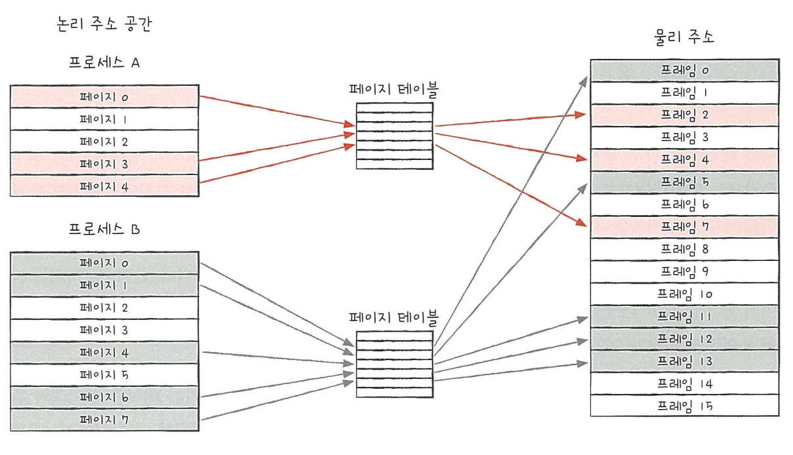

## 6주차 malloc-lab 구현 및 알고리즘 문제 풀이

- 2024 - 04 -30 (44일차)

#### 알고리즘 문제 풀이

- 1700번 [멀티탭 스케줄링](https://github.com/dongyeoppp/Jungle_TIL/blob/main/jungle_week06/bk_1700.py)

#### 페이징과 세그멘테이션

- 페이징과 세그멘테이션은 가상 메모리 관리 기법이다.

- 페이징

  - 프로세스의 논리 주소 공간을 '페이지'라는 일정한 단위로 자르고, 메모리 물리 주소 공간을 '프레임'이라는 페이지와 동일한 크기의 일정한 단위로 자른 뒤 페이지를 프레임에 할당하는 가상 메모리 관리 기법이다.
  - 메모리와 프로세스를 일정한 단위로 자르고, 이를 메모리에 불연속적으로 할당하는 방법이다.  
    

  - 페이징은 외부 단편화 문제를 해결할 수 있지만, 내부 단편화 문제를 야기할 수 있다. (모든 프로세스가 페이지 크기에 딱 맞게 잘리지 않기 때문 -> 하나의 페이지 크기보다 작은 크기가 할당 될 수 있다.)
  - 내부단편화 문제를 해결하기 위해 하나의 페이지 크기를 너무 작게 설정하면 그만큼 페이지 테이블의 크기도 커지기 때문에 페이지 테이블이 차지하는 공간이 낭비된다.

- 세그멘테이션
  - 메모리를 의미 있는 단위인 '세그먼트'로 나누는 방법이다. 가상 메모리를 서로 크기가 다른 논리적 단위로 분할한 것을 의미한다. -> 이 논리적 단위인 세그먼트는 프로세스의 특정한 부분을 나타낸다. (프로세스 내에서 코드, 데이터, 스택 등의 부분은 서로 다른 세그먼트로 나눌 수 있다.)
  - 각 세그먼트는 시작 주소와 길이를 가지며, 다른 유형의 데이터를 위해 사용된다.
  - 세그멘테이션은 메모리를 더 유연하게 관리할 수 있게 해주며, 프로그램의 논리적 구조를 반영할 수 있다.
  - 장점
    - 세그먼트 별 보호와 공유가 용이하다.
    - 내부 단편화 문제가 해소된다.
  - 단점
    - 외부 단편화 문제가 생길 수 있다.
    - 메모리 관리가 복잡해질 수 있다.

#### DMA

- Direct Memory Access
  - cpu의 중재 없이 주변장치가 메모리에 직접 접근하여 데이터를 읽고 쓸 수 있게 해주는 시스템의 한 기능이다.
  - 데이터 전송 과정에서 cpu가 필요하지 않으므로, cpu는 다른 작업을 수행하는데 더 많은 시간을 할애할 수 있다.
  - 이는 시스템 성능 향상으로 이어지는데 특히 i/o 작업이 많은 시스템에서 그 이점이 두드러진다.
- DMA 이점
  - CPU의 부하가 감소하여 전체 시스템의 효율성이 증가한다.
  - 데이터 전송 속도가 향상되므로 전반적인 시스템 응답 시간이 단축된다.

#### malloc-lab 구현

- [malloc - lab](https://github.com/dongyeoppp/malloc-lab/blob/main/mm.c)

* 적절한 메모리 블록 찾기
  - first_fit
    ```
    /* 적절한 메모리 블록찾기 (first_fit)*/
    static void *find_fit(size_t asize)
    {
        void *bp;
        for (bp = heap_listp; GET_SIZE(HDRP(bp)) > 0; bp = NEXT_BLKP(bp))   //  bp가 epilogue블록에 도달할때까지 순회
        {
            if (!GET_ALLOC(HDRP(bp)) && (asize <= GET_SIZE(HDRP(bp))))     // 들어갈 수 있는 블록이 있으면 바로 해당 bp를 return
            {
                return bp;
            }
        }
        return NULL;
    }
    ```
  - next_fit
    ```
    static void *find_fit(size_t asize) // last_bp는 이전에 탐색을 종료한 위치를 기억한다.
    {
        void *bp;
        if (last_bp == NULL) // 이전에 탐색한 적이 없을 경우
        {
            last_bp = heap_listp; // 초기 bp값을 last_bp에 저장
        }
        for (bp = last_bp; GET_SIZE(HDRP(bp)) > 0; bp = NEXT_BLKP(bp)) // last_bp에서 시작해서 epilogue블록에 도달할때까지 순회
        {
            if (!GET_ALLOC(HDRP(bp)) && (asize <= GET_SIZE(HDRP(bp)))) // 가용상태 블록에 size가 들어갈 수 있는 경우
            {
                last_bp = bp; // last_bp갱신
                return bp;
            }
        }
        for (bp = heap_listp; bp != last_bp; bp = NEXT_BLKP(bp)) // epilogue블록까지 할당가능한 블록을 찾지 못했을 경우, 다시 처음부터 last_bp까지 탐색
        {
            if (!GET_ALLOC(HDRP(bp)) && (asize <= GET_SIZE(HDRP(bp)))) // 가용상태 블록에 size가 들어갈 수 있는 경우
            {
                last_bp = bp; // last_bp 갱신
                return bp;
            }
        }
        return NULL; // 없을 경우 null 반환
    }
    ```
* 메모리 블록의 할당 및 분할

  ```
  static void place(void *bp, size_t asize)
  {
      size_t csize = GET_SIZE(HDRP(bp)); // csize = 현재 bp블록의 사이즈 // chunksize보다 asize가 작을경우 -> csize= chunksize

      if ((csize - asize) >= (2 * DSIZE)) // csize와 asize의 차이가 4개 블럭 이상일경우 (헤더와 풋터를 제외하고 데이터를 저장할 수 있는 공간이 두블럭 이상일 때)
      {
          PUT(HDRP(bp), PACK(asize, 1));
          PUT(FTRP(bp), PACK(asize, 1));
          bp = NEXT_BLKP(bp);                    // 가용블록에 할당이후 다음블록의 포인터로 bp 갱신
          PUT(HDRP(bp), PACK(csize - asize, 0)); // 남은 블록의 size와 할당상태 =0 으로 갱신
          PUT(FTRP(bp), PACK(csize - asize, 0));
          // bp = PREV_BLKP(bp); // 0으로 할당상태 체크헤준이후 다시 사용하고 있는 블록으로 bp 갱신// 인줄 알았지만 함수안에서 bp 변경은 함수를 나가면 반영되지 않아서 필요없는 코드였다.
      }
      else // 현재 블록의 header와 footer 할당상태 1로 변경  , 현재 블록의 사이즈는 csize
      {
          PUT(HDRP(bp), PACK(csize, 1));
          PUT(FTRP(bp), PACK(csize, 1));
      }
  }
  ```

* 블록 할당하기

  - brk 포인터를 증가시켜 블록 할당 (항상 크기가 정렬의 배수인 블록을 할당한다.)

  ```
  void *mm_malloc(size_t size)
  {
      size_t asize; // 블록 사이즈 정의
      size_t extendsize;
      char *bp;

      if (size == 0)
          return NULL;

      if (size <= DSIZE)     // size가 8바이트 이하일 경우
          asize = 2 * DSIZE; // 헤더(4byte) + 풋터(4byte) + 정렬 조건을 맞춰주기 위한 패딩 바이트 추가 => asize = 최소 16바이트
      else
          asize = DSIZE * ((size + (DSIZE) + (DSIZE - 1)) / DSIZE); // 블록이 가질 수 있는 크기 중에 최적화된 크기로 재조정

      if ((bp = find_fit(asize)) != NULL) // find_fit을 통해 정상적으로 할당이 되었을 경우
      {
          place(bp, asize); // 메모리 할당
          return bp;
      }
      // 적절한 블록을 찾지 못했을 경우
      extendsize = MAX(asize, CHUNKSIZE);                 // 힙을 확장할 때 적어도 asize 보다 큰 블록을 할당할 수 있도록 한다.// asize가 더 작다면 chunksize만큼 공간을 늘리고 asize만큼 남은 부분은 place에서 처리해준다.
      if ((bp = extend_heap(extendsize / WSIZE)) == NULL) // 힙을 정상적으로 늘리지 못했다면 NULL  (bp는 마지막 블록의 )
          return NULL;
      place(bp, asize); // asize만큼 할당하고 남은 공간을 처리한다.

      return bp;
  }
  ```

* 메모리 재할당

  ```
  void *mm_realloc(void *ptr, size_t size) // ptr은 이전에 할당된 메모리 블록의 포인터, size는 새로운 메모리 블록의 크기
  {
      void *oldptr = ptr;
      void *newptr;
      size_t copySize;

      newptr = mm_malloc(size); // 힙 확장이 정상적으로 되지 않았을 경우 null을 반환
      if (newptr == NULL)
          return NULL;
      // copySize = *(size_t *)((char *)oldptr - SIZE_T_SIZE);
      copySize = GET_SIZE(ptr) - DSIZE; // 기존 블록의 사이즈에서 - 8(header와 footer블록의 크기)
      if (size < copySize)              // 새로 만든 블록보다 이전 블록의 크기가 더 크다면 이전 블록의 size만큼만 복사한다. //
          copySize = size;
      memcpy(newptr, oldptr, copySize); // memcpy(복사 받을 메모리를 가리키는 포인터, 복사할 메모리를 가리키는 포인터, 복사할 데이터의 길이)
      mm_free(oldptr);                  // 새로운 블록에 복사한 이후 이전 블록 할당 해제 (header와 footer의 할당상태를 0으로 바꾸면 나중에 해당 블록을 사용할 수 있다. -> 안에 있는 데이터는 덮어쓰기 된다.)
      return newptr;
  }
  ```
