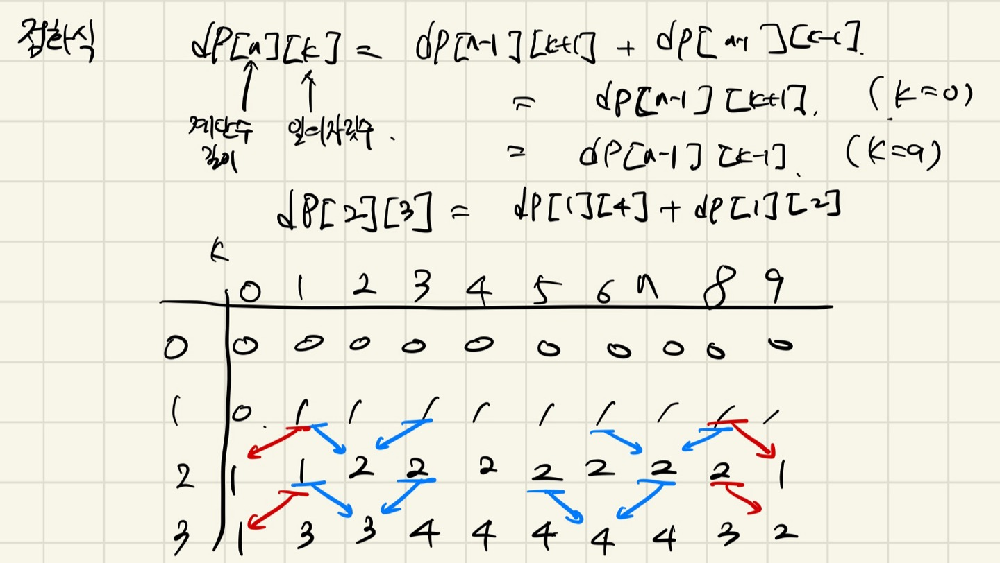
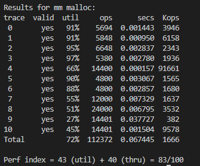
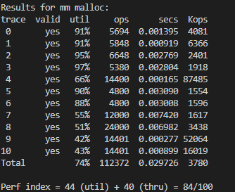

## 6주차 malloc-lab 구현 및 알고리즘 문제 풀이

- 2024 - 05 - 01 (45일차)

#### 알고리즘 문제 풀이

- 10844번 [쉬운 계단 수](https://github.com/dongyeoppp/Jungle_TIL/blob/main/jungle_week06/bk_10844.py)   
     


#### malloc-lab 구현

- [malloc - lab](https://github.com/dongyeoppp/malloc-lab/blob/main/mm.c)   

* realloc 재구현  
    * 성능을 높이기 위해 realloc 개선   
        * 초기 realloc   
        * 가용블록을 찾고 적절한 블록이 없으면 힙 영역을 늘려서 재할당하는 방식을 사용   
            ```
            void *mm_realloc(void *ptr, size_t size) // ptr은 이전에 할당된 메모리 블록의 포인터, size는 새로운 메모리 블록의 크기
            {
                void *oldptr = ptr;
                void *newptr;
                size_t copySize;

                newptr = mm_malloc(size); // 힙 확장이 정상적으로 되지 않았을 경우 null을 반환
                if (newptr == NULL)
                    return NULL;
                // copySize = *(size_t *)((char *)oldptr - SIZE_T_SIZE);
                copySize = GET_SIZE(ptr) - DSIZE; // 기존 블록의 사이즈에서 - 8(header와 footer블록의 크기)
                if (size < copySize)              // 새로 만든 블록보다 이전 블록의 크기가 더 크다면 이전 블록의 size만큼만 복사한다. //
                    copySize = size;
                memcpy(newptr, oldptr, copySize); // memcpy(복사 받을 메모리를 가리키는 포인터, 복사할 메모리를 가리키는 포인터, 복사할 데이터의 길이)
                mm_free(oldptr);                  // 새로운 블록에 복사한 이후 이전 블록 할당 해제 (header와 footer의 할당상태를 0으로 바꾸면 나중에 해당 블록을 사용할 수 있다. -> 안에 있는 데이터는 덮어쓰기 된다.)
                return newptr;
            }
            ```

        * 재구현한 realloc   
            * 현재 블록의 다음 블록을 확인 -> 다음 블록이 가용상태일 경우 힙을 확장하지 않고 두 블록을 합쳐서 하나로 만들 수 있도록 코드를 수정했다.   
            * 새로운 메모리 공간을 만들지 않고 더 효율적으로 공간을 사용할 수 있다.  
                ```
                void *mm_realloc(void *ptr, size_t size) // ptr은 이전에 할당된 메모리 블록의 포인터, size는 새로운 메모리 블록의 크기
                {
                    void *oldptr = ptr; // 현재 블록 포인터
                    void *newptr;
                    size_t oldsize = GET_SIZE(HDRP(oldptr)); // 현재 블록 사이즈 = oldsize
                    if (size + DSIZE <= oldsize)             // 새로 할당하려는 블록사이즈가 현재 블록 사이즈보다 작을 경우
                    {
                        place(ptr, size + DSIZE); // 현재 블록을 새로 할당하려는 블록 사이즈로 나눠준다.
                        return oldptr;
                    }
                    else if (GET_SIZE(HDRP(NEXT_BLKP(ptr))) != 0 && size > oldsize) // 다음 블록이 epilogue block이 아니고, 재할당할 블록의 사이즈가 현재 블록의 사이즈 보다 클 경우 -> 이전 블록과 다음 블록을 합쳐서 재할당하기
                    {
                        size_t nextsize = GET_SIZE(HDRP(NEXT_BLKP(oldptr)));            // 다음 블륵의 크기 = nextsize
                        size_t addsize = size - oldsize + DSIZE;                        // add size = size와 old size와의 차이(DSIZE는 블록과 헤더 크기)
                        if (!GET_ALLOC(HDRP(NEXT_BLKP(oldptr))) && addsize <= nextsize) // 다음 블록이 가용상태이고, 다음블록의 크기가 add 블록의 크기 보다 작은 경우
                        {
                            if (nextsize - addsize > 2 * DSIZE) // nextsize - addsize 만큼 뺀 값이 16 바이트 이상일 경우 -> 할당할 블록과 가용 블록을 나눠준다.
                            {
                                PUT(HDRP(oldptr), PACK(addsize + oldsize, 1)); // size만큼 블록 할당하기
                                PUT(FTRP(oldptr), PACK(addsize + oldsize, 1));
                                PUT(HDRP(NEXT_BLKP(oldptr)), PACK(nextsize - addsize, 0)); // 남음 블록 가용블록으로 만들기 (size만 헤더, 푸터에 넣어주기)
                                PUT(FTRP(NEXT_BLKP(oldptr)), PACK(nextsize - addsize, 0));
                            }
                            else // 조건보다 블록이 작을 경우 나누지 않고 현재블록과 다음 블록을 합쳐준다.
                            {
                                PUT(HDRP(oldptr), PACK(nextsize + oldsize, 1)); // 할당상태로 만들기
                                PUT(FTRP(oldptr), PACK(nextsize + oldsize, 1));
                            }
                            return oldptr;
                        }
                    }
                    // 다음 블록이 free가 아니거나 현재 블록과 다음 블록의 합보다 size값이 클 경우 힙을 늘려 재할당을 한다.
                    newptr = mm_malloc(size);
                    if (newptr == NULL)
                        return NULL;
                    oldsize = GET_SIZE(ptr) - DSIZE;
                    if (size < oldsize)
                        oldsize = size;
                    memcpy(newptr, oldptr, oldsize);
                    mm_free(oldptr);
                    return newptr;
                }
                ```   
    * 성능 비교   
        *  초기 realloc   
               
        * 수정한 realloc    
                
        * util(메모리 효율성) 점수가 근소하게 상승한 것을 확인 !   

  

