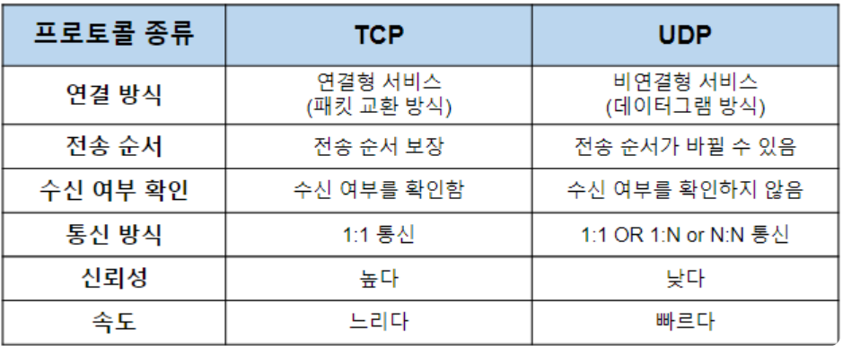

## 6주차 웹 서버 만들기 키워드 정리 및 알고리즘 문제 풀이

- 2024 - 05 - 03 (47일차)

#### 알고리즘 문제 풀이

- 6198번 [옥상 정원 꾸미기](https://github.com/dongyeoppp/Jungle_TIL/blob/main/jungle_week07/bk_6198.py)

#### 네트워크 계층 (OSI7 Layer, TCP/IP Layer)

- 네트워크 : 컴퓨터나 기타 기기들이 리소스를 공유하거나 데이터를 주고 받기 위해 유선 혹은 무선으로 연결된 통신 체계
  - 사용자 혹은 데이터가 어떤 곳에서 다른 곳으로 이동할 수 있게 만든 통로이다. 현대의 네트워크는 TCP/IP를 이용하고 어떠한 곳이든 접근할 수 있게 해준다.
- 네트워크 프로토콜

  - 네트워크 통신을 하기 위해서 통신에 참여하는 주체들이 따라야 하는 형식, 절차, 규약

- 패킷
  - 인터넷을 통해 발송되는 모든 데이터는 패킷이라는 작은 조각을 나뉜다.
  - 패킷은 두 부분으로 나뉘는데 헤더는 패킷 자체에 대한 정보를 담고 있으며 본문은 실제로 전송되는 데이터이다.
- 라우터 (router)
  - 데이터의 목적지가 정해지면 해당 목적지까지 어떤 경로로 가는 것이 좋은지 알려주는 기능을 한다.
- 라우팅

  - 목적지 ip 주소까지 어떤 경로로 데이터를 보낼지 결정하는 것

- TCP와 UDP  
   

  - TCP
    - 연결 지향 방식
    - 높은 신뢰성을 보장, UDP보다 속도가 느리다.
  - UDP
    - 데이터를 데이터그램 단위로 처리하는 프로토콜
    - 비 연결형 프로토콜 -> 각각의 패킷은 다른 경로로 전송되그 각각의 패킷은 독립적인 관계를 지니게 되는데 이렇게 데이터를 서로 다른 경로로 독립적으로 처리하게 된다.
    - 연결을 설정하고 해제하는 과정이 없고, 패킷에 순서를 부여하고 재조립을 하거나 흐름 제어와 같은 기능을 처리하지 않기 때문에 TCP보다 속도가 빠르며 네트워크 부하가 적다.
    - 신뢰성 있는 데이터를 보장하지는 못한다. 신뢰성보다 연속성이 중요한 서비스(실시간 서비스)에 자주 사용된다.

- OSI 7 Layer, TCP/IP Layer  
   

  - OSI 7계층 : 네트워크 분야에서 가장 중요하게 다루는 것으로 세계적으로 사용이 되고 있는 네트워크 표준 모델이다. 이 안에 TCP/IP 및 네트워크 통신에 사용되는 전반적인 프로토콜이 모두 포함되어 있다.

    - 각 layer에 맞게 프로토콜이 세분화돼서 구현
    - 각 레이어의 프로토콜은 하위 layer의 프로토콜이 제공하는 기능을 사용하여 동작

    - 1계층 : 물리층 (physical layer)
      - 실제로 장치들을 연결하기 위한 물리적인 사항을 정의
      - bit 단위로 데이터 전송
    - 2계층 : 데이터 링크층 (data link layer)

      - 두 지점 간의 신뢰성 있는 전송을 보장
      - frame을 단위로 사용
      - 직접 연결된 노드 간의 통신 담당
      - MAC 주소 기반 통신 (ARP: IP주소를 MAC주소로 변환)

    - 3계층 : 네트워크층 (network layer)

      - ip 주소를 통해 여러 개의 지점을 거칠 때 경로를 찾아줌
      - 호스트 간의 통신 담당
      - 목적지 호스트로 데이터 전송
      - 네트워크 간의 최적의 경로 결정
      - `라우터(router)`를 통해 다른 네트워크로 데이터를 전송

    - 4계층 : 전송층 (transport layer)

      - 양 끝단의 사용자들이 송수신에 있어서 신뢰성을 보장
      - 프로세스와 프로세스의 연결을 도와준다.
      - 애플리케이션 간의 통신 담당
      - 안정적이고 신뢰할 수 있는 데이터 전송 보장 -> TCP
      - 필수 기능만 제공 -> UDP

    - 5계층 : 세션층 (session layer)
      - 양 끝단의 프로세스가 통신을 관리하기 위한 방법을 제공
      - 애플리케이션 간의 통신에서 세션을 관리
      - RPC (remote procedure call)
    - 6계층 : 표현층(presentation layer)
      - 인코딩 및 데이터의 형식 차이를 조절
      - 애플리케이션 간의 통신에서 메시지 포맷 관리
    - 7계층 : 응용층 (application layer)
      - 응용 프로그램에서 서비스를 수행
      - 애플리케이션 목에 맞는 통신 방법을 제공
      - HTTP, DNS, SMTP, FTP

- TCP / IP Layer

  - 인터넷에 특화된 네트워크 구조
  - 4 계층 : Application Layer (osi 7,6,5 layer)
    - 유저에게 제공되는 애플리케이션에서 사용되는 통신의 움직임을 결정한다. (HTTP)
  - 3 계층 : Transport Layer (osi 4 layer)
    - 애플리케이션 계층에 네트워크로 접속되어 있는 2대의 컴퓨터 사이의 데이터 흐름을 제공한다. (TCP, UDP)
  - 2 계층 : Internet Layer (osi 3 layer)
    - 네트워크 상에서 패킷(전송하는 데이터의 최소 단위)의 이동을 다루는 계층
    - 어떠한 경로를 거쳐서 상대의 컴퓨터로 패킷을 보낼지 결정하는 계층
  - 1 계층 : Network Interface Layer (링크 계층, osi 2,1)

    - 네트워크에 접속하는 하드웨어적인 면을 다룬다.

  - HTTP 통신 과정
    - 송신측 클라이언트의 Application 계층에서 웹 페이지 요청인 HTTP Request를 보낸다.
    - Transport 계층은 Application 계층에서 받은 데이터를 조각내어 안내번호와 port 번호를 붙여 Network 계층으로 전달한다.
    - Internet 계층에서는 수신지 MAC 주소를 추가해서 Link 계층에 전달한다.
    - 이제 수신 측 Link 계층에서 데이터를 받아들여 순서대로 위의 계층에 전달하여 Application 계층까지 전달한다.  
      
    - Application 계층에서 하위 계층으로 가면서 해당 계층의 정보를 헤더에 추가하는 과정을 `캡슐화`라고 한다.
    - 하위 계층에서 Application 계층으로 가면서 헤더의 정보를 제거하는 과정을 `역캡슐화`라고 한다.

#### 클라이언트 - 서버 모델

- 모든 네트워크 응용 프로그램은 클라이언트 - 서버 모델에 기초하고 있다.
- 한 개의 서버 프로세스와 한 개 이상의 클라이언트 프로세스로 구성된다.
- 클라이언트 - 서버 모델에서 근본적인 연산은 트랜잭션이다.

  - 트랜잭션의 구성 단계
    1. 클라이언트가 한 개의 요청(request)을 서버에 보낸다.
    2. 서버는 요청을 받고, 해석하고, 자신의 자원들을 적절한 방법으로 조작한다.
    3. 서버는 응답(response)을 클라이언트로 보내고, 구 후에 다음 요청을 기다린다.
    4. 클라이언트는 응답을 받고 이것을 처리한다.  
       

- 클라이언트와 서버 모델은 클라이언트와 서버를 호스트에 매핑하는 방식과 관계없이 동일하다.

#### CS APP (8장)

- 예외의 종류
  - 인터럽트
    - 프로세서 외부에 있는 입출력 디바이스로부터의 시그널의 결과로 비동기적으로 발생
  - 트랩
    - 의도적인 예외상황으로, 어떤 인스트럭션을 실행한 결과로 발생한다.
    - `시스템 콜`을 제공
      - 시스템 콜은 사용자 프로그램과 커널 사이의 프로시저와 유사한 인터페이스를 제공하는 것이다.
      - 시스템 콜은 커널 모드에서 돌아가며, 이로 인해 커널 내에서 정의된 스택에 접근하며, 특권을 가진 인스트럭션을 실행할 수 있도록 해준다.
  - fault
    - fault는 핸들러가 정정할 수 있을 가능성이 있는 에러 조건으로부터 발생한다.
  - abort
    - 대개 DRAM이나 SRAM이 고장날 때 발생하는 패리티 에러와 하드웨어 같은 복구할 수 없는 치명적인 에러에서 발생한다.
    
- 시그널 (signal)
  - 유닉스 기반 운영 체제에서 프로세스에게 발생하는 이벤트를 나타내는 메커니즘
  - 시그널이 전송되는 이유
    - 시스템 이벤트로 인한 시그널 전달
      - 커널이 0으로 나누기와 같은 시스템 이벤트를 감지하면, 해당 프로세스에게 시그널을 보낸다.
    - 명시적인 요청으로 인한 시그널 전달
      - 프로세스가 프로세스에게 시그널을 보내기 위해 'kill'함수 또는 관련된 함수를 호출할 수 있다.
  - 시그널 핸들러
    - 프로세스는 `시그널 핸들러`라고 부르는 사용자 수준 함수를 실행해서 시그널을 무시하거나, 종료하거나, 획득할 수 있다.
