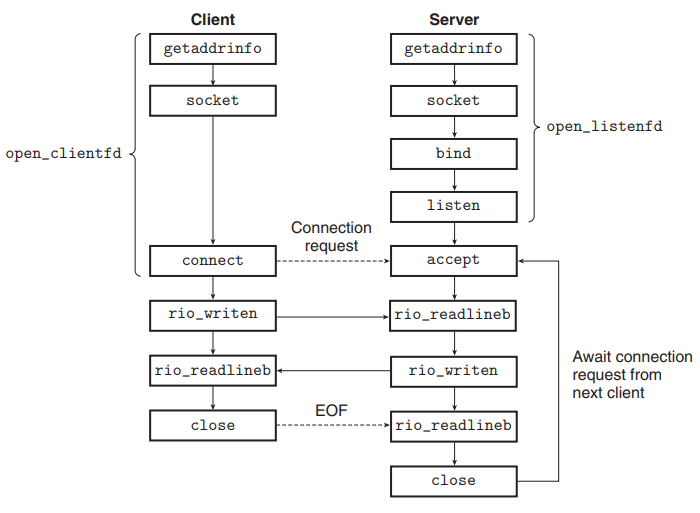

## 6주차 웹 서버 만들기 키워드 정리 및 알고리즘 문제 풀이

- 2024 - 05 - 04 (48일차)

#### 알고리즘 문제 풀이   
* 1715번 [카드 정렬하기](https://github.com/dongyeoppp/Jungle_TIL/blob/main/jungle_week07/bk_1715.py)   


#### OSI 7 Layer  vs TCP/IP stack
* OSI 7 Layer        
    * 네트워크 시스템 구성을 위한 범용적이고 개념적인 모델  
    * ISO/IEC에서 OSI 모델 관리   
* TCP/IP stack   
    * 인터넷이 발명되면서 함께 개발된 프로토콜 스택   
    * IETF에서 인터넷 표준을 관리 (RFC)   
    * TCP, UDP, IP .. 스펙은 RFC에서 정의   

#### 소켓    
* TCP   
    * 프로세스 간의 통신에서는 데이터를 안정적으로 주고 받을 수 있는 프로토콜이 필요하다.   
    * Connection   
        * 프로세스 간의 안정적이고 논리적인 통신 통로   
        * connection을 열고(3-way handshake), 데이터를 주고 받고, connection을 닫는다(4-way handshake).  -> connection - oriented 
    * 3-way handshake   
        * TCP 통신을 이용하여 데이터를 전송하기 위해 네트워크 연결을 설정하는 과정  
        * 양쪽 모두 데이터를 전송할 준비가 되었다는 것을 보장하고, 실제로 데이터 전달이 시작하기 전에 한 쪽이 다른 쪽에 준비되었다는 것을 알 수 있도록 한다.    
        * TCP/IP 프로토콜을 이용해서 통신을 하는 응용 프로그램이 데이터를 전송하기 전에 먼저 정확한 전송을 보장하기 위해 상대방 컴퓨터와 사전에 세션을 수립하는 과정을 의미한다.    
    * 3-way handshake 과정    
        * syn 전송 : 클라이언트는 서버에게 연결을 설정하겠다는 의도를 나타내는 syn 패킷을 보낸다. (이 패킷은 연결 요청을 보내는 패킷이다.)   
        * syn-ack 전송 : 서버는 클라이언트의 syn 패킷을 받고, 이에 대한 응답으로 syn-ack 패킷을 보낸다.  이 패킷은 클라이언트의 요청을 수락하고 자신도 연결을 설정할 준비가 되었음을 의미한다.   
        * ack 전송 : 클라이언트는 서버의 syn-ack 패킷을 받고, 이에 대한 응답으로 ack 패킷을 보낸다. 이로써 클라이언트와 서버 간의 연결이 성공적으로 설정되었음을 확인한다.  
    * 4-way handshake   
        * TCP 연결의 종료를 나타내는 프로세스이다. TCP 연결이 종료될 때 클라이언트와 서버 간에 발생하는 단계를 설명한다.   
        * 과정   
            * FIN 전송 : 클라이언트는 서버에게 연결을 종료하겠다는 의도를 나타내는 FIN 패킷을 보낸다.  
            * ACK 전송 : 서버는 클라이언의 FIN 패킷을 받고, 이에 대한 응답으로 ACK패킷을 보낸다. -> 서버는 클라이언트의 연결 종료 요청을 수락했음을 알린다.   
            * FIN 전송 : 서버는 더 이상 데이터를 보내지 않는다는 것을 나타내기 위해 클라이언트에게 FIN 패킷을 보낸다.   
            * ACK 전송 : 클라이언트는 서버의 FIN 패킷을 받고, 이에 대한 응답으로 ACK 패킷을 보낸다. -> 클라이언트는 서버의 연결 종료 요청을 수락했음을 알려준다.  
        
* UDP   
    * connectionless : 연결을 맺지 않고 바로 데이터를 주고 받는다.    
    * unreliable : internet protocol을 거의 그대로 사용   

* socket    
    * 인터넷 상에서 어떻게 port를 유니크하게 식별하는가에 대한 대안이 socket = internet address(ip주소)  + port number이 된다.  
    * 인터넷 상에서 존재하는 각 port를 유니크하게 식별하기 위한 주소   
    * 각 socket은 인터넷 상에서 유니크하다.  
    * 한 쌍의 socket이 connection을 이루고 connection도 유니크하게 식별된다.   
    * 하나의 socket은 동시에 여러 connection들에서도 사용될 수 있다.   
    * <protocol, ip address, port number>로 유니크하게 식별   
* 리눅스 커널의 관점에서 보면, 소켓은 통신을 위한 끝점이다.   
* unix 프로그램의 관점에서 보면 ```소켓```은 해당 식별자를 가지는 열린 파일 이다.        

* 소켓 인터페이스 기반 네트워크 응용프로그램 개요    
       

    * socket 함수   
        * 클라이언트와 서버가 소켓 식별자를 생성하기 위한 함수이다.   
        * socket 함수 호출   
            ```clientfd = Socket(AF_INET, SOCK_STREAM, 0)```   
            * ```AF_INET```은 32비트 IP주소를 사용하고 있다는 것을 나타낸다.   
            *  ```SOCK_STREAM```은 소켓이 인터넷 연결의 끝점이 될 것이라는 것을 나타낸다. -> TCP 방식    
    * connect 함수   
        * 클라이언트는 connect 함수를 호출해서 서버와의 연결을 수립한다.   
        * connect 함수는 소켓 주소 addr의 서버와 인터넷 연결을 시도한다.   
        * connect함수는 연결이 성공할 때까지 블록되어 있거나 에러가 발생한다.   
        * 만일 성공이라면 clinetfd 식별자는 이제 읽거나 쓸 준비가 되었으며, 이 연결은 ```(x:y, addr.sin_addr:addr.sin_port)``` 과 같은 소켓 쌍으로 규정된다. -> server와 client의 ip주소, port번호를 통해 socket을 식별할 수 있다.   
            * x는 client의 ip 주소이고, y는 port 번호이다. ```addr.sin_addr```은 접속할 서버의 ip주소이고, ```addr.sin_port```는 접속할 서버의 port 번호이다.   
    * bind 함수   
        * 서버가 클라이언트와 연결을 수립하기 위해 사용한다.   
        * 주로 서버 프로그램에서 사용되며, 클라이언트의 연결 요청을 받을 준비를 하기 위해 소켓에 주소를 할당할 때 호출된다.   
        * ip 주소와 port번호를 묶어 소켓에 할당하는 역할을 한다.  
    * listen 함수   
        * 서버가 클라이언트와 연결을 수립하기 위해 사용한다.   
        * sockfd(소켓 식별자)를 능동 소켓에서 듣기 소켓으로 변환하며, 듣기 소켓은 클라이언트로부터의 연결 요청을 승락할 수 있다.   
        * listening socket은 connection 맺는 요청을 기다리는 소켓이다.    
    * accept 함수   
        * 서버가 클라이언트와 연결을 수립하기 위해 사용한다.  
        * 서버는 accept함수를 호출해서 클라이언트로부터의 연결 요청을 기다린다.   
        * 클라이언트로부터의 연결 요청이 듣기 식별자 listenfd에 도달하기를 기다리고, 그 후에 addr 내의 클라이언트의 소켓 주소를 채우고, unix I/O 함수들을 사용해서 클라이언트와 통신하기 위해 사용될 수 있는 연결 식별자(connfd)를 리턴한다.   
    * close 함수   
        * 소켓을 닫는 역할을 한다. 소켓을 사용한 후에는 반드시 소켓을 닫아야 한다. 소켓을 닫으면 네트워크 리소스가 반환되고 해당 소켓이 사용되는 네트워크 연결도 종료된다.  
        * 네트워크 리소스를 효율적으로 관리하고, 안정적인 네트워크 통신을 보장하기 위해 필요한 작업이다.   
     
* port number   
    * 16 bits로 이루어진 숫자 (0 ~ 65535) -> 포트 번호는 한계가 있어 서로 다른 프로세스가 동시에 같은 포트 번호를 사용할 수 없다.   
    * 0 ~ 1023 : well-known ports, system port (http:80, https:443, dns:53)    
    * 다중 요청을 동일한 포트에서 처리하는 등의 방법을 통해 포트 번호의 한계보다 더 많은 양의 요청을 처리할 수 있다.   