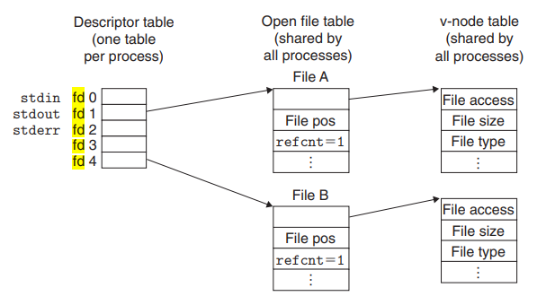
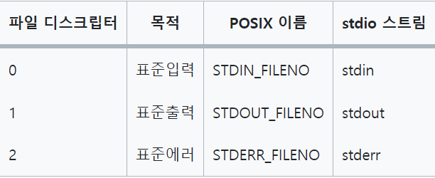

## 6주차 웹 서버 만들기 키워드 정리

- 2024 - 05 - 05 (49일차)

#### 10장 시스템 수준 입출력

- 입출력 (I/O)은 메인 메모리와 디스크 드라이브, 터미널, 네트워크 같은 외부 장치들 간에 데이터를 복사하는 작업이다. 입력 연산은 입출력 장치에서 메인 메모리로 데이터를 복사하고, 출력 연산은 데이터를 메모리에서 디바이스 복사한다.

- EOF (End-Of-File)

  - 컴퓨터 프로그래밍에서 파일의 끝을 나타낸다. 파일이 끝나면 프로그램은 EOF를 감지하여 파일 처리를 중단하거나 종료한다.

- short count

  - 네트워크 통신이나 파일 I/O 작업에서 데이터를 읽을 때, 프로그램이 요청한 데이터 양보다 실제로 읽어들인 데이터 양이 적을 경우 -> 프로그램이 예상한만큼의 데이터 양을 읽지 못한 경우
  - EOF를 읽는 도중에 만난 경우 발생
  - 터미널에서 텍스트 줄을 읽을 때 발생
  - 네트워크 소켓 통신 시 발생

- Rio 패키지를 이용한 안정적인 읽기와 쓰기

  - short count를 자동으로 처리해준다. 이는 short count가 발생할 수 있는 네트워크 프로그램 같은 응용에서 편리하고, 안정적이고 효율적인 I/O를 제공한다.
  - Rio 패키지가 제공하는 함수

    - 버퍼 없는 입력 및 출력 함수

      - 버퍼링 없이 직접 데이터를 전송한다. (메모리와 파일 간 직접 데이터 전송)
      - rio_readn, rio_writen 사용
        - rio_readn은 eof를 만나게 되면, short count를 리턴하지만, rio_writen은 short count를 리턴하지 않는다.

    - 버퍼를 사용하는 입력 함수
      - 내부 메모리 버퍼를 두어 조금 더 효율적인 입출력을 도모할 수 있다.
      - rio_readinitb, rio_readlineb, rio_readnb 사용
        - rio_readinitb : 초기화 함수
        - rio_readlineb
          - 한 줄 단위로 입력을 받는다. 이때 파라미터로 입력의 최대 바이트 크기를 넣어주어야 한다.
          - 텍스트 라인 전체를 내부 읽기 버퍼에서 복사하는 래퍼 함수이다.
        - rio_readnb
          - rio_readn의 버퍼형 버전으로써 파일 fd에서 n바이트 크기를 읽어온다.

- 파일 디스크립터

  - 일반적으로 파일 디스크립터는 0이 아닌 정수로 표현되며, 파일이나 소켓과 같은 I/O 리소스를 식별하는데 사용된다.  
     

  - 각 프로세스는 자신만의 별도의 식별자 테이블을 가지고 있으며, 이들의 엔트리는 프로세스의 오픈된 파일 식별자(fd)로 인덱스 된다.
    - FD(File Discriptor : 식별자 테이블의 인덱스 값)
  - 파일 디스크립터 세 개의 표준 스트림 (기본적으로 할당되는 디스크립터)  
     

    - stdin : 키보드나 다른 프로세스의 출력을 읽을 때 사용
    - stdout : 터미널이나 다른 프로세스로 출력할 때 사용
    - stderr : 에러메시지를 터미널이나 로그 파일등에 출력할 때 사용
