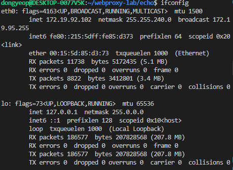

## 7주차 웹 서버 만들기 키워드 정리 및 알고리즘 문제 풀이

- 2024 - 05 - 06 (50일차)

#### 알고리즘 문제 풀이

- 17451번 [평행 우주](https://github.com/dongyeoppp/Jungle_TIL/blob/main/jungle_week07/bk_17451.py)

#### Datagram Socket, Stream Socket

- Datagram Socket
  - `UDP(User Datagram Protocol)`라고 불리는 프로토콜을 사용하여 전송된다.
  - 비연결 기반 통신
  - 데이터를 패킷 단위로 전송하며, 패킷은 독립적으로 전송되고 수신된다. 데이터 순서가 보장되지 않는다.
  - 다순하고 빠른 데이터 전송에 적합하다.
- Stream Socket
  - `TCP(Transmission Control Protocol)`라고 불리는 프로토콜을 사용하여 전송된다.
  - 연결 기반 통신
  - 데이터 순서롤 보장하며, 데이터가 손실되거나 중복되지 않도록 보장한다.
  - 신뢰성 있는 데이터 전송에 적합하며, 대용량 데이터를 안정적으로 전송할 때 많이 사용된다.

#### eco 서버

- echo 서버는 클라이언트가 보낸 메시지를 그대로 다시 반환하는 간단한 서버이다.
- echo 서버는 한 번에 한 개의 클라이언트만 처리할 수 있고, 이렇게 한 번에 한 개씩의 클라이언트를 반복해서 실행하는 종류의 서버를 `반복서버(iterative server)`라고 부른다.
- echo 디렉토리를 새로 만든 이후, `csapp.c`,`csapp.h` 파일을 복사하여 디렉토리에 추가한다.
- `echo.c` , `echoclient.c`, `echoserver.c`, `Makefile`파일을 만들어서 echo 디록토리에 추가한다.
- echo.c

  ```
  # include "csapp.h"

  void echo(int connfd)
  {
      size_t n;
      char buf[MAXLINE];
      rio_t rio;

      Rio_readinitb(&rio, connfd);
      while ((n = Rio_readlineb(&rio, buf, MAXLINE)) != 0) {      // rio_readlineb 함수가 EOF를 만날때까지 텍스트 줄을 반복해서 읽고 써준다.
          printf("server received %d bytes\n", (int)n);
          Rio_writen(connfd, buf, n);
      }
  }
  ```

- echoclient.c

  ```
  #include "csapp.h"

  int main(int argc, char **argv) // argc: 입력 받은 인자 수 , argv : 입력받은 인자들의 배열  -> (./echoclient) (호스트 name or ip주소) (port 번호) 일 경우 argc ->3 이고 argv  배열에 인자들이 차례대로 들어간다.
  {
      int clientfd;
      char *host, *port, buf[MAXLINE];
      rio_t rio;

      if (argc != 3)
      { // 인자의 개수가 3이 아닐 경우 메시지 출력
          fprintf(stderr, "usage: %s <host> <port>\n", argv[0]);
          exit(0);
      }
      host = argv[1]; // host 와 port 에 각각 ip주소와 port번호 저장
      port = argv[2];

      clientfd = Open_clientfd(host, port); // host에서 돌아가면서 port에 연결 요청을 드는 서버와 연결을 설정한다. 준비된 열린 소켓 식별자를 리턴하여 clientfd에 저장
      Rio_readinitb(&rio, clientfd);        // rio 구조체를 초기화하고 clientfd에 대한 읽기 작업을 수행할 수 있도록 설정한다.

      while (Fgets(buf, MAXLINE, stdin) != NULL)  // eof 표준을 만나면 종료
      {                                           // while문을 통해 사용자로부터 입력을 buf에 저장
          Rio_writen(clientfd, buf, strlen(buf)); // client 식별자를 통해 buf에 저장된 데이터를 서버로 전송
          Rio_readlineb(&rio, buf, MAXLINE);      // rio 구조체를 통해 읽어온 한 줄의 문자열을 buf에 저장 (리턴 코드가 0일 경우 eof 감지)
          Fputs(buf, stdout);                     // buf에 저장된 문자열을 출력 (받은 응답 화면에 출력)
      }
      Close(clientfd); // client 소켓 닫기
      exit(0);
  }
  ```

- echoserver.c

  ```
  # include "csapp.h"
  # include "echo.c"

  void echo(int connfd);

  int main(int argc, char **argv)

  {
      int listenfd, connfd;
      socklen_t clientlen;
      struct sockaddr_storage clientaddr;     // clientaddr은 accept로 보내지는 소켓 주소 구조체  // sockaddr_storage 구조체는 모든 형태의 소켓 주소를 저장하기에 충분히 크며, 코드를 프로토콜 - 독립적으로 유지해준다.
      char client_hostname[MAXLINE], client_port[MAXLINE];

      if (argc != 2) {        // 인자가 2개 아닐 경우 메시지 출력
          fprintf(stderr, "usage: %s <port>\n", argv[0]);
          exit(0);
      }

      listenfd = Open_listenfd(argv[1]);      // 듣기 식별자를 오픈한 후에 무한루프에 진입한다.
      while (1) {
          clientlen = sizeof(struct sockaddr_storage);
          connfd = Accept(listenfd, (SA *) &clientaddr, &clientlen);  // accept를 통해 client 연결 수락, client와의 통신을 위한 연결 소켓 식별자 'connfd'반환
          Getnameinfo((SA *) &clientaddr, clientlen, client_hostname, MAXLINE, client_port, MAXLINE, 0);  //client 이름(호스트 이름)과 port번호 얻음
          printf("Connected to (%s, %s)\n", client_hostname, client_port); // 연결된 client의 hostname과 port 번호 출력, client와 server가 연결되었음을 알림
          echo(connfd);
          Close(connfd);
      }
      exit(0);
  }
  ```

- Makefile

  ```
  CC = gcc
  CFLAGS = -O2 -Wall -I .
  LIB = -lpthread

  all: echoclient echoserver

  csapp.o: csapp.c csapp.h
      $(CC) $(CFLAGS) -c csapp.c

  echoclient: echoclient.c csapp.o
      $(CC) $(CFLAGS) -o echoclient echoclient.c csapp.o $(LIB)

  echoserver: echoserver.c csapp.o
      $(CC) $(CFLAGS) -o echoserver echoserver.c csapp.o $(LIB)

  clean:
      rm -f *.o echoclient echoserver *~
  ```

- echo 작동 확인

  - 오브젝트 파일 생성
  - ./echoserver를 통해 port 번호를 정해준다.  
    

  - echoserver로 port번호 지정 이후 client와 연결

    - server 터미널

      - 입력값의 bytes 출력  
        

    - client 터미널  
       

  - telnet으로 응답 출력하기

    - telnet : 인터넷이나 로컬 영역 네트워크 연결에 쓰이는 네트워크 프로토콜

    - `sudo apt-get install telnetd xinetd` : telnet 설치
    - `sudo vi /etc/xinetd.d/telnet` : 파일을 생성하고 vi 실행하고 아래 텍스 입력 후 저장 (esc 누르고 :wq 입력, enter -> 저장 후 나가기)
      ```
      service telnet {
          disable         = no
          flags           = REUSE
          socket_type     = stream
          wait            = no
          user            = root
          server          = /usr/sbin/in.telnetd
          log_on_failure  += USERID
      }
      ```
    - `sudo /etc/init.d/xinetd restart` : xinetd 서비스 재시작
    - ifconfig 명령어로 서버 ip 확인  
       

    - 서버 열어준 이후 telnet으로 clinet 접속
      - ifconfig로 확인 한 ip주소와 server에서 열어준 port 번호를 입력하여 접속
    - telnet을 이용한 접속 확인  
       

      - ctrl + ']' -> enter -> quit 입력 : telnet으로 접속한 client 해제

    - ubuntu 터미널이 아닌 powershell에서도 동일하게 작동
      - `window 기능 켜기/ 끄기` 에서 텔넷 클라이언트 체크를 확인 해줘야한다.
