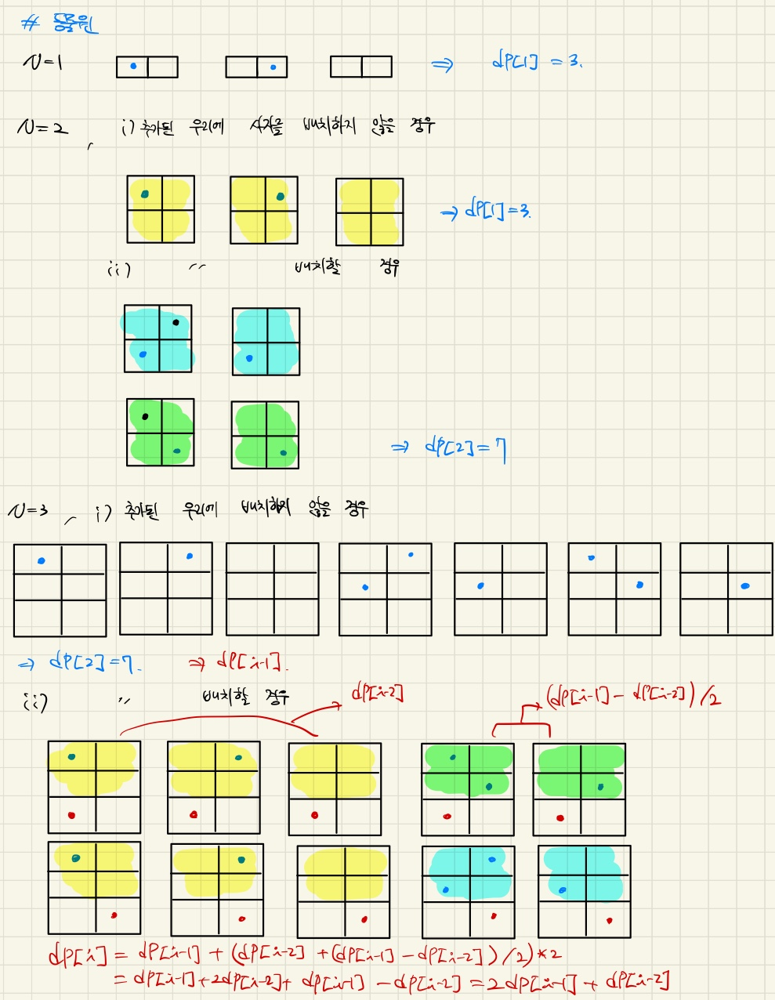
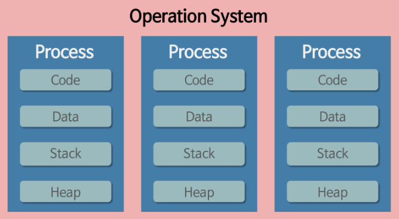
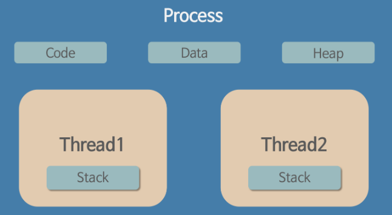

## 8주차 pintos 및 알고리즘 문제 풀이

- 2024 - 05 -10 (54일차)

#### 알고리즘 문제 풀이

- 1309번[동물원](https://github.com/dongyeoppp/Jungle_TIL/blob/main/jungle_week08/bk_1309.py)  
   

#### pintos

- 운영체제
  - 사용자와 하드웨어 사이에서 동작하는 시스템 소프트웨어이다.
  - 운영체제는 프로세스가 다른 프로세스의 메모리 영역을 침범하지 못하도록 내부 보안 기능을 제공한다.
- 커널
  - 운영체제 내에서 동작하는 시스템 소프트웨어로, 메모리 관리 및 디스크 관리, 프로세스 관리 등 하드웨어와 가까운 서비스를 제공한다.
  - 커널의 대표적인 역할 중 하나는 cpu 사용량을 극대화하는 것이다.
- 프로세스
  - 프로그램이 실행되어 메인 메모리(RAM)에 올라가 있는 상태로, 운영체제의 입장에서 관리하는 하나의 작업 단위이다.
- 멀티태스킹 (멀티프로그래밍)

  - 하나의 프로세스가 계속 CPU를 점유하는 것을 막으면서, 여러 프로세스를 동시에 실행시키는 것처럼 만드는 기법  
     

  - 이때 프로세스 간 작업을 전환하는 것을 `Context Switching` 이라고 부른다.
  - `Context swithching`
    - 커널의 도움을 필요로 하기 때문에 리소스가 든다.
    - 인터럽트 기밥으로 동작하며 인터럽트가 발생하면 CPU는 현재 진행중인 작업을 중단하고, 인터럽트가 발생했을 때 해야 할 일이 정의된 인터럽트 서비스 루틴을 수행한다.

- 쓰레드 (Thread)

  - 프로세스 내에서 실행되는 CPU 스케줄링의 기본 단위로, 하나의 프로세스 내에서 여러 개의 쓰레드가 실행될 수 있고, 이를 `멀티 쓰레드`라고 부른다.
  - 각 쓰레드는 자기 자신만의 실행 상태를 가질 수 있기 때문에, 서로 다른 CPU에서도 동작할 수 있다.
  - 기본적으로 하나의 프로세스 내에서 실행되는 각 쓰레드는 프로세스의 메모리를 공유한다. 쓰레드 별로 실행중인 코드 위치와 컨텍스트가 다를 수 있기 때문에, 프로그램 카운터는 따로 저장하고 스택은 분할해서 사용한다.
  - 각 쓰레드의 정보를 저장하기 위해 커널은 쓰레드 제어 블록(TCB, Thread Control Block)을 만들어 PCB(Process Control Block: 커널이 각 프로세서의 정보를 저장하고 관리하기 위해 사용 -> PID: 프로세스를 식별하기 위한 번호, 우선순위, 프로세스 상태 등이 포함되어 있다. )에 저장한다.
  - 멀티 쓰레딩  
     

- 동기화(Synchronization)

  - 공유 자원: 여러 쓰레드가 동시에 접근할 수 있는 자원
  - 여러 쓰레드가 동시에 공유 자원에 접근할때 타이밍과 접근순서에 따라 결과가 달라질 수 있다. (= Race condition(경쟁상태))
  - 쓰레드가 공유자원에 동시에 접근하지 못하도록 접근 순서를 제어하는 방법 -> `동기화`
  - 임계영역 : 공유 자원의 일관성을 보장하기 위해 특정 프로세스/스레드만 진입해서 실행 가능한 코드 영역

- busy - waiting: cpu를 계속해서 사용하며 특정 조건을 만족할 때 까지 대기하는 방식

- Mutex
  - mutual exclusion (상호배제)의 약어로 여러개의 프로세스/스레드가 공유 자원에 동시에 접근하는 것을 방지하는 락
- semaphore
  - 여러개의 프로세스/스레드가 공유 자원에 동시에 접근하는 것을 제한하기 위한 정수
  - 세마포어로 지정해준 정수 값만큼(한개이상의) 프로세스/스레드가 공유자원에 접근 가능
- mutex와 semaphore 비교

  - 동시에 실행되는 프로세스/스레드 들 간에 공유 자원들 보호
  - 잘못 사용시 교착상태가 발생할 수 있음
  - 1개의 자원에 대한 상호 배제만 필요하다면 mutex, 공유 자원 접근 수를 조절하고, 작업 간의 실행순서 동기화가 필요하다면 세마포어

- CPU Scheduling 알고리즘

  - 선점형 스케줄링
    - 어느 하나의 프로세스가 자원 사용을 독립적으로 할 수 없는 스케줄링 방식
    - 문맥 교환이 많아져서 오버헤드가 커질 수 있다.
  - 비선점형 스케줄링
    - 어느 하나의 프로세스가 자원 사용을 독립적으로 할 수 있는 스케줄링 방식
    - 기아 현상이 발생할 수 있다.
  - FCFS
    - First Come First Served
    - 비선점형 스케줄링 방식
    - CPU 사용시간이 긴 프로세스가 먼저 들어갈 경우 대기시간이 길어질 수 있다.
  - SJF
    - Shotest Job First
    - 비선점형 스케줄링 방식
  - Round Robin
    - FCFS 스케줄링 방식과 Time Slace 사용
    - 선점형 스케줄링 방식
    - Time Slace : 각 프로세스가 CPU를 사용할 수 있는 정해진 시간
    - Time Slace가 너무 커지면 FCFS와 다를게 없고, Time Slace가 작아지면 문맥교환이 많아져 오버헤드가 증가할 수 있다.
  - SRT
    - SJF 스케줄링 방식과 RR 스케줄링 방식을 사용
    - 짧은 실행시간을 갖는 프로세스부터 CPU 사용
    - 남은 잔여시간을 계산 // 새로운 프로세스가 들어왔을 경우, 현재 실행중인 프로세스의 잔여시간보다 새로 들어온 프로세스의 실행시간이 짧을 경우 -> 프로세스 교체 (context switching)
  - 우선순위 스케줄링

    - 우선순위가 높은 것부터 CPU 사용
    - 우선순위가 높은 것부터 계속 CPU를 사용하기 때문에 우선 순위가 낮은 프로세스는 CPU를 사용하지 못해 기아현상이 발생할 수 있다.
    - 기아 현상이 발생할 경우 `에이징`기법을 사용하여 이를 해결할 수 있다. -> `에이징`기법은 오래 대기한 프로세스의 우선순위를 점차 높여주는 방식이다.

  - 다단계 큐
    - Multilevel Queue Scheduling
    - 우선순위별로 준비 큐를 여러 개 사용하는 스케줄링 방식
    - 우선순위가 가장 높은 큐에 있는 프로세스들을 먼저 처리하고, 우선순위가 가장 높은 큐가 비어 있으면 그 다음 우선순위 큐에 있는 프로세스들을 처리한다.
    - 큐마다 다른 스케줄링 알고리즘을 사용할 수 있다.
  - 다단계 피드백 큐 스케줄링
    - Multilevel feedback queue scheduling
    - 다단계 큐는 큐 사이를 이동할 수 없으며, 우선 순위가 낮은 프로세스는 계속 연기될 여지가 있다. -> 기아 현상이 발생할 수 있다.
    - 다단계 피드백 큐는 프로세스들이 큐 사이를 이동할 수 있다.
    - 타임 슬라이스 동안 한 프로세스가 실행을 다 못 끝냈다면 낮은 우선순위를 가지는 큐로 이동하게 된다.
    - CPU를 비교적 오래 사용해야 하는 CPU 집중 프로세스들은 자연스레 우선순위가 낮아지고, CPU를 비교적 적게 사용하는 입출력 집중 프로세스들은 자연스레 우선순위가 높은 큐에서 실행이 끝난다. (에이징 기법을 사용한 기아 현상 예방)

- Deadlock(데드락)   
  - 프로세스가 자원을 얻지 못해 다음 처리를 하지 못하는 상태 -> 교착 상태
  - 시스템적으로 한정된 자원을 여러 곳에서 사용하려고 할 때 발생한다.
