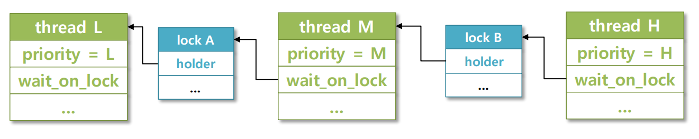

## 8주차 pintos 및 알고리즘 문제 풀이

- 2024 - 05 -17 (61일차)

#### 알고리즘 문제 풀이

- 1238번 [파티](https://github.com/dongyeoppp/Jungle_TIL/blob/main/jungle_week08/bk_1238.py)
- 16165번 [걸그룹 마스터 준석이](https://github.com/dongyeoppp/Jungle_TIL/blob/main/jungle_week08/bk_16165.py)

#### pintos 구현 - priority (donations)

- keypoint

  - priority donation(우선순위 기부: nested, multiple)을 통해 priority inversion(우선순위 역전) 방지
  - nested donation  
     
  - multiple donation  
     
  - priority inversion problem  
     
  - priority inversion problem solution -> prioriy donation 적용  
     

- chellenge
  - 왜 priority donation 할 때 while을 사용해야하는가
    - lock을 가지고 있는 thread가 다른 lock을 요구하고 있는 경우 -> nasted donation
    - 현재 thread의 wait_on_lock 값을 통해 해당 lock을 소유하는 thread로 접근하여 우선순위 기부를 해줘야 한다.
    - 원래 if 문을 사용하였는데 while 반복문을 통해 nasted donation 문제를 해결하였다.
  - 왜 lock_release에서 우선순위를 기부할 때 do-while을 해주는가
    - 현재 thread의 wait_on_lock이 null이더라도 현재 thread의 우선순위는 한 번 갱신해줘야하기 때문에 do - while문을 써야했다.
- lock_acquire

  ```
  /* lock 요청 */
  void lock_acquire(struct lock *lock)
  {
      ASSERT(lock != NULL);
      ASSERT(!intr_context());
      ASSERT(!lock_held_by_current_thread(lock));

      if (lock->holder != NULL)
      {											// 해당 lock을 다른 쓰레드가 점유하고 있을 경우
          struct thread *curr = thread_current(); // donations 목록에 들어가야 하는 쓰레드 = curr
          curr->wait_on_lock = lock;
          list_insert_ordered(&lock->holder->donations, &curr->d_elem, cmp_priority_donation, NULL); // 현재 주어진 lock을 기다리는 donation목록에 curr->d_lem 추가(오름차순으로 정렬 됨)
          // 우선순위 기부
          struct thread *donation_first;	   // lock을 가지고 있는 쓰레드의 도네이션 목록에 =>>가장 우선순위가 높은 쓰레드
          while (curr->wait_on_lock != NULL) // nested 상황을 고려하여 while문을 사용 wait_on_lock을 가지고 있지 않은 쓰레드가 나올 때 까지 반복
          {
              struct lock *new_lock = curr->wait_on_lock; // 새로운 lock 구조체를 선언하여 lock을 갱신 해준다.		// 새로 선언을 해주지 않고 그냥 lock을 써서 갱신이 되지 않았었다.
              donation_first = list_entry(list_begin(&new_lock->holder->donations), struct thread, d_elem);
              if (new_lock->holder->priority < donation_first->priority)
              {
                  new_lock->holder->priority = donation_first->priority; // donation의 첫번째 값과 우선순위를 비교하여 조정
              }
              curr = curr->wait_on_lock->holder; // 현재 쓰레드의 wait_on_lock의 holder가 가리키는 쓰레드로 이동 하여 연결된 쓰레드들의 priority값 조정
          }
      }
      sema_down(&lock->semaphore);
      lock->holder = thread_current();
      thread_current()->wait_on_lock = NULL;
  }
  ```

- lock_release

  ```
  /* lock 해제 */
  void lock_release(struct lock *lock)
  {
      ASSERT(lock != NULL);
      ASSERT(lock_held_by_current_thread(lock)); // 현재 쓰레드가 lock을 보유하고 있는지 확인

      struct thread *curr = lock->holder; // 해제할 lock을 가지고 있는 쓰레드 curr
      struct list_elem *donation_elem = list_begin(&curr->donations);		// 해제할 lock을 기다리고 있는 쓰레드들의 우선순위가 가장 높은 list_elem => donation_elem

      while (!list_empty(&curr->donations) && donation_elem != list_tail(&curr->donations))		// donation이 empty가 아니고, donation_elem이 tail이 아닐 때까지
      {																						 	// lock을 가지고 있던 쓰레드의 donations 목록에 wait_on_lock으로 lock을 가지고 있던 쓰레도 모두 삭제
          struct thread *donation_thread = list_entry(donation_elem, struct thread, d_elem);
          if (donation_thread->wait_on_lock == lock)
          {
              donation_elem = list_remove(donation_elem);		// 해당 쓰레드 삭제하고 remove로 반환된 elem값을 donation_elem으로 받아서 donation_elem 갱신
          }
          else
          {
              donation_elem = donation_elem->next;		// wait_on_lock 값이 lock이 아닌 쓰레드라면 다음 쓰레드로 donation_elem 갱신
          }
      }
      // 우선 순위 기부
      // do - while 문을 사용하여 갱신이 안되는 경우가 없도록 하였다.
      do
      {
          curr->priority = curr->org_priority;		// 기부 받았던 priority를 반납
          if (!list_empty(&curr->donations))		// donations가 비어있지 않을 경우 갱신된 donations 리스트에서 첫번째 값으로 우선순위 갱신
          {
              struct thread *donation_first = list_entry(list_begin(&curr->donations), struct thread, d_elem);
              if (curr->priority < donation_first->priority)
              {
                  curr->priority = donation_first->priority;
              }
          }
          // donations가 비어있을 경우
          // while문 들어가기전이므로 wait_on_lock이 있는지 확인한다.
          // 이 조건이 없으면 wait_on_lock이 null일 경우 holder를 찾지 못해 error가 나타난다.
          if (curr->wait_on_lock == NULL)
          {
              break;
          }
          curr = curr->wait_on_lock->holder;		// wait_on_lock이 null이 아닐경우 holder 쓰레드로 이동한다.
      } while (curr->wait_on_lock != NULL);

      lock->holder = NULL;		// lock 해제
      sema_up(&lock->semaphore);
  }
  ```

- thread_set_priority

  ```
  // 현재 thread의 우선순위를 new_priority로 설정
  void thread_set_priority(int new_priority)
  {
      struct thread *curr = thread_current();
      curr->org_priority = new_priority; // 새로 받은 우선순위를 org_priority에 반영
      curr->priority = new_priority;	   // 새로 받은 우선순위를 priority에 반영

      // 우선 순위 기부
      if (!list_empty(&curr->donations))		// donations가 비어있지 않을 경우
      {
          struct thread *donation_first;
          donation_first = list_entry(list_begin(&curr->donations), struct thread, d_elem);
          if (curr->priority < donation_first->priority)
          {
              curr->priority = donation_first->priority;
          }
      }
      //
      struct thread *readey_list_first = list_entry(list_begin(&ready_list), struct thread, elem);
      if (curr->priority < readey_list_first->priority)
      {
          thread_yield();
      }
  }
  ```
