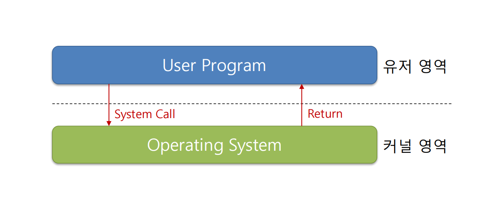

## 9주차 pintos USER PROGRAMS 및 알고리즘 문제 풀이

- 2024 - 05 -28 (72일차)

#### 알고리즘 문제 풀이

- 13023번 [ABCDE](https://github.com/dongyeoppp/Jungle_TIL/blob/main/jungle_week09/bk_13023.py)    

#### quiz_review

- 커널 모드에서 실행될 수 있는 작업의 예

  - 공유 자원 관리는 운영체제의 중요한 기능 중 하나로, 주로 커널 모드에서 실행된다.
    - 파일 시스템, 메모리, 프린터 등과 같은 자원은 여러 프로세스에 의해 동시에 요청될 수 있으며, 이에 대한 접근과 사용을 적절히 관리하는 것이 필수적이다.
    - 커널 모드에서는 이러한 자원들에 대한 접근을 제어하고, 충돌이나 데이터 손상을 방지하는 역할을 한다.
  - 사용자 모드에서 실행되지 않는 이유
    - 사용자모드에서는 이러한 공유 자원의 직접 관리를 수행하지 않는다.
    - 여러 사용자 또는 프로세스가 자원에 직접 접근할 경우 데이터의 일관성과 안정성이 위협받을 수 있기 때문이다.

- 운영체제에서 컨텍스트 스위칭이 발생하는 과정에서 저장되는 정보

  - 컨텍스트 스위칭 과정에서 운영체제는 현재 프로세스의 상태를 저장하고 다음에 실행할 프로세스의 저장된 상태를 복원한다.
    - 저장되는 정보에는 프로세스의 프로그램 카운터, 레지스터 상태, 메모리 관리 정보, 열린 파일 목록 등이 포함된다.

- fsync() 함수의 작동원리
  - fsync()가 파일 시스템에서 하는 역할
    - fsync() 함수는 열려 있는 파일 디스크립터와 관련된 모든 수정된 데이터를 디스크에 동기화한다.
    - 파일의 쓰기 작업이 메모리에만 저장되는 것이 아니라, 실제 저장 매체에도 반영되도록 보장하는 역할을 한다.
    - fsync()의 중요한 역할 중 하나는 시스템이 예기치 않게 중단되더라도 데이터의 무결성을 보장하는 것이다.
  - fsync()를 사용할 때 고려해야 할 성능상의 영향
    - 디스크 i/o 작업이 증가하여 시스템의 전반적인 성능 저하가 발생할 수 있다.
    - 빈번한 fsync() 호출은 디스크의 작업 부하를 증가시키고, 결과적으로 시스템의 반응 속도를 늦출 수 있다. #### system call

#### system call handler 구현

- 몇 가지 시스템 콜을 구현하고 시스템 콜 핸들러를 통해 호출  
   

  - system call : 커널모드에서 실행되고, 처리 후 사용자 모드로 복귀

    - `halt` : pintos를 종료시키는 시스템 콜
      ```
      // pintos를 종료시키는 시스템 콜x
      void halt(void)
      {
          power_off(); // 핀토스를 종료
      }
      ```
    - `exit` : 현재 프로세스를 종료시키는 시스템 콜
      ```
      // 현재 프로세스를 종료시키는 시스템 콜
      void exit(int status)
      {
          struct thread *curr = thread_current();
          curr->exit_status = status;
          printf("%s: exit(%d)\n", curr->name, status);
          thread_exit(); // 쓰레드 종료
      }
      ```
    - `create` : 파일을 생성하는 시스템 콜
      ```
      // 파일을 생성하는 시스템 콜 (성공일 경우 true 리턴)
      bool create(const char *file, unsigned initial_size)
      {
          check_address(file);
          return filesys_create(file, initial_size); // 파일 이름과 파일 사이즈를 인자 값으로 받아 파일을 생성
      }
      ```
    - `remove` : 파일을 삭제하는 시스템 콜
      ```
      // 파일을 삭제하는 시스템 콜
      bool remove(const char *file)
      {
          check_address(file);
          return filesys_remove(file); // 파일 이름에 해당하는 파일을 제거
      }
      ```

  - `check_address` : 포인터가 가리키는 주소가 사용자 영역인지 검사
    ```
    // 주소 값이 유저 영역에서 사용하는 주소 값인지 확인
    void check_address(void *addr)
    {
        if (addr == NULL || !is_user_vaddr(addr))
        {
            exit(-1);
        }
    }
    ```

