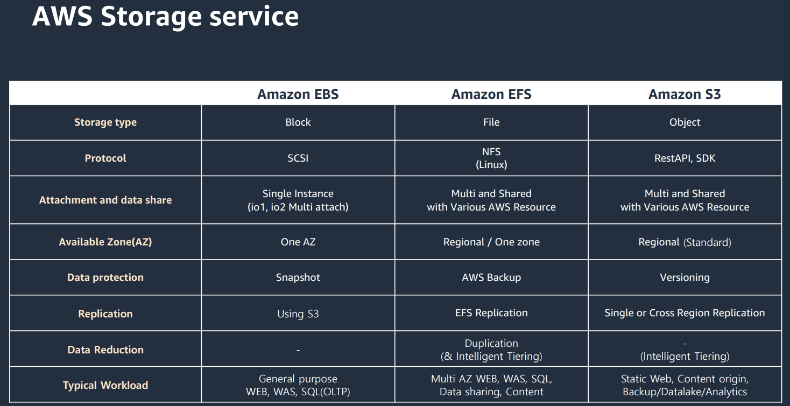
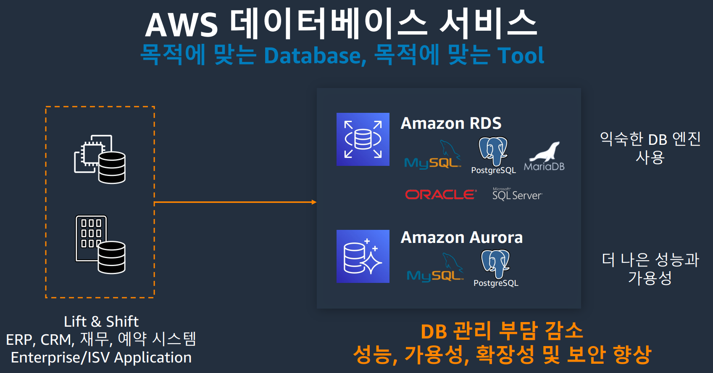

## 13주차 알고리즘 및 실력다지기 + aws 교육

- 2024 - 06 -18 (93일차)    

#### 알고리즘 문제 풀이  
* 2477번 [참외밭]()
#### aws   
* stroage in aws
    * aws storage service  
        * Amazon EBS       
        * Amazon EFS   
        * Amazon S3   
           

* 목적에 맞게 구축된 database   
        

    
#### java spring  
* 스프링 부트는 jpa를 사용하여 데이터베이스를 관리한다.  
* 스프링 부트는 jpa를 orm기술의 표준으로 사용한다.   
    * jpa   
        * jpa는 인터페이스(클래스가 구현해야하는 메서드 목록을 정의한 틀) 모음   

* 스프링 시큐리티       
    * 스프링 부트에서 회원 가입과 로그인을 도와준다.  
    * 스프링 기반 웹 애플리케이션의 인증과 권한을 담당하는 스프링의 하위 프레임워크이다.   
