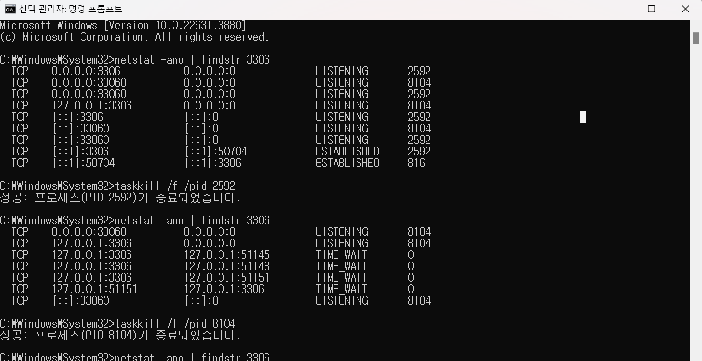
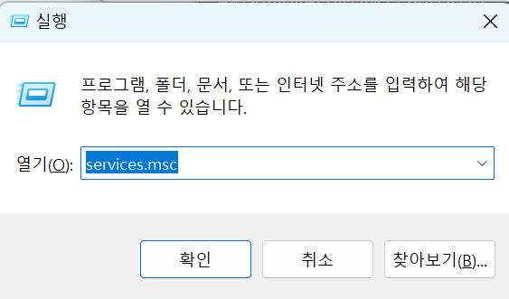
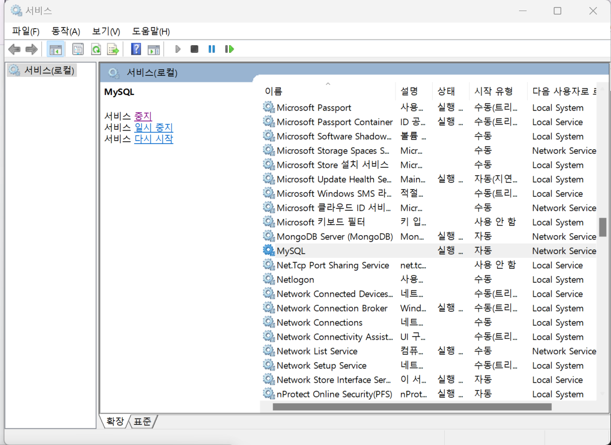

## 14주차 알고리즘 및 기획 + spring 부트, jpa

- 2024 - 06 -28 (103일차)

#### 알고리즘 문제 풀이

- 5525번 [IOIOI](https://github.com/dongyeoppp/Jungle_TIL/blob/main/jungle_week14/bk_5525.py)  
* 2170번 [선 긋기](https://github.com/dongyeoppp/Jungle_TIL/blob/main/jungle_week14/bk_2170.py)   
* 2512번 [예산](https://github.com/dongyeoppp/Jungle_TIL/blob/main/jungle_week14/bk_2512.py)   
* 15903번 [카드 합체 놀이](https://github.com/dongyeoppp/Jungle_TIL/blob/main/jungle_week14/bk_15903.py)   
* 1713번 [후보 추천하기](https://github.com/dongyeoppp/Jungle_TIL/blob/main/jungle_week14/bk_1713.py)   
* 20310번 [타노스](https://github.com/dongyeoppp/Jungle_TIL/blob/main/jungle_week14/bk_20310.py)   
* 17298번[오큰수](https://github.com/dongyeoppp/Jungle_TIL/blob/main/jungle_week14/bk_17298.py)   

#### springboot + jpa

- api 개발

  - 엔티티 조회하기 순서
    - 엔티티 조회 방식으로 우선 접근
      - fetch join으로 쿼리 수를 최적화
      - 컬렉션 최적화
        - 페이징 필요 `hibernate.default_batch_fetch_size`, `@BatchSize`로 최적화
        - 페이징 필요 x -> fetch join 사용

- spring data jpa
  - `JpaRepository`라는 인테페이스를 제공
    - 여기에 기본적인 CRUD 기능이 모두 제공된다.
  - `findByName`처럼 일반화하기 어려운 기능도 메서드 이름으로 정확한 JPQL 쿼리를 실행한다.
    - ` select m from member m where m.name = :name`

* my sql 오류 해결
  - db연결이 안되어서 3306포트에 연결된 pid 번호를 다 죽였다.
    
  - window + R  
      
    
    - mysql 다시 서비스 시작하니 해결 되었다.
